This are GLSL examples of how to use [LYGIA Shader Library](https://github.com/patriciogonzalezvivo/lygia). You can try them using:

* [glslViewer](https://github.com/patriciogonzalezvivo/glslViewer/wiki/Compiling)
* [glsl-canvas VS Code pluging](https://marketplace.visualstudio.com/items?itemName=circledev.glsl-canvas)


## How to start?

Clone this repository recursivelly

```bash
git clone --recursive https://github.com/patriciogonzalezvivo/lygia_examples.git
```

# COLOR 

#### OKLab and MixBox color mixing

```bash
glslViewer color_mix.frag lygia/assets/mixbox_lut.png -l
```

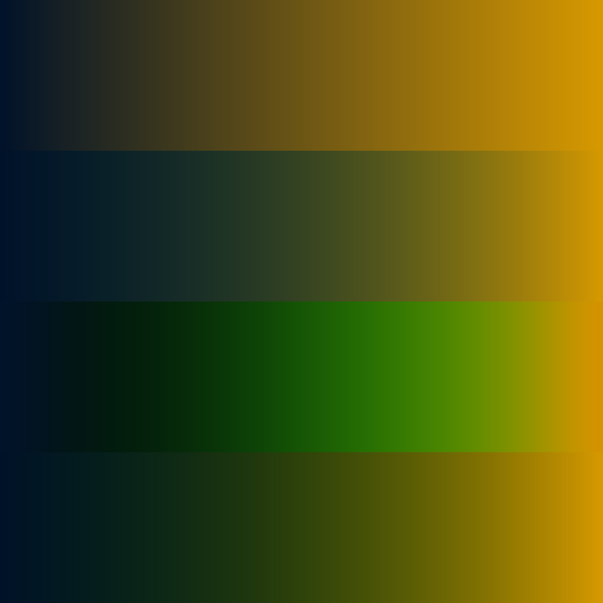

# DRAW

#### Digits

```bash
glslViewer draw_digits.frag -l
```

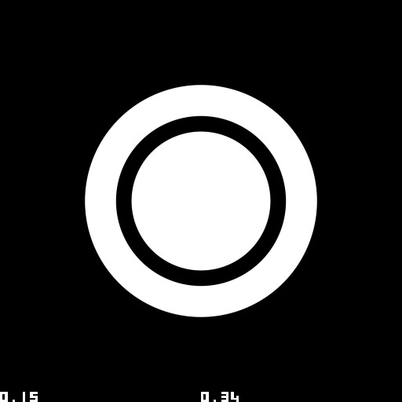

# GENERATIVE


#### Random

```bash
glslViewer generative_random.frag 
```


#### Clasic Noise

```bash
glslViewer generative_cnoise.frag 
```

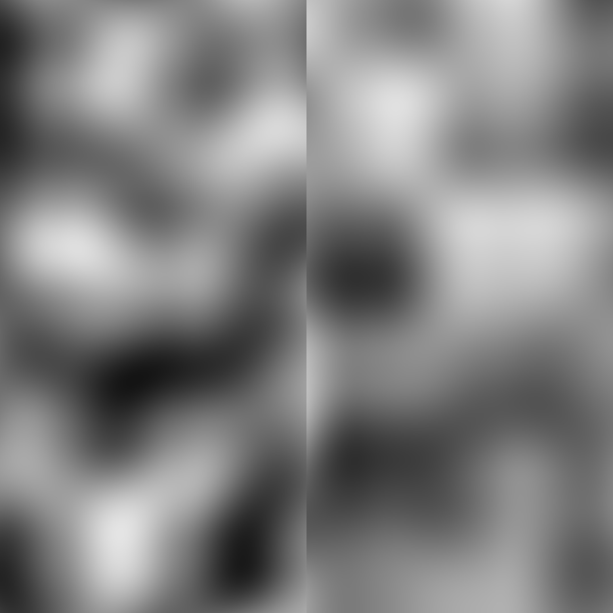


#### Perlin Noise

```bash
glslViewer generative_pnoise.frag 
```

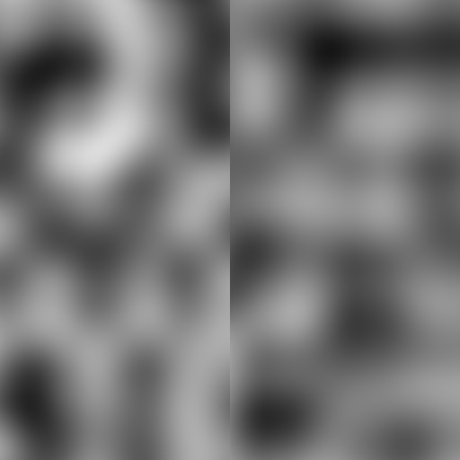


#### Simplex Noise

```bash
glslViewer generative_snoise.frag 
```

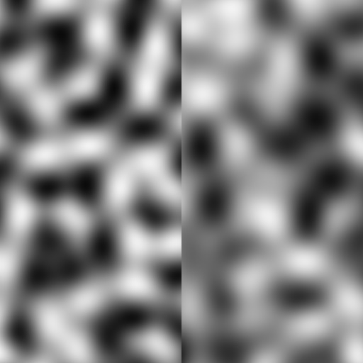

#### Tiling Simplex Flow Noise

```bash
glslViewer generative_psrdnoise.frag assets/sphere.ply -l
```


#### Simplex Noise Derivatives

```bash
glslViewer generative_noised.frag 
```

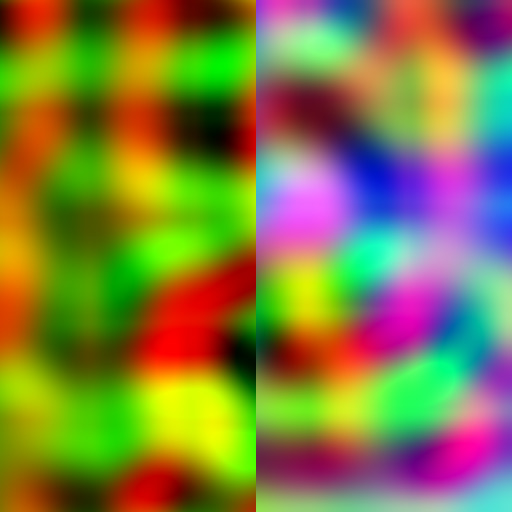


#### Curl Noise

```bash
glslViewer generative_curl.frag 
```
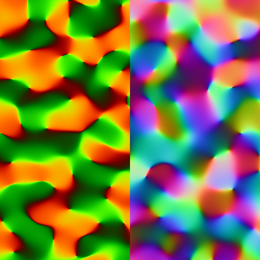


#### Fractal Brownian Motion

```bash
glslViewer generative_fbm.frag 
```

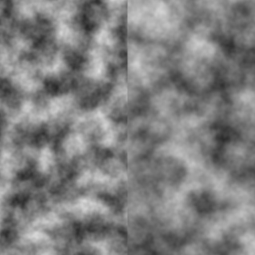


#### Voronoi

```bash
glslViewer generative_voronoi.frag 
```


#### Worley Noise

```bash
glslViewer generative_worley.frag 
```

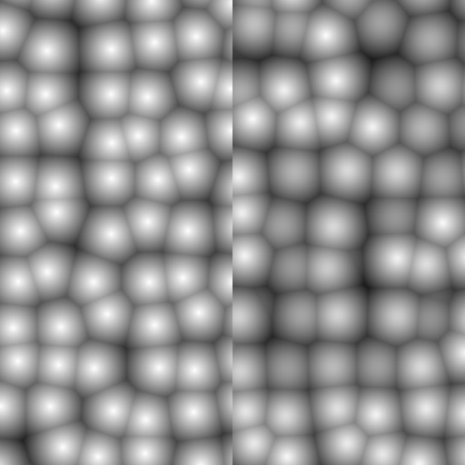


#### Filter

#### boxBlur 1D

```bash
	glslViewer filter_boxBlur1D.frag assets/danny.png -e buffers,on -l
```


#### boxBlur 2D

```bash
filter_boxBlur2D:
	glslViewer filter_boxBlur2D.frag assets/danny.png -l
```


#### GaussianBlur 1D

```bash
	glslViewer filter_gaussianBlur1D.frag assets/danny.png -e buffers,on -l
```


#### GaussianBlur 2D

```bash
	glslViewer filter_gaussianBlur2D.frag assets/danny.png -l
```


#### BilateralBlur 2D 

```bash
	glslViewer filter_bilateralBlur2D.frag assets/danny.png -l
```


#### RadialBlur 2D 

```bash
	glslViewer filter_radialBlur2D.frag assets/danny.png -l
```

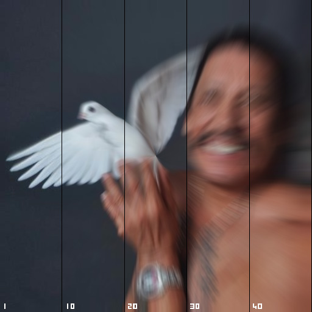


#### NoiseBlur 2D 

```bash
	glslViewer filter_noiseBlur2D.frag assets/danny.png -l
```


#### Median 2D 

```bash
	glslViewer filter_median2D.frag assets/danny.png -l
```


#### Kuwahara 2D 

```bash
	glslViewer filter_kuwahara2D.frag assets/danny.png -l
```


#### Sharpen 2D 

```bash
	glslViewer filter_sharpen2D.frag assets/danny.png -l
```

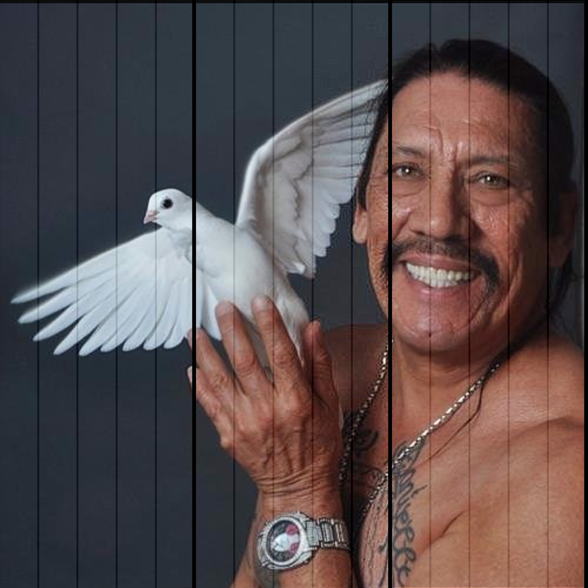


#### Laplacian 2D 

```bash
	glslViewer filter_laplacian2D.frag assets/danny.png -l
```

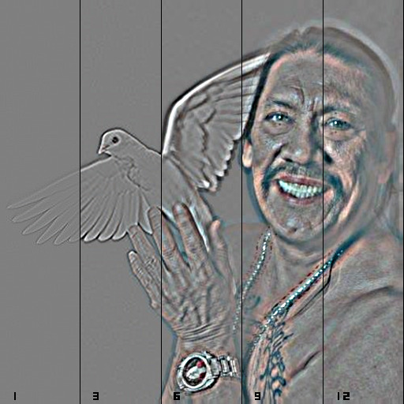


#### Edge 2D 

```bash
	glslViewer filter_edge2D.frag assets/danny.png -l
```

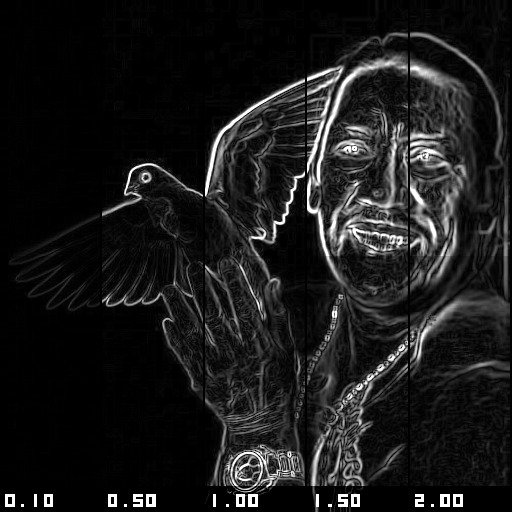


# LIGHTING

#### View Position

```bash
glslViewer assets/dragon.obj lighting_position.frag -e camera_position,1.43923,-0.891203,-1.98093 -l
```

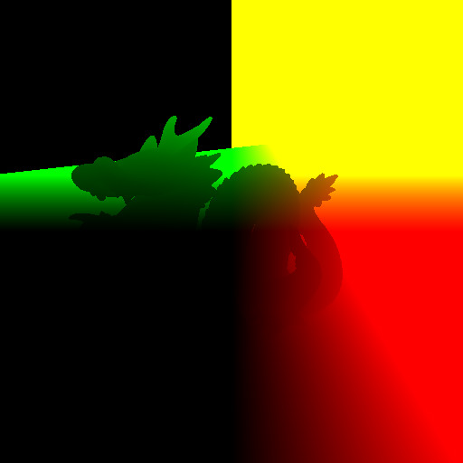

#### View Normal

```bash
glslViewer assets/dragon.obj lighting_normal.frag -e camera_position,1.43923,-0.891203,-1.98093 -l
```

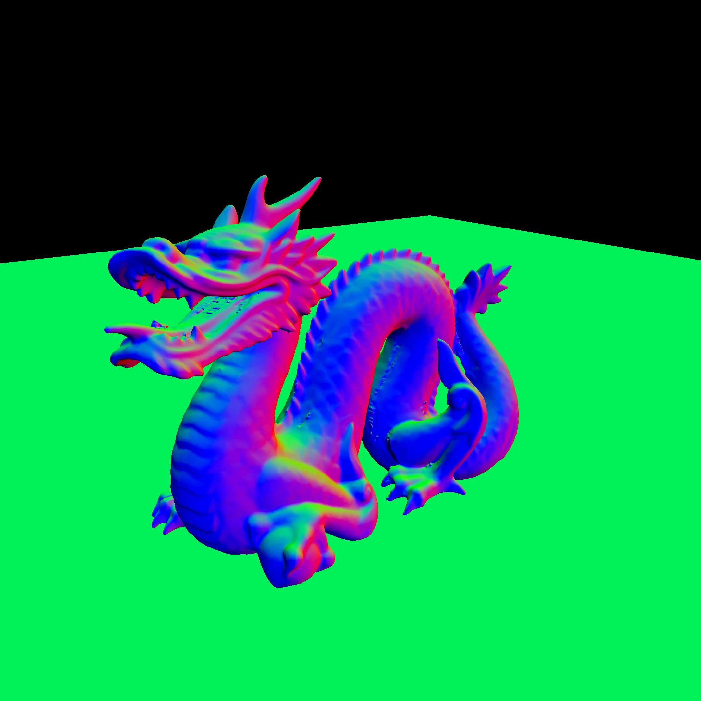

#### Shadow

```bash
glslViewer assets/dragon.obj lighting_shadow.frag -e camera_position,1.43923,-0.891203,-1.98093 -l
```

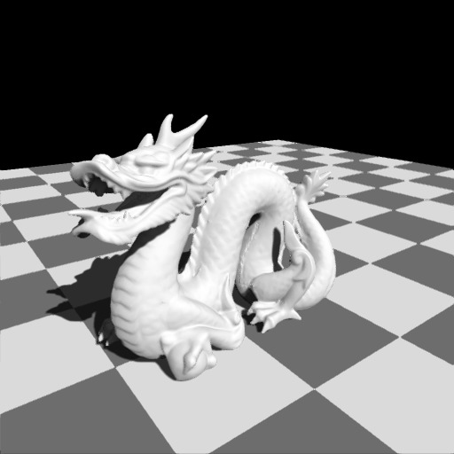


#### Spherical Harmonics

```bash
glslViewer assets/dragon.obj lighting_sphericalHarmonics.frag -e camera_position,1.43923,-0.891203,-1.98093 -c assets/uffizi_cross.hdr -l
```

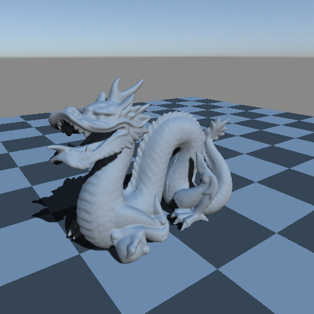

#### ScreenSpace Ambient Occlusion

```bash
glslViewer assets/dragon.obj lighting_ssao.frag -e camera_position,1.43923,-0.891203,-1.98093 -l
```


#### Gooch

```bash
glslViewer assets/dragon.obj lighting_gooch.frag -e camera_position,1.43923,-0.891203,-1.98093 -l
```

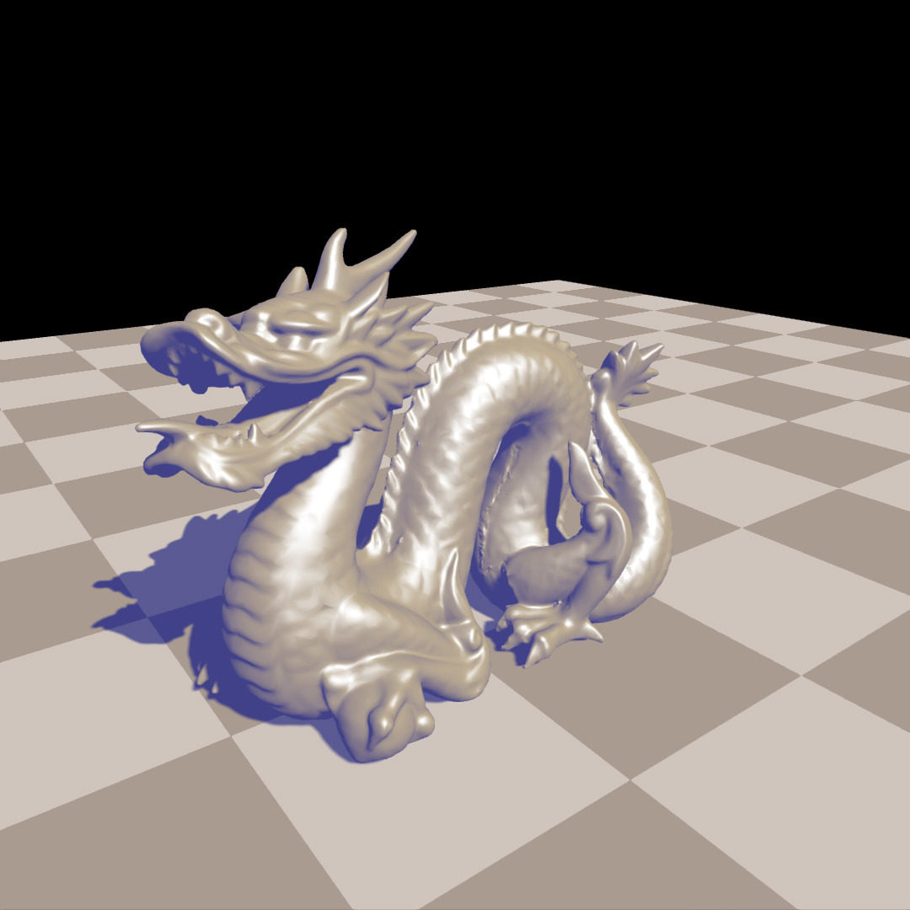


#### PBR little 

```bash
glslViewer assets/dragon.obj lighting_pbrLittle.frag -e camera_position,1.43923,-0.891203,-1.98093 -l
```

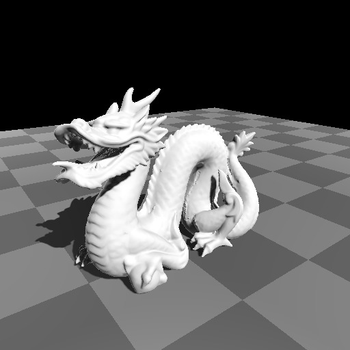


#### PBR little with cubemap

```bash
glslViewer assets/dragon.obj lighting_pbrLittle.frag -e camera_position,1.43923,-0.891203,-1.98093 -C assets/uffizi_cross.hdr -e dynamic_shadows,on -l 
```

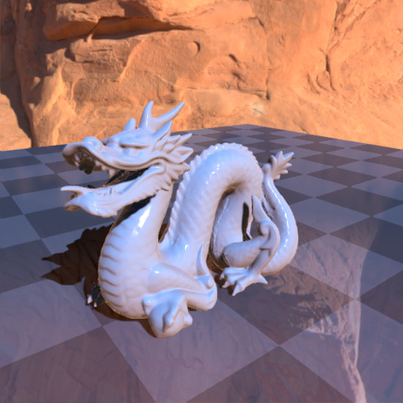

#### ScreenSpace Reflections

```bash
glslViewer assets/dragon.obj lighting_ssr.frag -e camera_position,1.43923,-0.891203,-1.98093 -C assets/uffizi_cross.hdr -l 
```

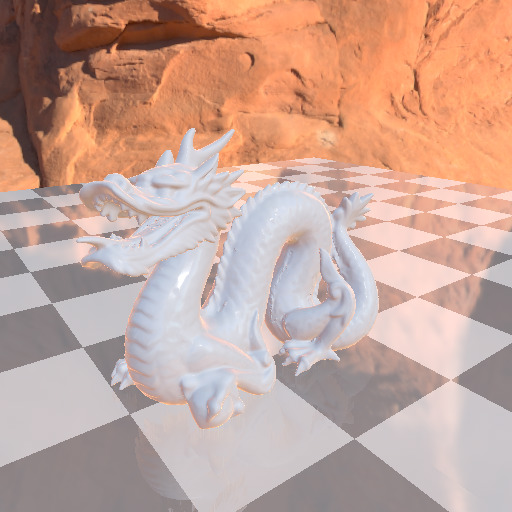


#### Raymarching 

```bash
glslViewer lighting_raymarching.frag -e camera_position,-29.5393,-26.2406,-42.1865 -l
```

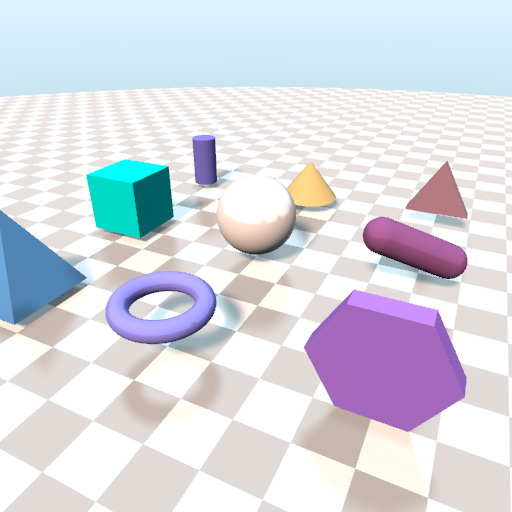


#### Raymarching custom PBR

```bash
glslViewer lighting_raymarching_pbr.frag -e camera_position,-29.5393,-26.2406,-42.1865 -l
```

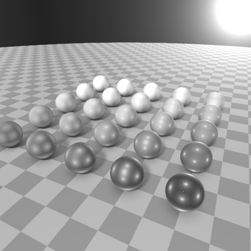


#### Raymarching custom PBR with CUBEMAP

```bash
glslViewer lighting_raymarching_pbr.frag -e camera_position,-29.5393,-26.2406,-42.1865 -C assets/uffizi_cross.hdr -l
```

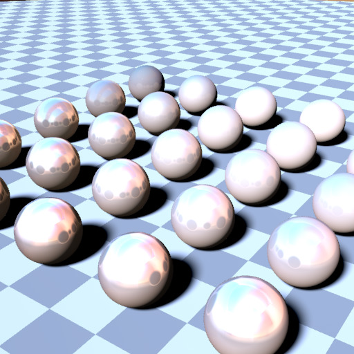


#### Raymarching custom GLASS material

```bash
glslViewer lighting_raymarching_glass.frag -e camera_position,-29.5393,-26.2406,-42.1865 -l
```

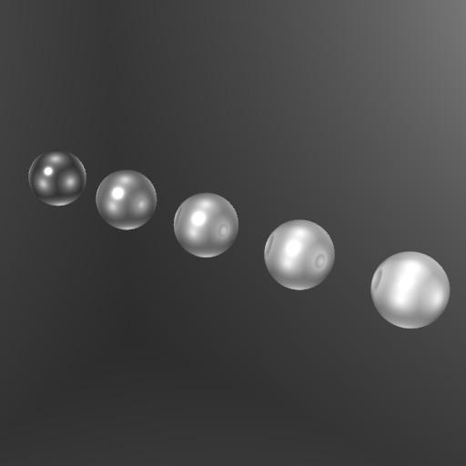


#### Raymarching custom GLASS material with CUBEMAP

```bash
glslViewer lighting_raymarching_glass.frag -e camera_position,-29.5393,-26.2406,-42.1865 -C assets/uffizi_cross.hdr -l
```

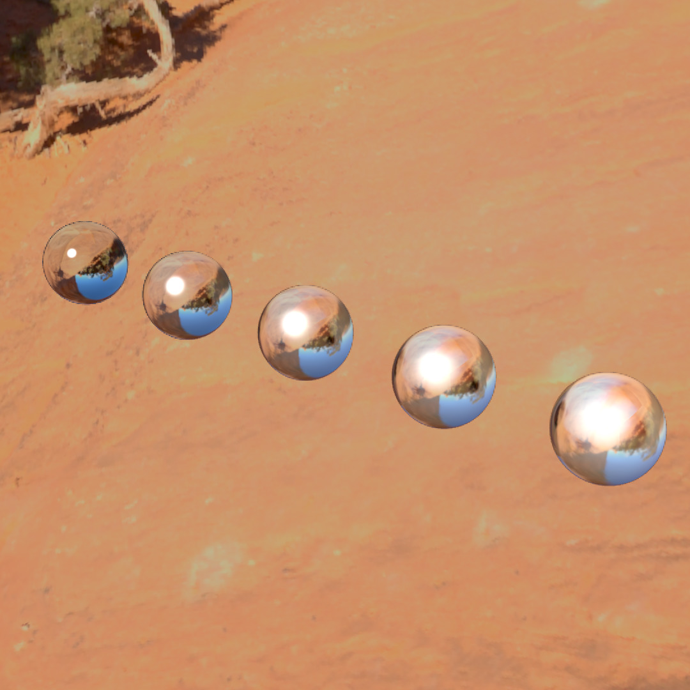


#### Raymarching efault VOLUME

```bash
glslViewer lighting_raymarching_volume.frag -e camera_position,-29.5393,-26.2406,-42.1865 -l
```

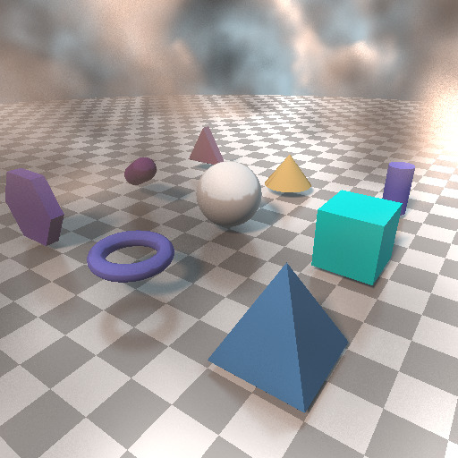

#### Atmosphere Scatering

```bash
glslViewer lighting_atmosphere.frag -l -w 1024 -h 512 -e define,PROJECTION_MODE,0
```

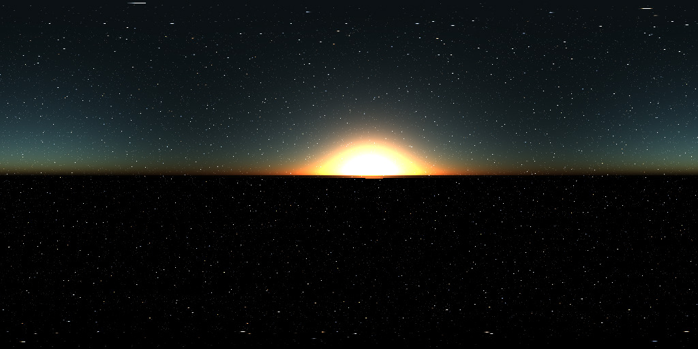


```bash
glslViewer lighting_atmosphere.frag -l -e define,PROJECTION_MODE,1
```

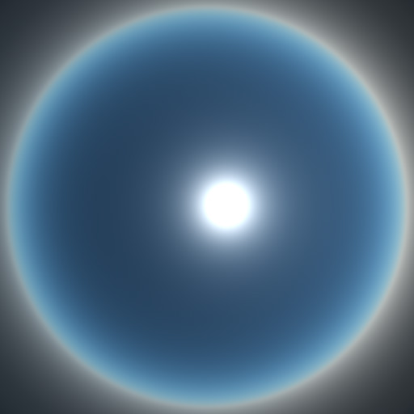
