# GLSL Viewer Examples
                
This are GLSL examples of how to use [LYGIA Shader Library](https://github.com/patriciogonzalezvivo/lygia). You can try them using:

* [glslViewer](https://github.com/patriciogonzalezvivo/glslViewer/wiki/Compiling)
* [glsl-canvas VS Code pluging](https://marketplace.visualstudio.com/items?itemName=circledev.glsl-canvas)


## How to start?

Clone this repository recursivelly

```bash
git clone --recursive https://github.com/patriciogonzalezvivo/lygia_examples.git
```

## math_functions
```bash
glslViewer math_functions.frag --msaa --width 512 --height 512 -e dynamic_shadows,on -l
```


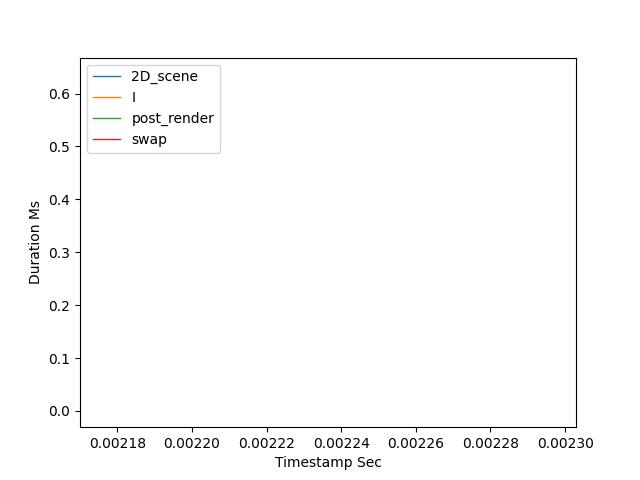

## math_gaussian
```bash
glslViewer math_gaussian.frag --msaa --width 512 --height 512 -e dynamic_shadows,on -l
```


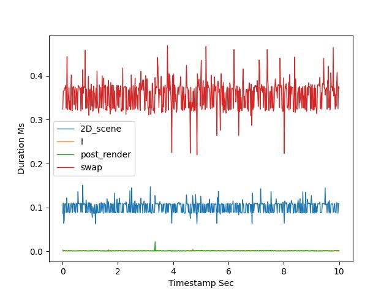

## math_quat
```bash
glslViewer math_quat.frag assets/suzanne.obj math_quat.vert --msaa --width 512 --height 512 -e dynamic_shadows,on -l
```


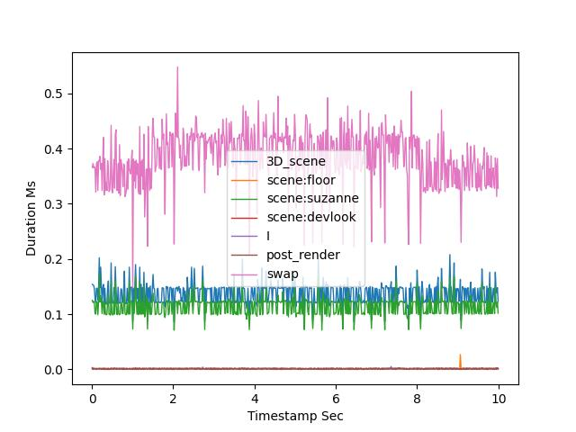

## animation_easing
```bash
glslViewer animation_easing.frag --msaa --width 512 --height 512 -e dynamic_shadows,on -l
```


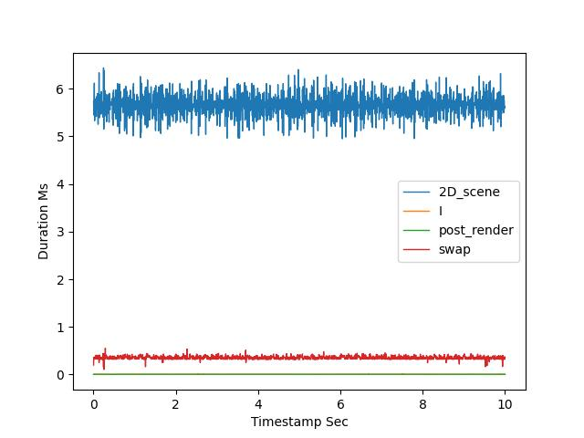

## animation_sprite
```bash
glslViewer animation_sprite.frag assets/sprite_megaman.png --msaa --width 512 --height 512 -e dynamic_shadows,on -l
```


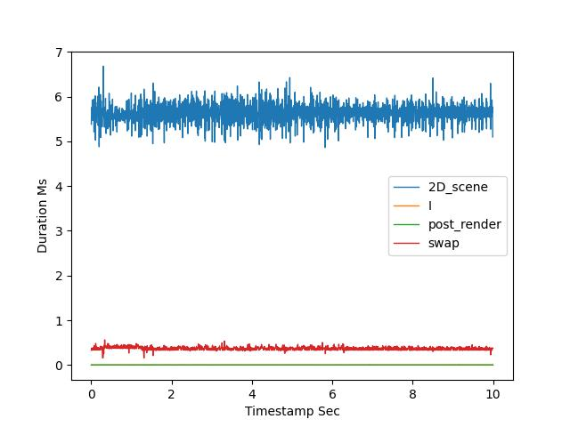

## color_brightnessContrast
```bash
glslViewer color_brightnessContrast.frag assets/danny.png --msaa --width 512 --height 512 -e dynamic_shadows,on -l
```


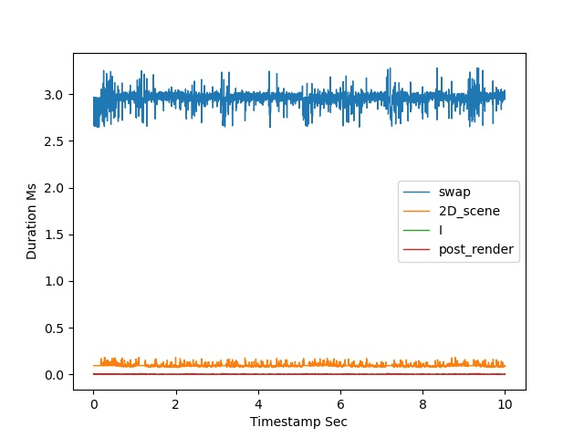

## color_brightnessContrastMatrix
```bash
glslViewer color_brightnessContrastMatrix.frag assets/danny.png --msaa --width 512 --height 512 -e dynamic_shadows,on -l
```


## color_mix
```bash
glslViewer color_mix.frag --msaa --width 512 --height 512 -e dynamic_shadows,on -l
```


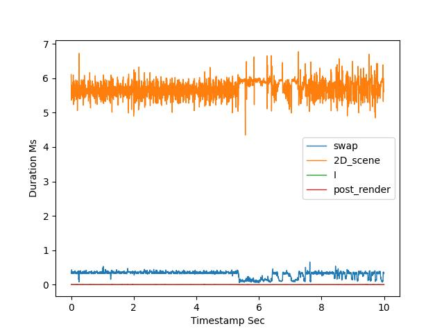

## color_lut
```bash
glslViewer color_lut.frag assets/danny.png assets/square_01.png --msaa --width 512 --height 512 -e dynamic_shadows,on -l
```


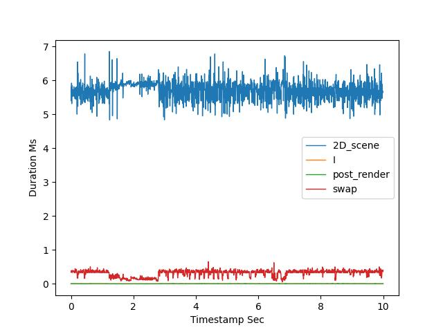

## color_dither
```bash
glslViewer color_dither.frag -u_noise assets/noise_blue.png --msaa --width 512 --height 512 -e dynamic_shadows,on -l
```


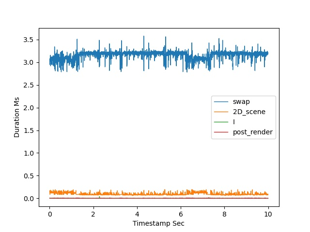

## sample_dither
```bash
glslViewer sample_dither.frag assets/danny.png --msaa --width 512 --height 512 -e dynamic_shadows,on -l
```


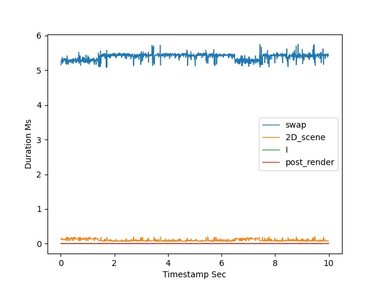

## color_iridescence_map
```bash
glslViewer color_iridescence_map.frag --msaa --width 512 --height 512 -e dynamic_shadows,on -l
```


## color_wavelength
```bash
glslViewer color_wavelength.frag --msaa --width 512 --height 512 -e dynamic_shadows,on -l
```


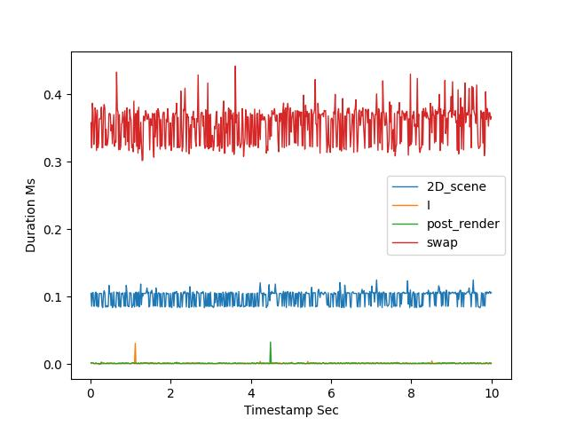

## color_wada
```bash
glslViewer color_wada.frag --msaa --width 512 --height 512 -e dynamic_shadows,on -l
```


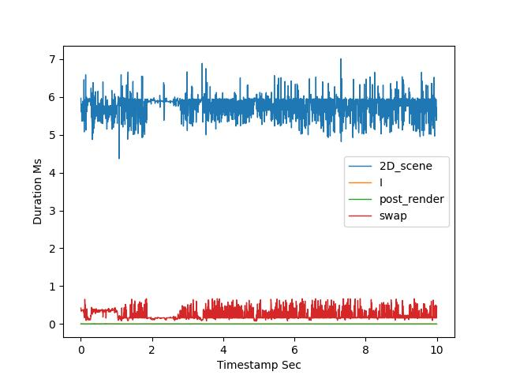

## color_wada_dyads
```bash
glslViewer color_wada_dyads.frag --msaa --width 512 --height 512 -e dynamic_shadows,on -l
```


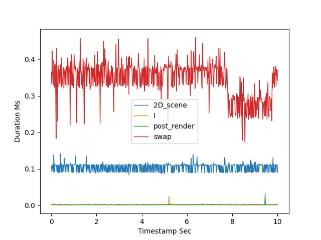

## color_wada_triads
```bash
glslViewer color_wada_triads.frag --msaa --width 512 --height 512 -e dynamic_shadows,on -l
```


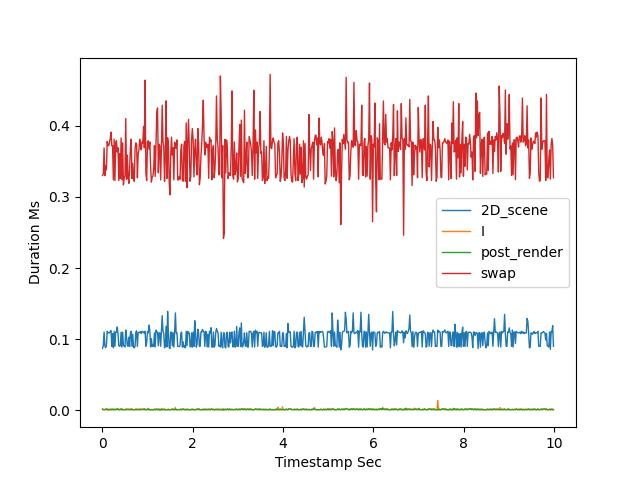

## color_wada_tetrads
```bash
glslViewer color_wada_tetrads.frag --msaa --width 512 --height 512 -e dynamic_shadows,on -l
```


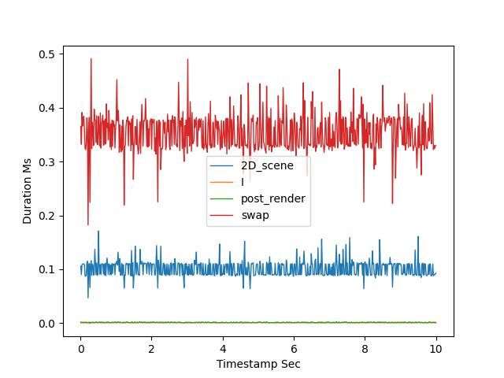

## color_pigments
```bash
glslViewer color_pigments.frag --msaa --width 512 --height 512 -e dynamic_shadows,on -l
```


## color_palette_lerp
```bash
glslViewer color_palette_lerp.frag --msaa --width 512 --height 512 -e dynamic_shadows,on -l
```


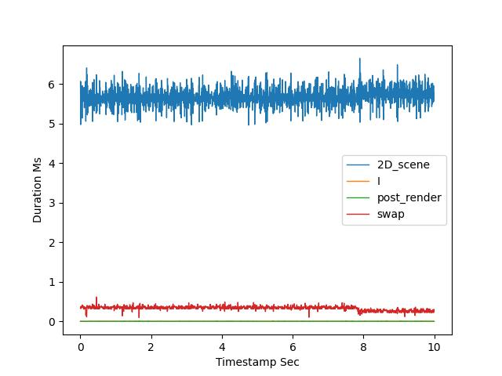

## color_ryb
```bash
glslViewer color_ryb.frag --msaa --width 512 --height 512 -e dynamic_shadows,on -l
```


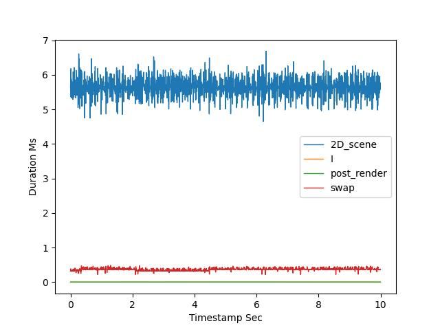

## color_zorn
```bash
glslViewer color_zorn.frag --msaa --width 512 --height 512 -e dynamic_shadows,on -l
```


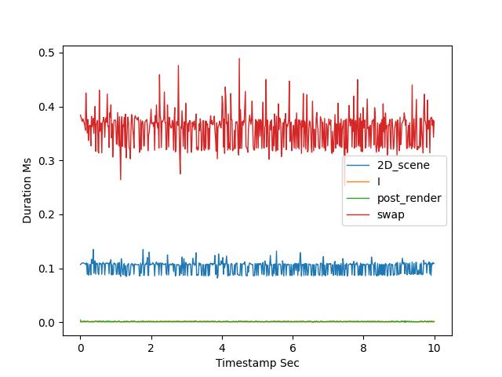

## color_mix_ryb
```bash
glslViewer color_mix_ryb.frag --msaa --width 512 --height 512 -e dynamic_shadows,on -l
```


## distort_pincushion
```bash
glslViewer distort_pincushion.frag assets/danny.png --msaa --width 512 --height 512 -e dynamic_shadows,on -l
```


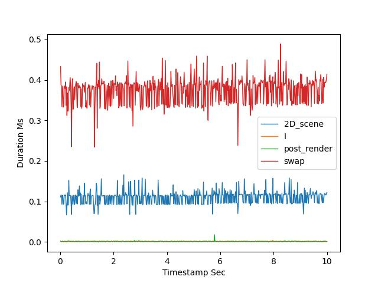

## draw_digits
```bash
glslViewer draw_digits.frag --msaa --width 512 --height 512 -e dynamic_shadows,on -l
```


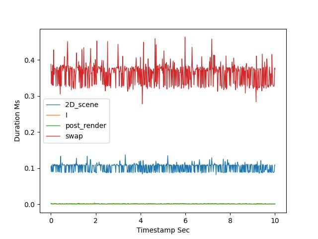

## draw_aa
```bash
glslViewer draw_aa.frag --msaa --width 512 --height 512 -e dynamic_shadows,on -l
```


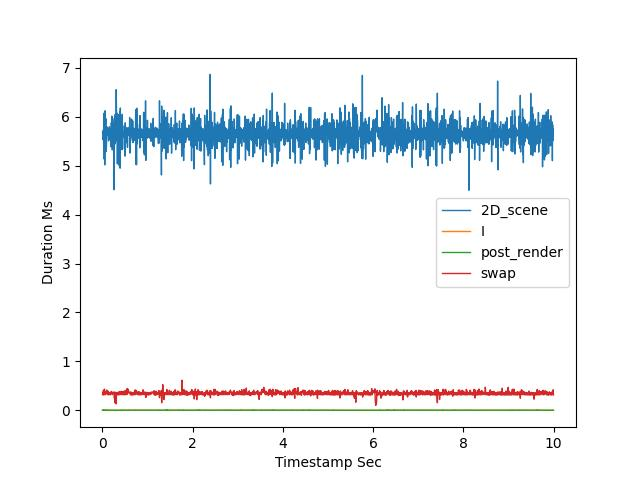

## draw_shapes
```bash
glslViewer draw_shapes.frag --msaa --width 512 --height 512 -e dynamic_shadows,on -l
```


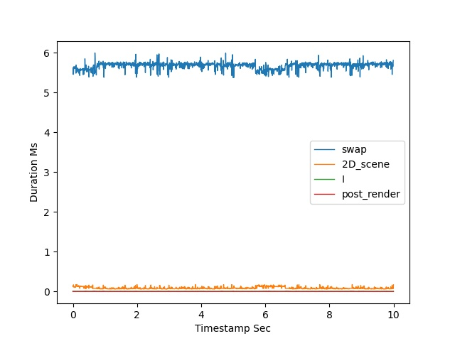

## draw_supershape
```bash
glslViewer draw_supershape.frag --msaa --width 512 --height 512 -e dynamic_shadows,on -l
```


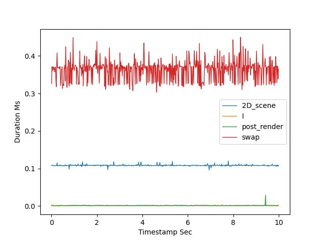

## draw_tiles
```bash
glslViewer draw_tiles.frag --msaa --width 512 --height 512 -e dynamic_shadows,on -l
```


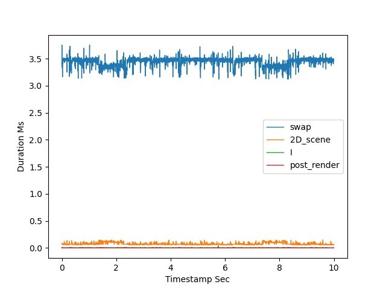

## draw_koch
```bash
glslViewer draw_koch.frag --msaa --width 512 --height 512 -e dynamic_shadows,on -l
```


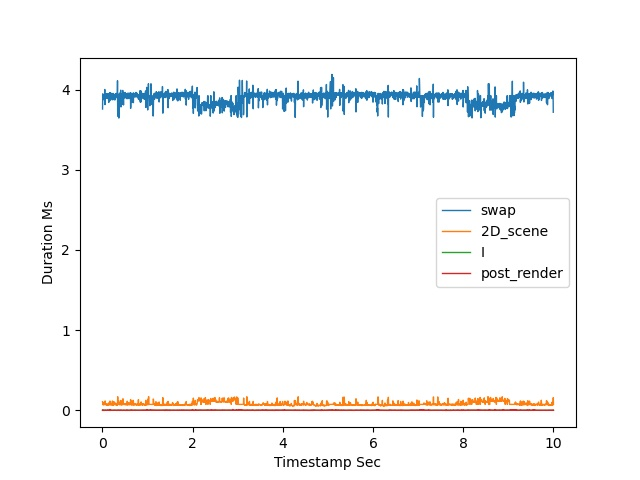

## draw_julia
```bash
glslViewer draw_julia.frag --msaa --width 512 --height 512 -e dynamic_shadows,on -l
```


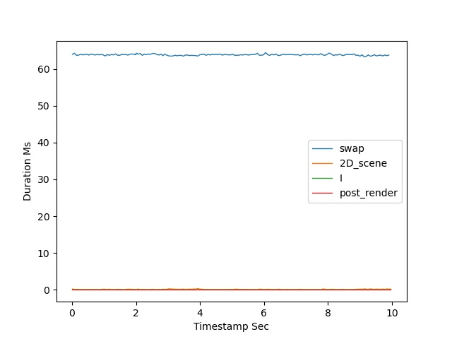

## draw_mandelbulb
```bash
glslViewer draw_mandelbulb.frag --msaa --width 512 --height 512 -e dynamic_shadows,on -l
```


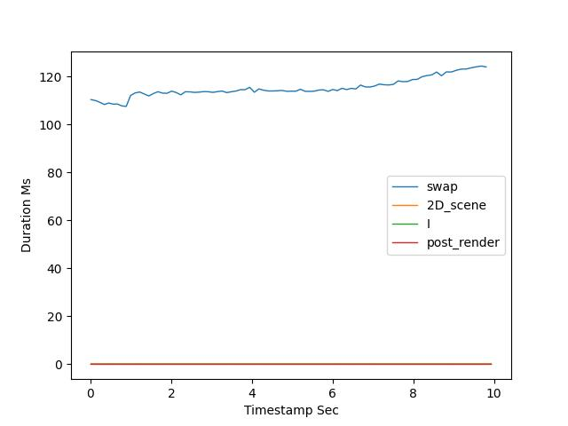

## draw_colorChecker
```bash
glslViewer draw_colorChecker.frag --msaa --width 512 --height 512 -e dynamic_shadows,on -l
```


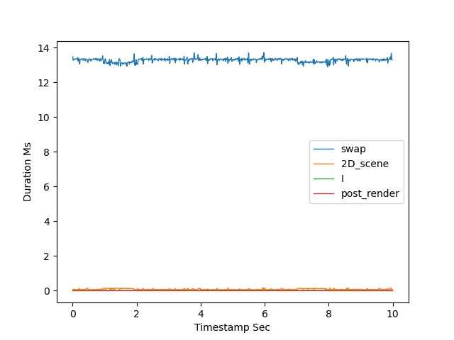

## generative_random
```bash
glslViewer generative_random.frag --msaa --width 512 --height 512 -e dynamic_shadows,on -l
```


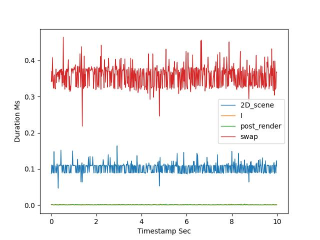

## generative_cnoise
```bash
glslViewer generative_cnoise.frag --msaa --width 512 --height 512 -e dynamic_shadows,on -l
```


## generative_pnoise
```bash
glslViewer generative_pnoise.frag --msaa --width 512 --height 512 -e dynamic_shadows,on -l
```


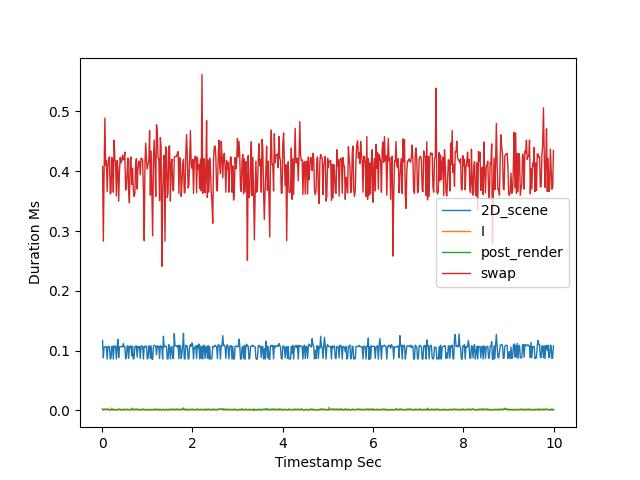

## generative_snoise
```bash
glslViewer generative_snoise.frag --msaa --width 512 --height 512 -e dynamic_shadows,on -l
```


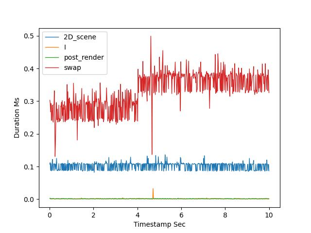

## generative_psrdnoise
```bash
glslViewer generative_psrdnoise.frag assets/sphere.ply --msaa --width 512 --height 512 -e dynamic_shadows,on -l
```


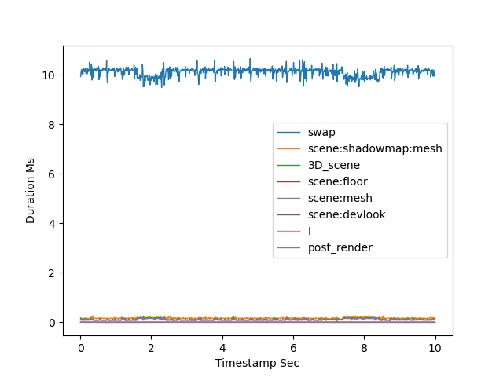

## generative_noised
```bash
glslViewer generative_noised.frag --msaa --width 512 --height 512 -e dynamic_shadows,on -l
```


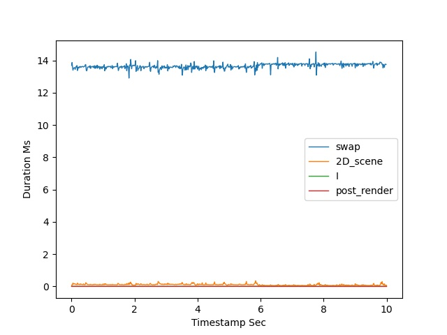

## generative_curl
```bash
glslViewer generative_curl.frag --msaa --width 512 --height 512 -e dynamic_shadows,on -l
```


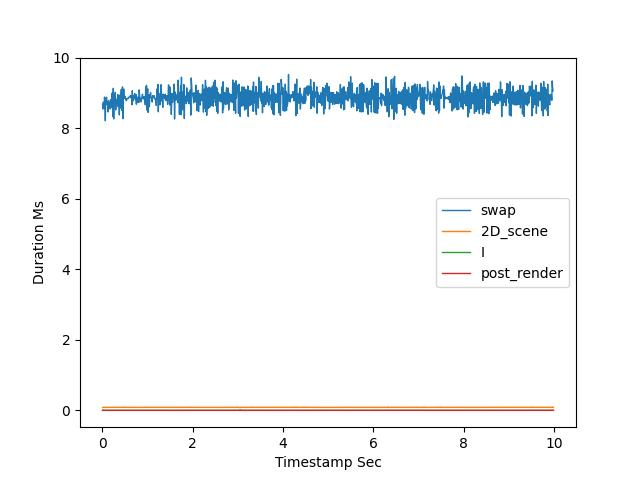

## generative_fbm
```bash
glslViewer generative_fbm.frag --msaa --width 512 --height 512 -e dynamic_shadows,on -l
```


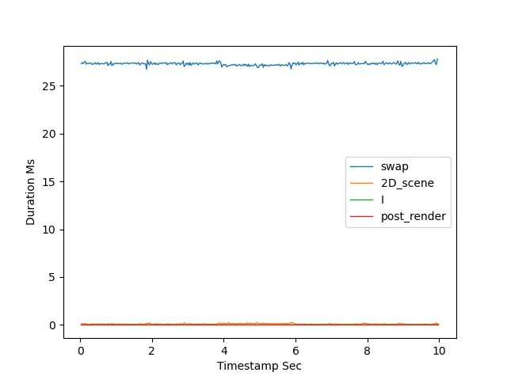

## generative_voronoi
```bash
glslViewer generative_voronoi.frag --msaa --width 512 --height 512 -e dynamic_shadows,on -l
```


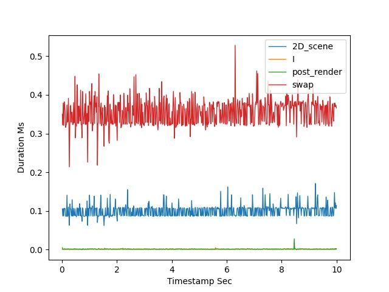

## generative_voronoise
```bash
glslViewer generative_voronoise.frag --msaa --width 512 --height 512 -e dynamic_shadows,on -l
```


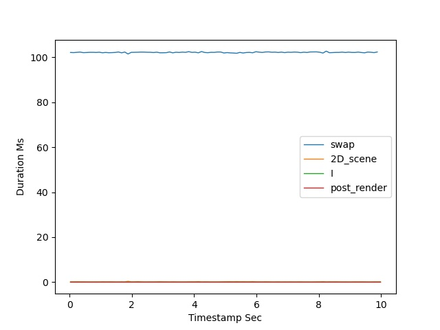

## generative_wavelet
```bash
glslViewer generative_wavelet.frag --msaa --width 512 --height 512 -e dynamic_shadows,on -l
```


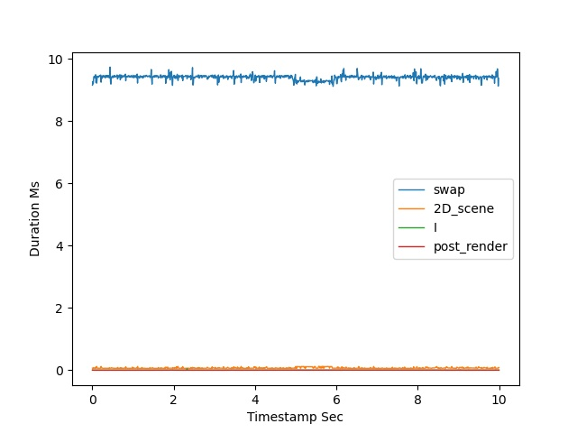

## generative_worley
```bash
glslViewer generative_worley.frag --msaa --width 512 --height 512 -e dynamic_shadows,on -l
```


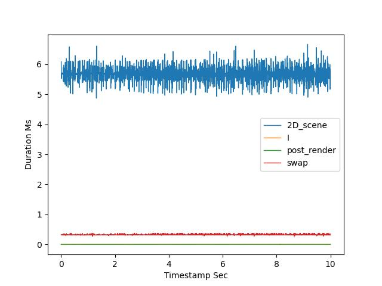

## filter_boxBlur1D
```bash
glslViewer filter_boxBlur1D.frag assets/danny.png --msaa --width 512 --height 512 -e dynamic_shadows,on -l
```


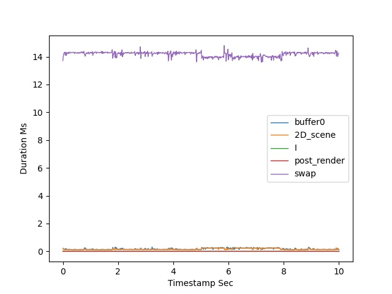

## filter_boxBlur2D
```bash
glslViewer filter_boxBlur2D.frag assets/danny.png --msaa --width 512 --height 512 -e dynamic_shadows,on -l
```


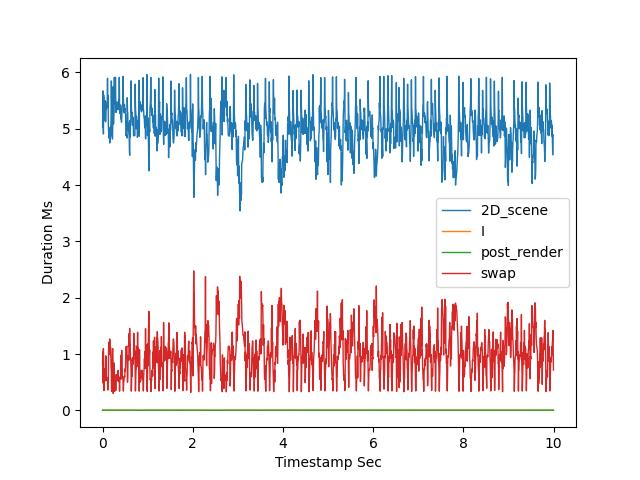

## filter_fibonacciBokeh
```bash
glslViewer filter_fibonacciBokeh.frag assets/danny.png --msaa --width 512 --height 512 -e dynamic_shadows,on -l
```


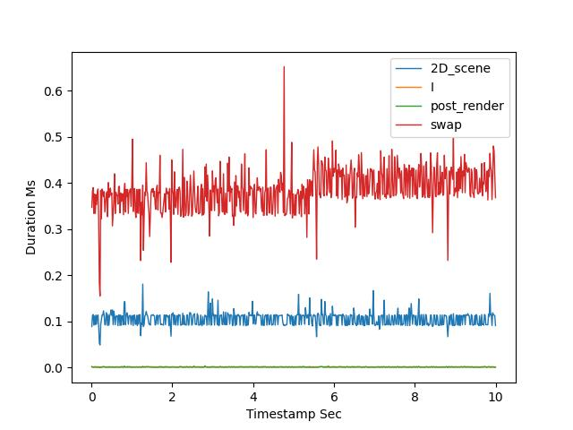

## filter_gaussianBlur1D
```bash
glslViewer filter_gaussianBlur1D.frag assets/danny.png --msaa --width 512 --height 512 -e dynamic_shadows,on -l
```


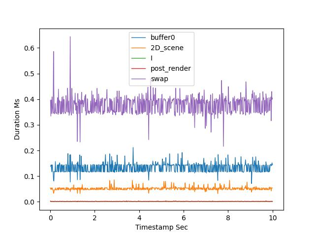

## filter_gaussianBlur2D
```bash
glslViewer filter_gaussianBlur2D.frag assets/danny.png --msaa --width 512 --height 512 -e dynamic_shadows,on -l
```


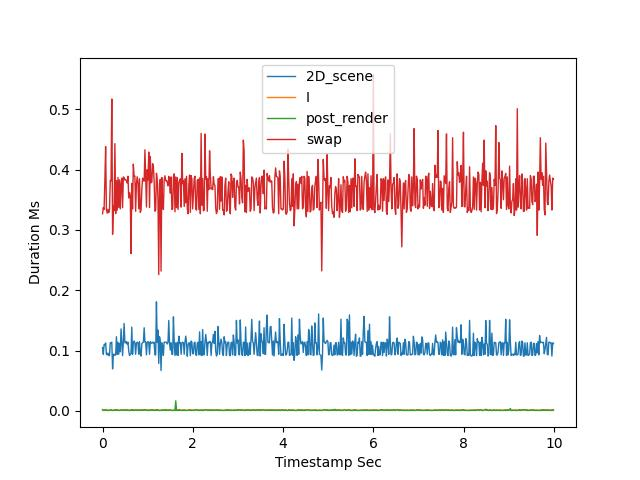

## filter_bilateral2D
```bash
glslViewer filter_bilateral2D.frag assets/danny.png --msaa --width 512 --height 512 -e dynamic_shadows,on -l
```


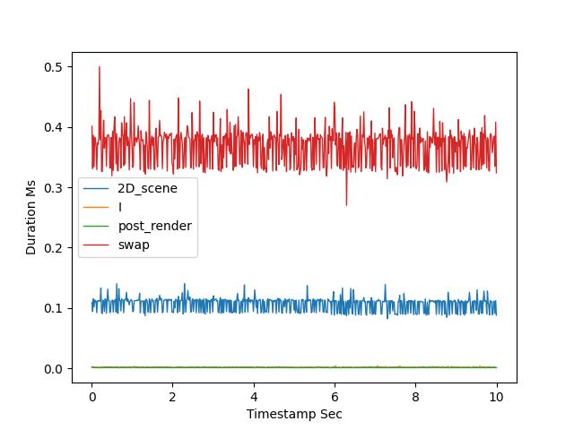

## filter_radialBlur2D
```bash
glslViewer filter_radialBlur2D.frag assets/danny.png --msaa --width 512 --height 512 -e dynamic_shadows,on -l
```


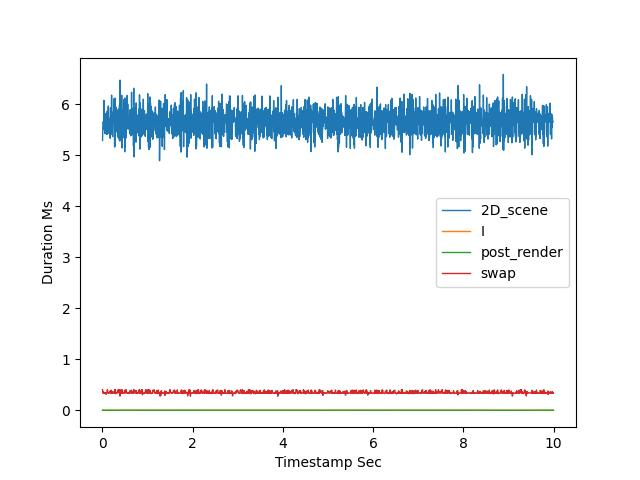

## filter_noiseBlur2D
```bash
glslViewer filter_noiseBlur2D.frag -u_tex0 assets/danny.png -u_noise assets/noise_blue.png --msaa --width 512 --height 512 -e dynamic_shadows,on -l
```


## filter_median2D
```bash
glslViewer filter_median2D.frag assets/danny.png --msaa --width 512 --height 512 -e dynamic_shadows,on -l
```


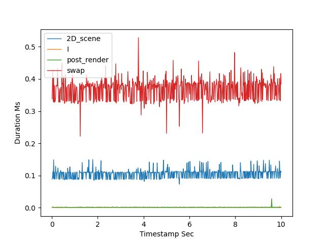

## filter_kuwahara2D
```bash
glslViewer filter_kuwahara2D.frag assets/danny.png --msaa --width 512 --height 512 -e dynamic_shadows,on -l
```


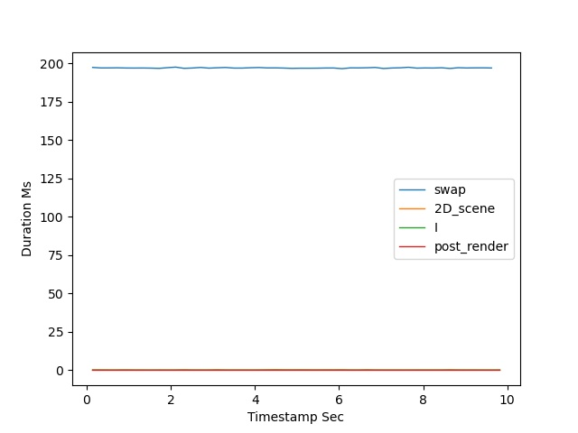

## filter_sharpen2D
```bash
glslViewer filter_sharpen2D.frag assets/danny.png --msaa --width 512 --height 512 -e dynamic_shadows,on -l
```


## filter_laplacian2D
```bash
glslViewer filter_laplacian2D.frag assets/danny.png --msaa --width 512 --height 512 -e dynamic_shadows,on -l
```


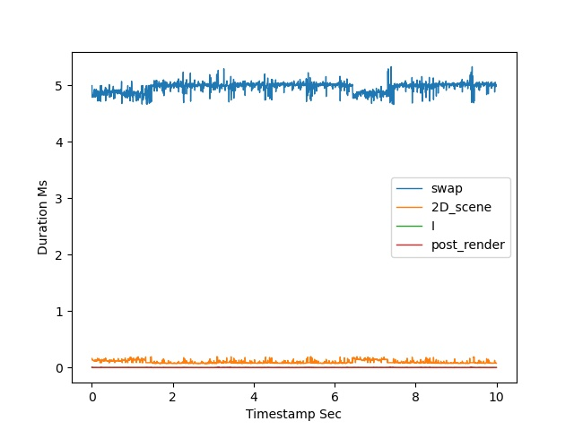

## filter_edge2D
```bash
glslViewer filter_edge2D.frag assets/danny.png --msaa --width 512 --height 512 -e dynamic_shadows,on -l
```


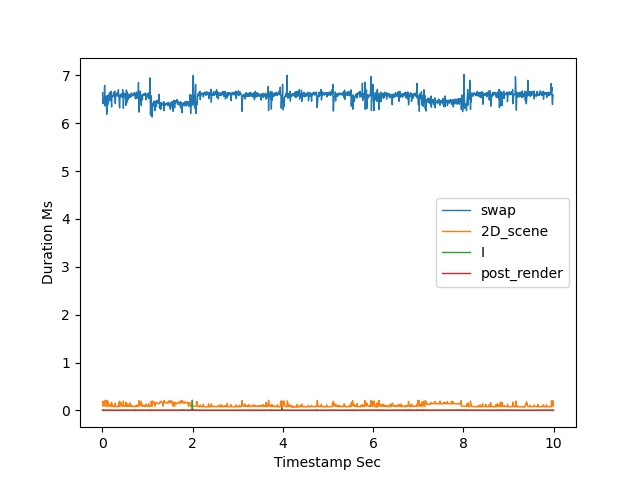

## filter_bilinear2D
```bash
glslViewer filter_bilinear2D.frag assets/danny.png --msaa --width 512 --height 512 -e dynamic_shadows,on -l
```


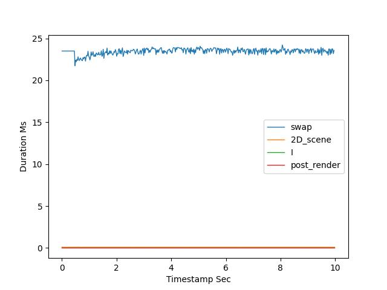

## sample_dof
```bash
glslViewer sample_dof.frag assets/dragon.obj  -e camera_position,-1.43923,0.891203,1.98093 --msaa --width 512 --height 512 -e dynamic_shadows,on -C assets/Arches_E_PineTree_3k.hdr -l
```


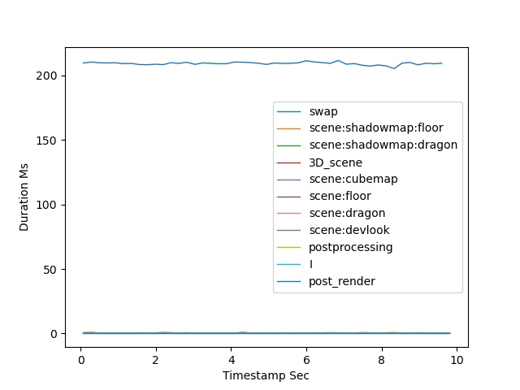

## sample_bracketing
```bash
glslViewer sample_bracketing.frag assets/rock_moss.jpg --msaa --width 512 --height 512 -e dynamic_shadows,on -l
```


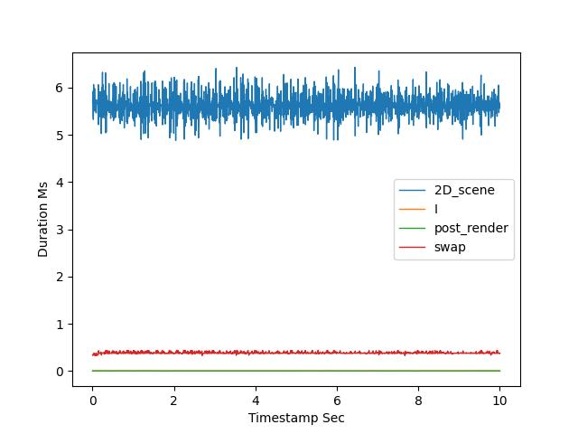

## sample_wrap
```bash
glslViewer sample_wrap.frag assets/rocks.png --msaa --width 512 --height 512 -e dynamic_shadows,on -l
```


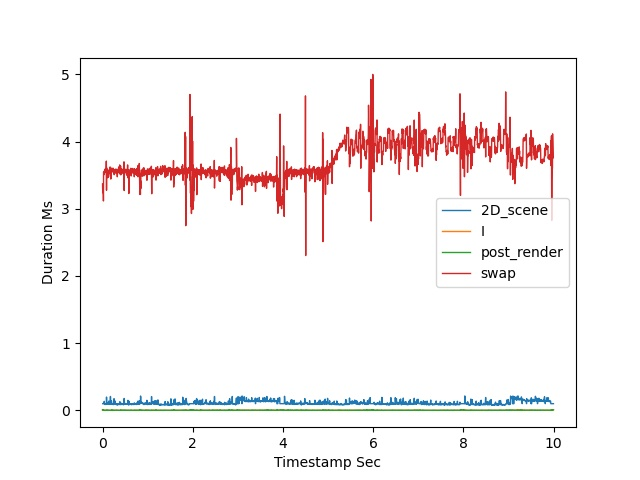

## sample_wrap_repeat
```bash
glslViewer sample_wrap_repeat.frag assets/rocks.png --msaa --width 512 --height 512 -e dynamic_shadows,on -l
```


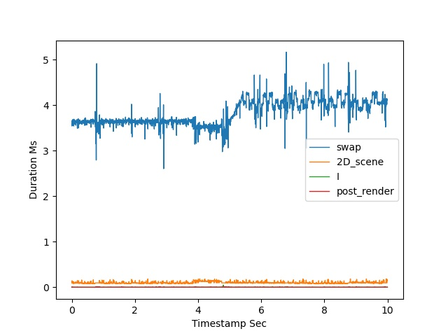

## sample_wrap_clamp
```bash
glslViewer sample_wrap_clamp.frag assets/rocks.png --msaa --width 512 --height 512 -e dynamic_shadows,on -l
```


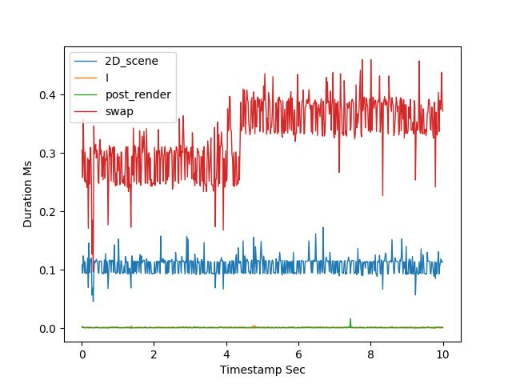

## sample_wrap_mirror
```bash
glslViewer sample_wrap_mirror.frag assets/rocks.png --msaa --width 512 --height 512 -e dynamic_shadows,on -l
```


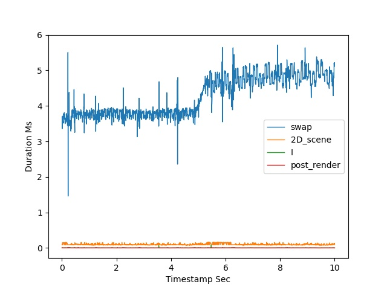

## sample_wrap_untile
```bash
glslViewer sample_wrap_untile.frag assets/rocks.png --msaa --width 512 --height 512 -e dynamic_shadows,on -l
```


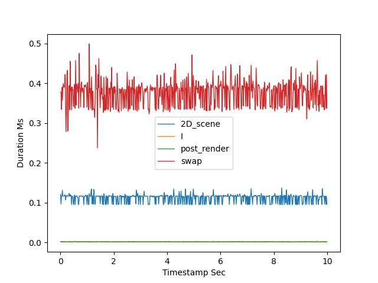

## sample_wrap_zero
```bash
glslViewer sample_wrap_zero.frag assets/rocks.png --msaa --width 512 --height 512 -e dynamic_shadows,on -l
```


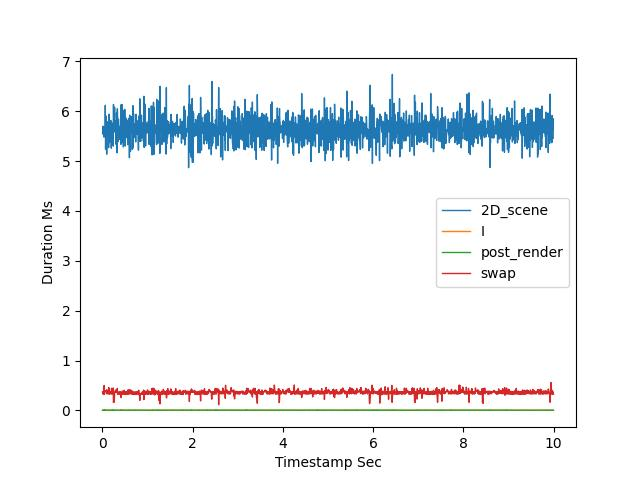

## sample_filter_bicubic
```bash
glslViewer sample_filter_bicubic.frag assets/noise_blue.png --msaa --width 512 --height 512 -e dynamic_shadows,on -l
```


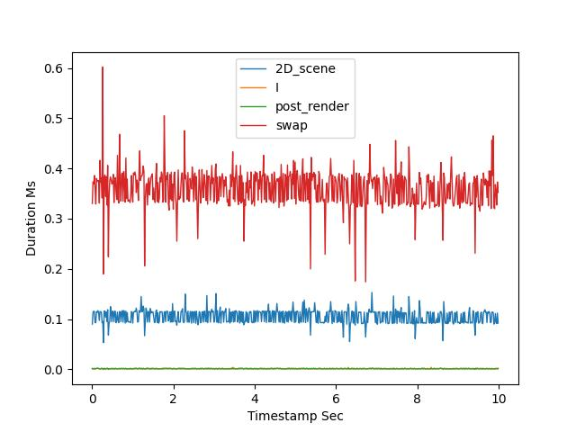

## sample_filter_nearest
```bash
glslViewer sample_filter_nearest.frag assets/noise_blue.png --msaa --width 512 --height 512 -e dynamic_shadows,on -l
```


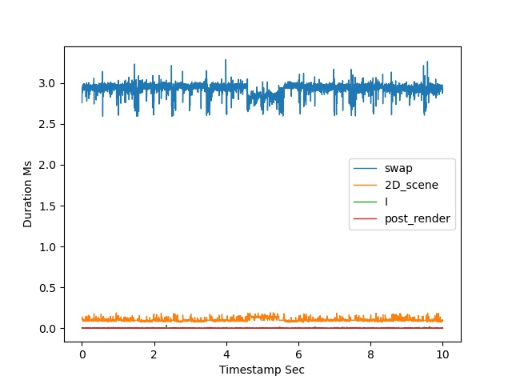

## sample_filter_smooth
```bash
glslViewer sample_filter_smooth.frag assets/noise_blue.png --msaa --width 512 --height 512 -e dynamic_shadows,on -l
```


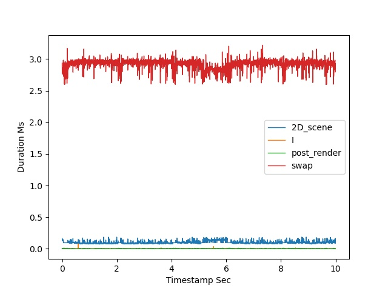

## sample_equirect
```bash
glslViewer sample_equirect.frag assets/dragon.obj assets/studio.png  -e camera_position,-1.43923,0.891203,1.98093  -e define,SCENE_CUBEMAP,u_tex0 --msaa --width 512 --height 512 -e dynamic_shadows,on -l
```


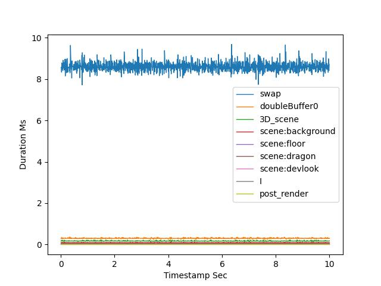

## sample_3Dsdf
```bash
glslViewer sample_3Dsdf.frag assets/suzanne.png  -e camera_position,-29.5393,26.2406,-42.1865 --msaa --width 512 --height 512 -e dynamic_shadows,on -l
```


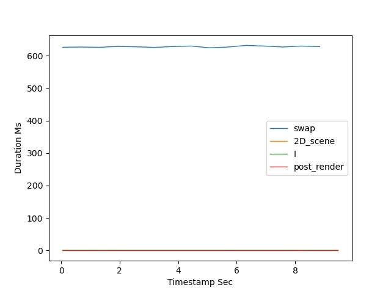

## sample_triplanar
```bash
glslViewer sample_triplanar.frag assets/suzanne.obj assets/rock_moss.jpg --msaa --width 512 --height 512 -e dynamic_shadows,on -l
```


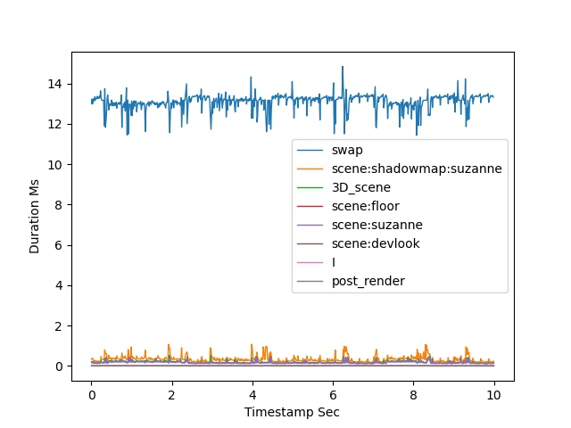

## morphological_erosion
```bash
glslViewer morphological_erosion.frag assets/flower.png --msaa --width 512 --height 512 -e dynamic_shadows,on -l
```


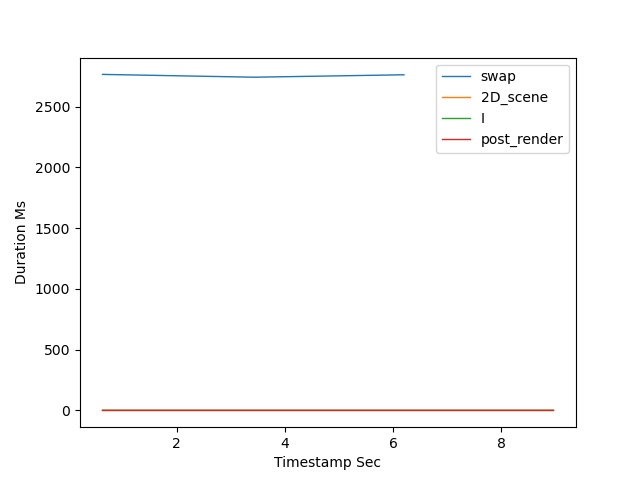

## morphological_dilation
```bash
glslViewer morphological_dilation.frag assets/flower.png --msaa --width 512 --height 512 -e dynamic_shadows,on -l
```


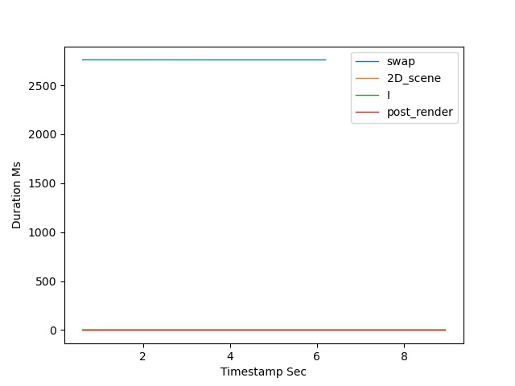

## morphological_alphaFill
```bash
glslViewer morphological_alphaFill.frag assets/flower.png --msaa --width 512 --height 512 -e dynamic_shadows,on -l
```


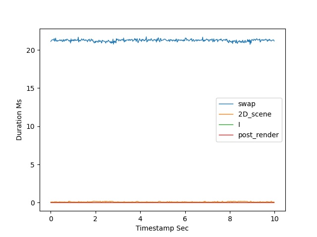

## morphological_poissonFill
```bash
glslViewer morphological_poissonFill.frag assets/flower.png --msaa --width 512 --height 512 -e dynamic_shadows,on -l
```


## morphological_marchinSquares
```bash
glslViewer morphological_marchinSquares.frag assets/flower.png --msaa --width 512 --height 512 -e dynamic_shadows,on -l
```


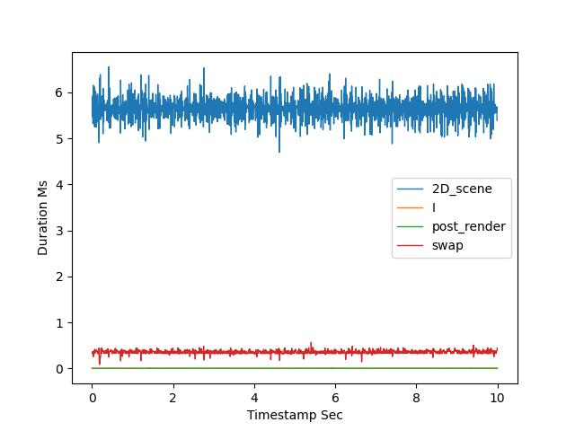

## lighting_position
```bash
glslViewer lighting_position.frag assets/dragon.obj  -e camera_position,-1.43923,0.891203,1.98093 --msaa --width 512 --height 512 -e dynamic_shadows,on -l
```


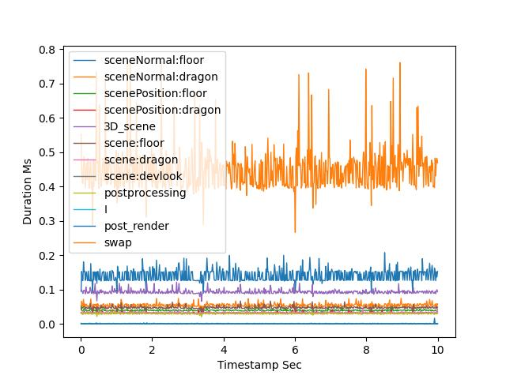

## lighting_normal
```bash
glslViewer lighting_normal.frag assets/dragon.obj  -e camera_position,-1.43923,0.891203,1.98093 --msaa --width 512 --height 512 -e dynamic_shadows,on -l
```


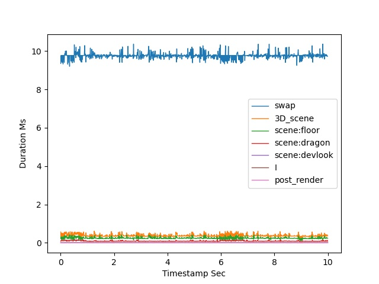

## lighting_gooch
```bash
glslViewer lighting_gooch.frag assets/dragon.obj  -e camera_position,-1.43923,0.891203,1.98093 --msaa --width 512 --height 512 -e dynamic_shadows,on -l
```


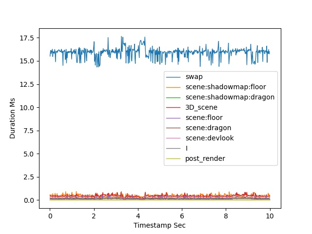

## lighting_pbrLittle
```bash
glslViewer lighting_pbrLittle.frag assets/dragon.obj  -e camera_position,-1.43923,0.891203,1.98093 --msaa --width 512 --height 512 -e dynamic_shadows,on -l
```


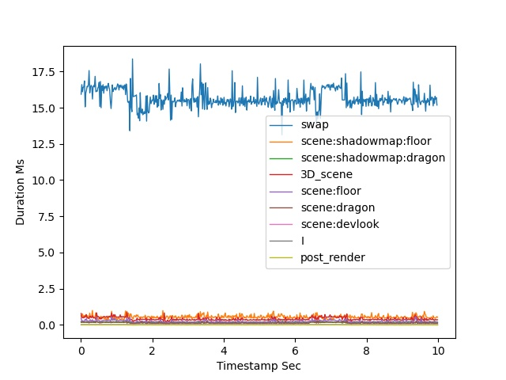

## lighting_pbrLittle_cubemap
```bash
glslViewer lighting_pbrLittle.frag assets/dragon.obj  -e camera_position,-1.43923,0.891203,1.98093 --msaa --width 512 --height 512 -e dynamic_shadows,on -C assets/Arches_E_PineTree_3k.hdr -l
```


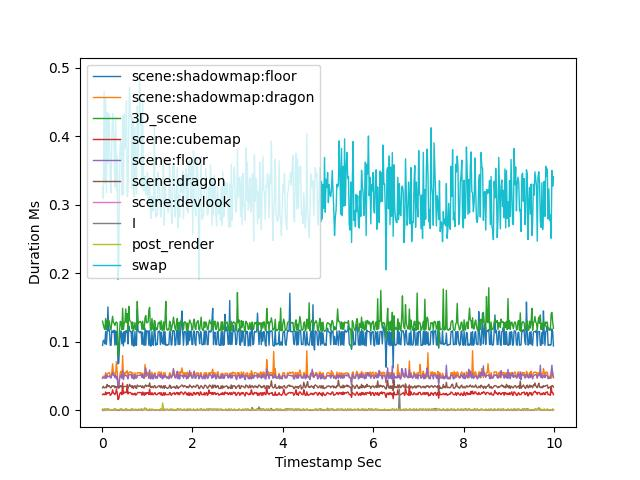

## lighting_pbrLittle_deferred
```bash
glslViewer lighting_pbrLittle_deferred.frag assets/dragon.obj  -e camera_position,-1.43923,0.891203,1.98093 --msaa --width 512 --height 512 -e dynamic_shadows,on -l
```


## lighting_pbr
```bash
glslViewer lighting_pbr.frag assets/dragon.obj  -e camera_position,-1.43923,0.891203,1.98093 --msaa --width 512 --height 512 -e dynamic_shadows,on -l
```


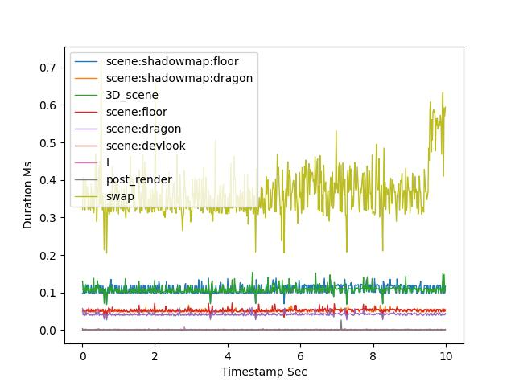

## lighting_pbr_cubemap
```bash
glslViewer lighting_pbr.frag assets/dragon.obj  -e camera_position,-1.43923,0.891203,1.98093 --msaa --width 512 --height 512 -e dynamic_shadows,on -C assets/Arches_E_PineTree_3k.hdr -l
```


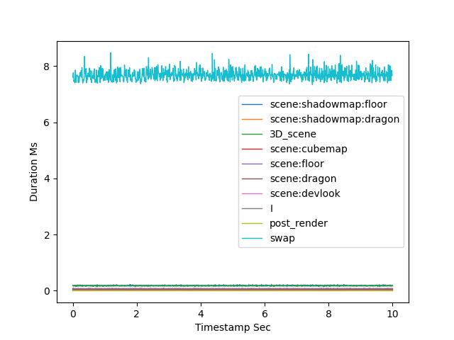

## lighting_pbr_lights
```bash
glslViewer lighting_pbr_lights.frag assets/dragon.obj  -e camera_position,-1.43923,0.891203,1.98093 --msaa --width 512 --height 512 -e dynamic_shadows,on -l
```


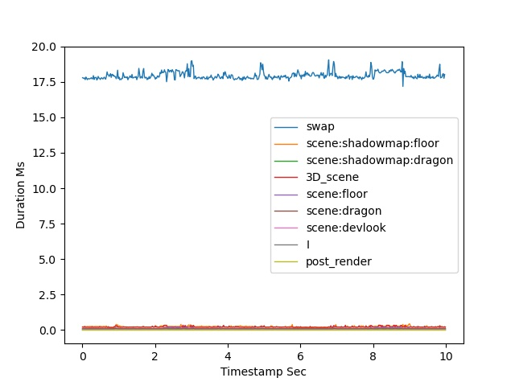

## lighting_pbr_dynamic
```bash
glslViewer lighting_pbr_dynamic.frag assets/dragon.obj lighting_pbr_dynamic.vert  -e camera_position,-1.43923,0.891203,1.98093 --msaa --width 512 --height 512 -e dynamic_shadows,on -l
```


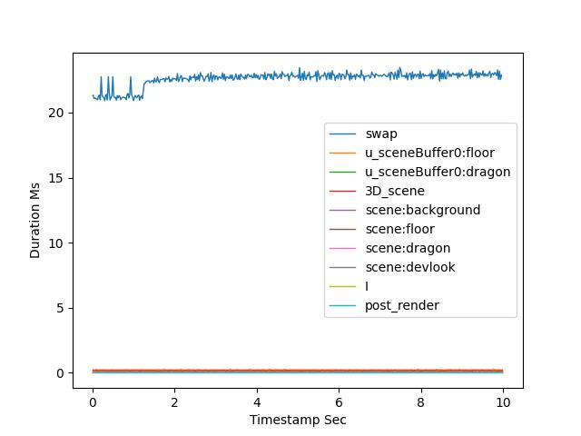

## lighting_pbrClearCoat
```bash
glslViewer lighting_pbrClearCoat.frag assets/dragon.obj  -e camera_position,-1.43923,0.891203,1.98093 --msaa --width 512 --height 512 -e dynamic_shadows,on -l
```


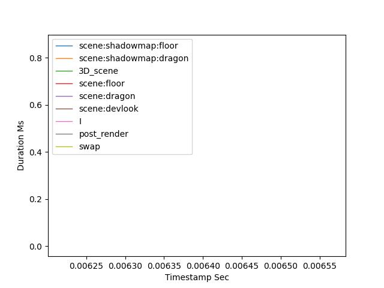

## lighting_pbrClearCoat_cubemap
```bash
glslViewer lighting_pbrClearCoat.frag assets/dragon.obj  -e camera_position,-1.43923,0.891203,1.98093 --msaa --width 512 --height 512 -e dynamic_shadows,on -C assets/Arches_E_PineTree_3k.hdr -l
```


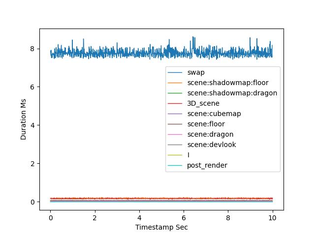

## lighting_pbrIridescence
```bash
glslViewer lighting_pbrIridescence.frag assets/IridescenceSuzanne.glb  -e camera_position,-5.34446,3.96689,5.76653 --msaa --width 512 --height 512 -e dynamic_shadows,on -l
```


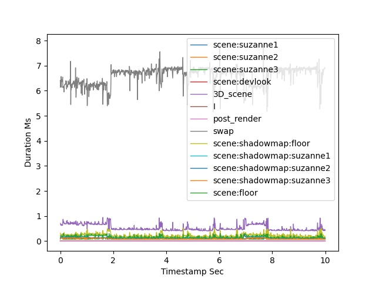

## lighting_pbrIridescence_cubemap
```bash
glslViewer lighting_pbrIridescence.frag assets/IridescenceSuzanne.glb  -e camera_position,-5.34446,3.96689,5.76653 --msaa --width 512 --height 512 -e dynamic_shadows,on -C assets/Arches_E_PineTree_3k.hdr -l
```


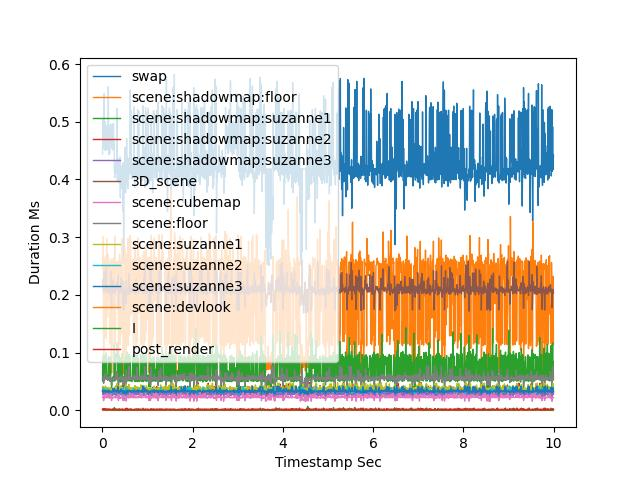

## lighting_pbrGlass
```bash
glslViewer lighting_pbrGlass.frag assets/dragon.obj  -e camera_position,-1.43923,0.891203,1.98093 --msaa --width 512 --height 512 -e dynamic_shadows,on -l
```


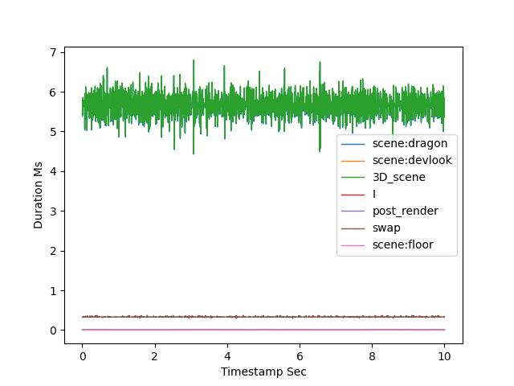

## lighting_pbrGlass_cubemap
```bash
glslViewer lighting_pbrGlass.frag assets/dragon.obj  -e camera_position,-1.43923,0.891203,1.98093 --msaa --width 512 --height 512 -e dynamic_shadows,on -C assets/Arches_E_PineTree_3k.hdr -l
```


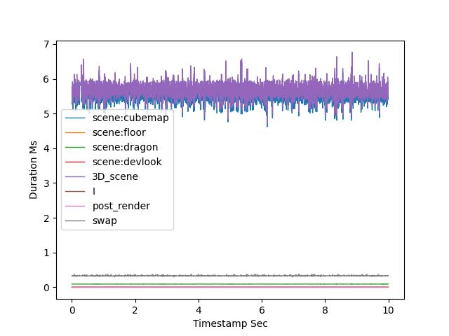

## lighting_pbrSsS
```bash
glslViewer lighting_pbrSsS.frag assets/dragon.obj  -e camera_position,-1.43923,0.891203,1.98093 --msaa --width 512 --height 512 -e dynamic_shadows,on -l
```


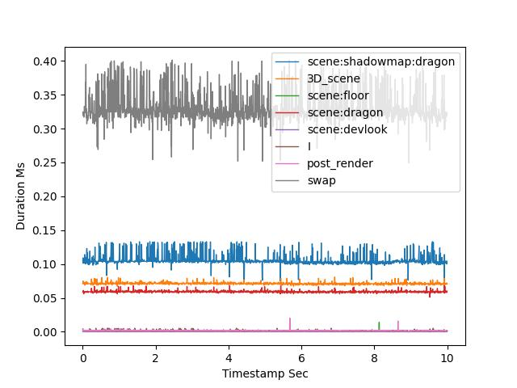

## lighting_pbrSsS_cubemap
```bash
glslViewer lighting_pbrSsS.frag assets/dragon.obj  -e camera_position,-1.43923,0.891203,1.98093 --msaa --width 512 --height 512 -e dynamic_shadows,on -C assets/Arches_E_PineTree_3k.hdr -l
```


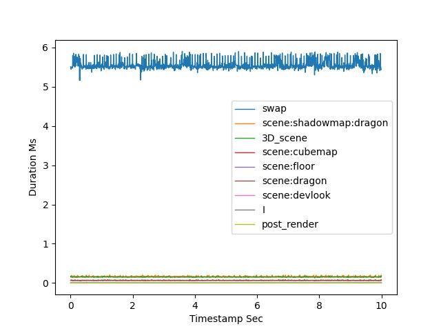

## lighting_shadow
```bash
glslViewer lighting_shadow.frag assets/dragon.obj  -e camera_position,-1.43923,0.891203,1.98093 --msaa --width 512 --height 512 -e dynamic_shadows,on -l
```


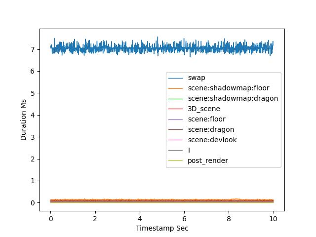

## lighting_sphereMap_glass
```bash
glslViewer lighting_sphereMap.frag assets/sem-glass-0003.jpg assets/dragon.obj  -e camera_position,-1.43923,0.891203,1.98093 --msaa --width 512 --height 512 -e dynamic_shadows,on -l
```


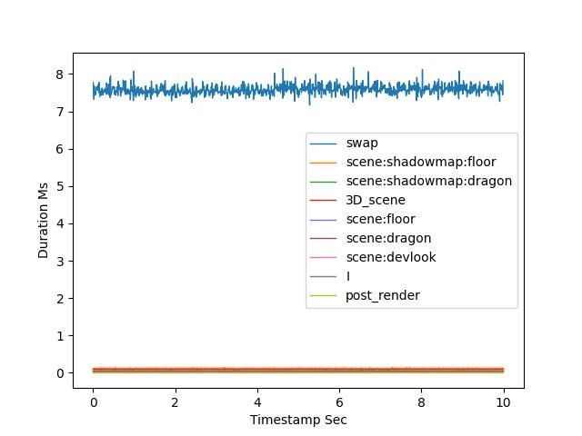

## lighting_sphereMap_crystal
```bash
glslViewer lighting_sphereMap.frag assets/sem-glass-0004.jpg assets/dragon.obj  -e camera_position,-1.43923,0.891203,1.98093 --msaa --width 512 --height 512 -e dynamic_shadows,on -l
```


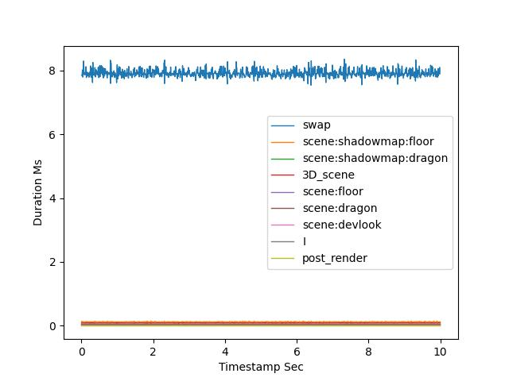

## lighting_sphereMap_gold
```bash
glslViewer lighting_sphereMap.frag assets/sem-gold-0003.jpg assets/dragon.obj  -e camera_position,-1.43923,0.891203,1.98093 --msaa --width 512 --height 512 -e dynamic_shadows,on -l
```


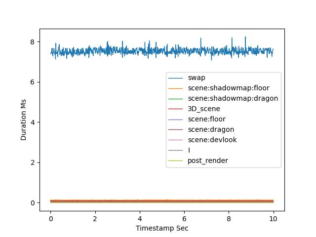

## lighting_sphereMap_metal
```bash
glslViewer lighting_sphereMap.frag assets/sem-metal-0003.jpg assets/dragon.obj  -e camera_position,-1.43923,0.891203,1.98093 --msaa --width 512 --height 512 -e dynamic_shadows,on -l
```


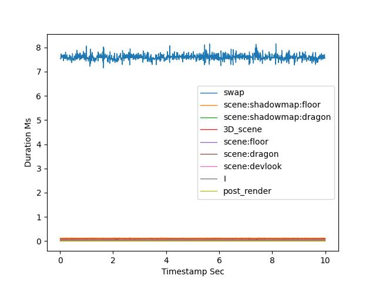

## lighting_sphereMap_dark_metal
```bash
glslViewer lighting_sphereMap.frag assets/sem-metal-0019.jpg assets/dragon.obj  -e camera_position,-1.43923,0.891203,1.98093 --msaa --width 512 --height 512 -e dynamic_shadows,on -l
```


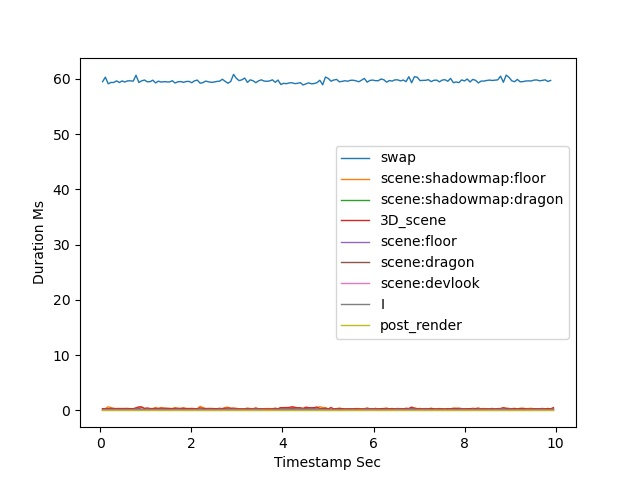

## lighting_sphereMap_iridescent
```bash
glslViewer lighting_sphereMap.frag assets/sem-0033.jpg assets/dragon.obj  -e camera_position,-1.43923,0.891203,1.98093 --msaa --width 512 --height 512 -e dynamic_shadows,on -l
```


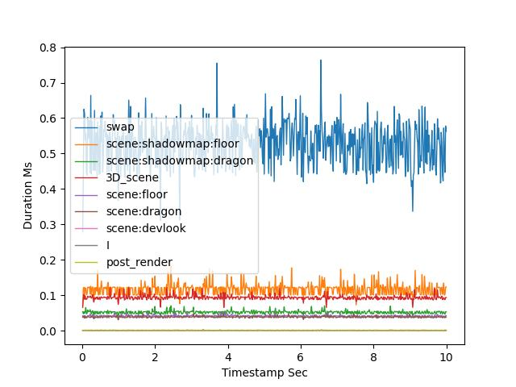

## lighting_sphericalHarmonics
```bash
glslViewer lighting_sphericalHarmonics.frag assets/dragon.obj  -e camera_position,-1.43923,0.891203,1.98093  -e sky,on --msaa --width 512 --height 512 -e dynamic_shadows,on -C assets/Arches_E_PineTree_3k.hdr -l
```


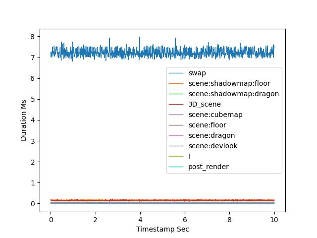

## lighting_ssao
```bash
glslViewer lighting_ssao.frag assets/dragon.obj  -e camera_position,-1.43923,0.891203,1.98093 --msaa --width 512 --height 512 -e dynamic_shadows,on -l
```


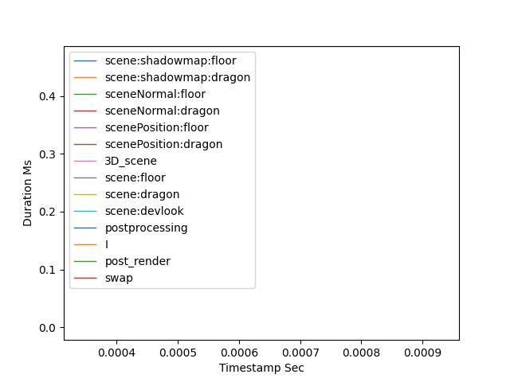

## lighting_ssr
```bash
glslViewer lighting_ssr.frag assets/dragon.obj  -e camera_position,-1.43923,0.891203,1.98093 --msaa --width 512 --height 512 -e dynamic_shadows,on -C assets/Arches_E_PineTree_3k.hdr -l
```


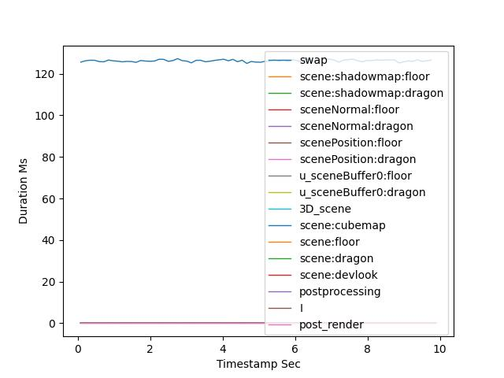

## lighting_volumetric
```bash
glslViewer lighting_volumetric.frag assets/dragon.obj  -e camera_position,-1.67433,0.0682091,-1.99539 --msaa --width 512 --height 512 -e dynamic_shadows,on -C assets/Arches_E_PineTree_3k.hdr -l
```


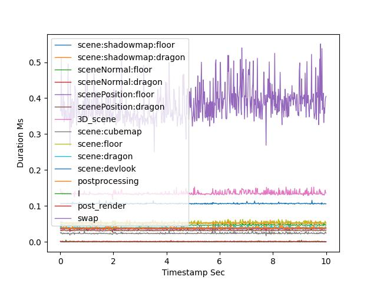

## lighting_raymarching
```bash
glslViewer lighting_raymarching.frag  -e camera_position,29.5393,26.2406,42.1865 --msaa --width 512 --height 512 -e dynamic_shadows,on -l
```


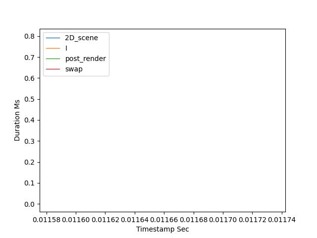

## lighting_raymarching_cubemap
```bash
glslViewer lighting_raymarching.frag  -e camera_position,29.5393,26.2406,42.1865 --msaa --width 512 --height 512 -e dynamic_shadows,on -C assets/Arches_E_PineTree_3k.hdr -l
```


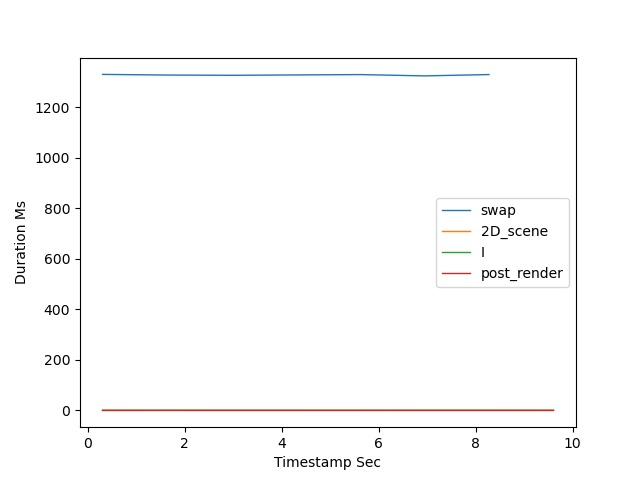

## lighting_raymarching_return
```bash
glslViewer lighting_raymarching_return.frag  -e camera_position,29.5393,26.2406,42.1865 --msaa --width 512 --height 512 -e dynamic_shadows,on -l
```


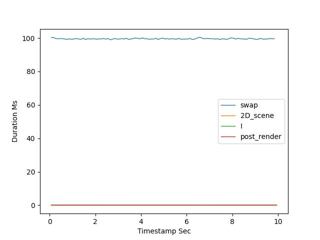

## lighting_raymarching_gooch
```bash
glslViewer lighting_raymarching_gooch.frag  -e camera_position,29.5393,26.2406,42.1865 --msaa --width 512 --height 512 -e dynamic_shadows,on -l
```


## lighting_raymarching_pbr
```bash
glslViewer lighting_raymarching_pbr.frag  -e camera_position,29.5393,26.2406,42.1865 --msaa --width 512 --height 512 -e dynamic_shadows,on -l
```


## lighting_raymarching_pbr_cubemap
```bash
glslViewer lighting_raymarching_pbr.frag  -e camera_position,29.5393,26.2406,42.1865 --msaa --width 512 --height 512 -e dynamic_shadows,on -C assets/Arches_E_PineTree_3k.hdr -l
```


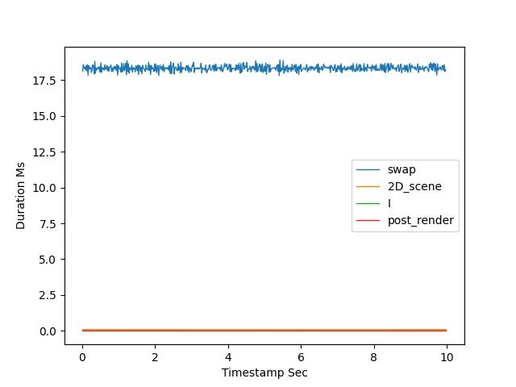

## lighting_raymarching_pbrLittle
```bash
glslViewer lighting_raymarching_pbrLittle.frag  -e camera_position,29.5393,26.2406,42.1865 --msaa --width 512 --height 512 -e dynamic_shadows,on -l
```


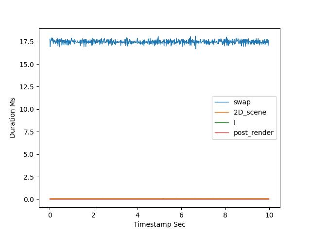

## lighting_raymarching_pbrLittle_cubemap
```bash
glslViewer lighting_raymarching_pbrLittle.frag  -e camera_position,29.5393,26.2406,42.1865 --msaa --width 512 --height 512 -e dynamic_shadows,on -C assets/Arches_E_PineTree_3k.hdr -l
```


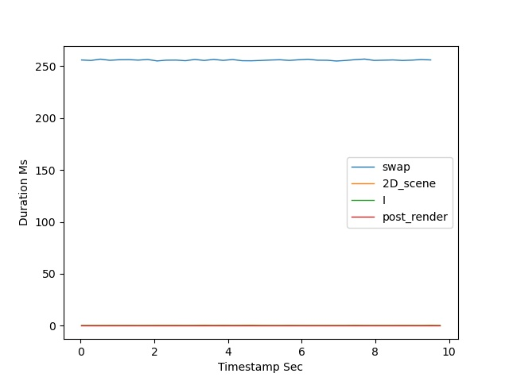

## lighting_raymarching_pbrClearCoat
```bash
glslViewer lighting_raymarching_pbrClearCoat.frag  -e camera_position,29.5393,26.2406,42.1865 --msaa --width 512 --height 512 -e dynamic_shadows,on -l
```


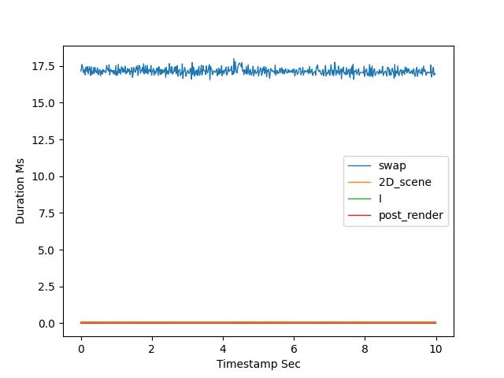

## lighting_raymarching_pbrClearCoat_cubemap
```bash
glslViewer lighting_raymarching_pbrClearCoat.frag  -e camera_position,29.5393,26.2406,42.1865 --msaa --width 512 --height 512 -e dynamic_shadows,on -C assets/Arches_E_PineTree_3k.hdr -l
```


## lighting_raymarching_pbrGlass
```bash
glslViewer lighting_raymarching_pbrGlass.frag  -e camera_position,29.5393,26.2406,42.1865 --msaa --width 512 --height 512 -e dynamic_shadows,on -l
```


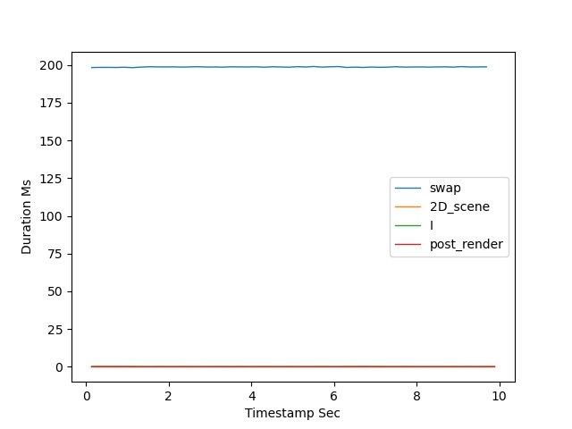

## lighting_raymarching_pbrGlass_cubemap
```bash
glslViewer lighting_raymarching_pbrGlass.frag  -e camera_position,29.5393,26.2406,42.1865 --msaa --width 512 --height 512 -e dynamic_shadows,on -C assets/Arches_E_PineTree_3k.hdr -l
```


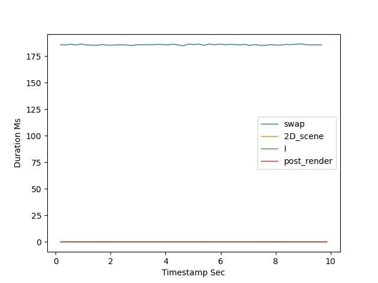

## lighting_raymarching_pbrIridescence
```bash
glslViewer lighting_raymarching_pbrIridescence.frag  -e camera_position,29.5393,26.2406,42.1865 --msaa --width 512 --height 512 -e dynamic_shadows,on -l
```


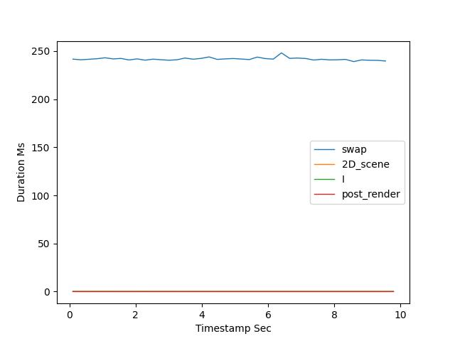

## lighting_raymarching_pbrIridescence_cubemap
```bash
glslViewer lighting_raymarching_pbrIridescence.frag  -e camera_position,29.5393,26.2406,42.1865 --msaa --width 512 --height 512 -e dynamic_shadows,on -C assets/Arches_E_PineTree_3k.hdr -l
```


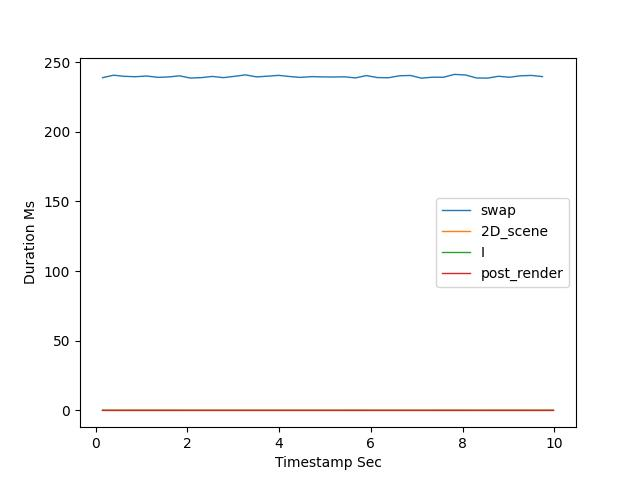

## lighting_raymarching_volume
```bash
glslViewer lighting_raymarching_volume.frag  -e camera_position,29.5393,26.2406,42.1865 --msaa --width 512 --height 512 -e dynamic_shadows,on -l
```


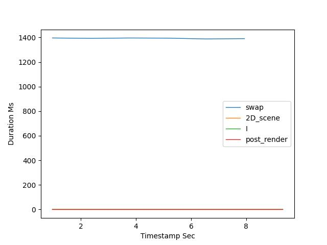

## lighting_raymarching_pbr_volume
```bash
glslViewer lighting_raymarching_pbr_volume.frag  -e camera_position,29.5393,26.2406,42.1865 --msaa --width 512 --height 512 -e dynamic_shadows,on -l
```


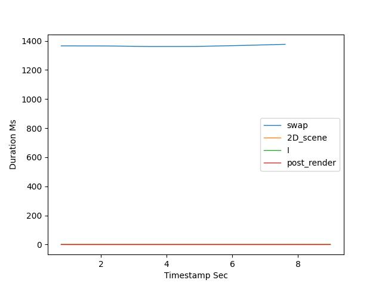

## lighting_raymarching_pbr_volume_cubemap
```bash
glslViewer lighting_raymarching_pbr_volume.frag  -e camera_position,29.5393,26.2406,42.1865 --msaa --width 512 --height 512 -e dynamic_shadows,on -C assets/Arches_E_PineTree_3k.hdr -l
```


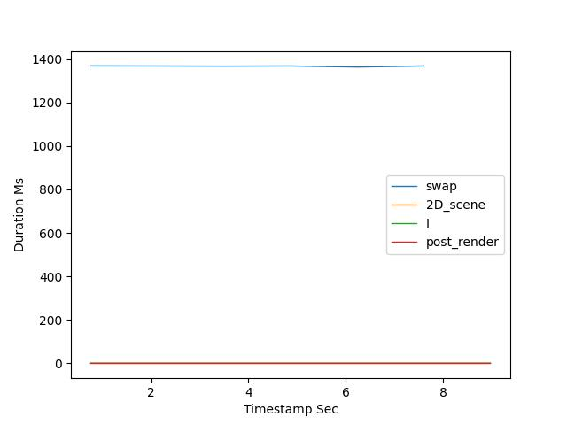

## lighting_atmosphere_equirectangular
```bash
glslViewer lighting_atmosphere.frag  -e define,PROJECTION_MODE,0 --msaa --width 1024 --height 512 -e dynamic_shadows,on -l
```


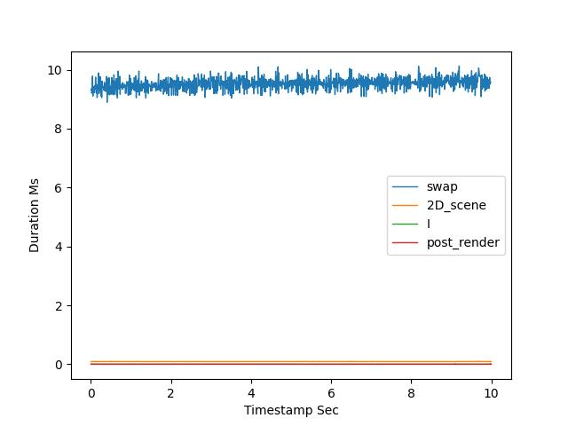

## lighting_atmosphere_fisheye
```bash
glslViewer lighting_atmosphere.frag  -e define,PROJECTION_MODE,1 --msaa --width 512 --height 512 -e dynamic_shadows,on -l
```


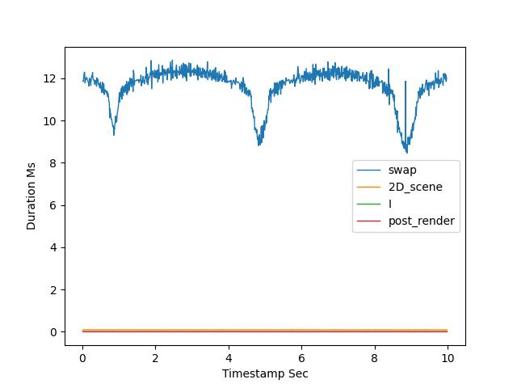

