# GLSL Viewer Examples
                
This are GLSL examples of how to use [LYGIA Shader Library](https://github.com/patriciogonzalezvivo/lygia). You can try them using:

* [glslViewer](https://github.com/patriciogonzalezvivo/glslViewer/wiki/Compiling)
* [glsl-canvas VS Code pluging](https://marketplace.visualstudio.com/items?itemName=circledev.glsl-canvas)


## How to start?

Clone this repository recursivelly

```bash
git clone --recursive https://github.com/patriciogonzalezvivo/lygia_examples.git
```

## Examples
                
### math_functions
```bash
glslViewer math_functions.frag --msaa --width 512 --height 512 -e dynamic_shadows,on -l
```


| GPU | Mean | Median | plot 
| --- | --- | --- | --- |
| V3D | 16.79704228114478 | 16.799073000000135 | 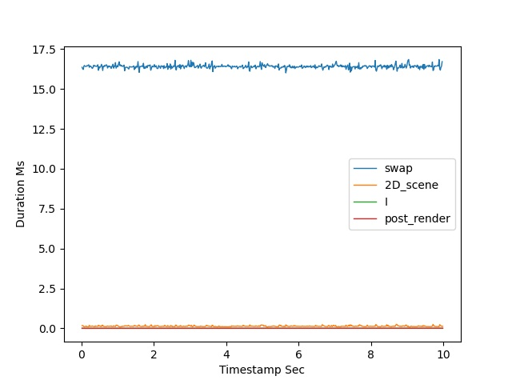 |


### math_gaussian
```bash
glslViewer math_gaussian.frag --msaa --width 512 --height 512 -e dynamic_shadows,on -l
```


| GPU | Mean | Median | plot 
| --- | --- | --- | --- |
| V3D | 3.4595536702422147 | 3.4460449999996854 | 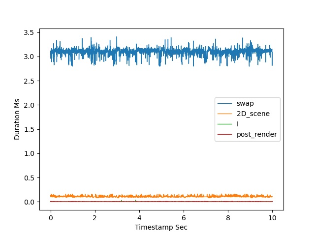 |


### math_quat
```bash
glslViewer math_quat.frag assets/suzanne.obj math_quat.vert --msaa --width 512 --height 512 -e dynamic_shadows,on -l
```


| GPU | Mean | Median | plot 
| --- | --- | --- | --- |
| V3D | 3.9759021356404145 | 3.935058999999683 | 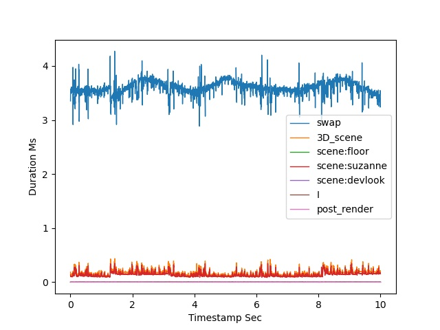 |


### animation_easing
```bash
glslViewer animation_easing.frag --msaa --width 512 --height 512 -e dynamic_shadows,on -l
```

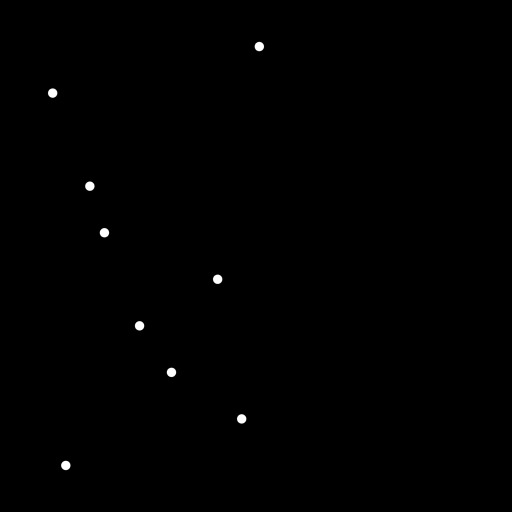

| GPU | Mean | Median | plot 
| --- | --- | --- | --- |
| V3D | 5.434387771071235 | 5.4189449999994395 | 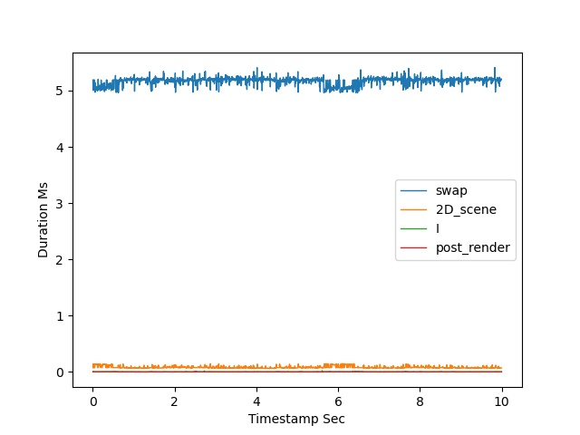 |


### animation_sprite
```bash
glslViewer animation_sprite.frag assets/sprite_megaman.png --msaa --width 512 --height 512 -e dynamic_shadows,on -l
```

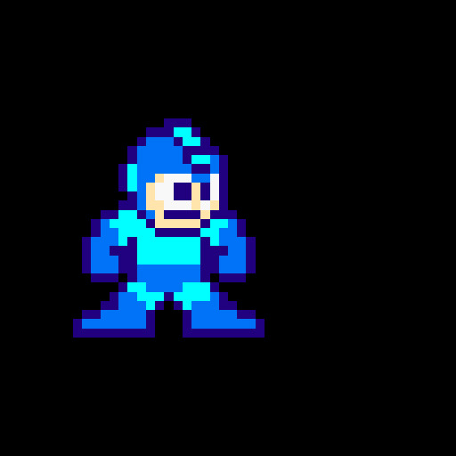

| GPU | Mean | Median | plot 
| --- | --- | --- | --- |
| V3D | 3.949399734202212 | 3.9859620000001996 | 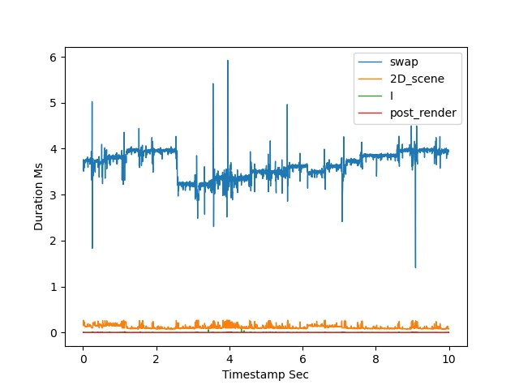 |


### color_brightnessContrast
```bash
glslViewer color_brightnessContrast.frag assets/danny.png --msaa --width 512 --height 512 -e dynamic_shadows,on -l
```


| GPU | Mean | Median | plot 
| --- | --- | --- | --- |
| V3D | 3.2519600344827584 | 3.2270500000004176 | 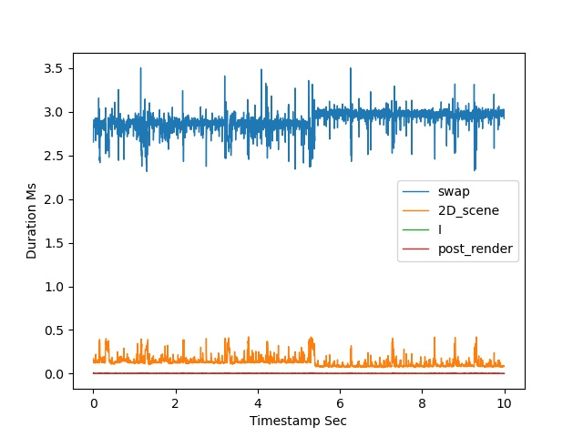 |


### color_brightnessContrastMatrix
```bash
glslViewer color_brightnessContrastMatrix.frag assets/danny.png --msaa --width 512 --height 512 -e dynamic_shadows,on -l
```


| GPU | Mean | Median | plot 
| --- | --- | --- | --- |
| V3D | 3.2534775732421877 | 3.230956999999762 | 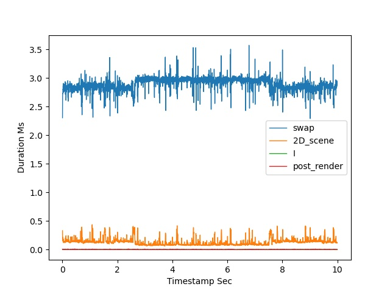 |


### color_mix
```bash
glslViewer color_mix.frag --msaa --width 512 --height 512 -e dynamic_shadows,on -l
```


| GPU | Mean | Median | plot 
| --- | --- | --- | --- |
| V3D | 19.90580606387226 | 19.930908000000272 | 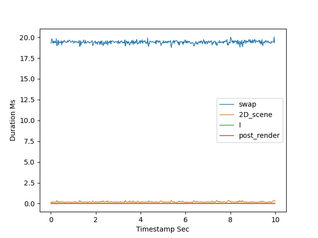 |


### color_lut
```bash
glslViewer color_lut.frag assets/danny.png assets/square_01.png --msaa --width 512 --height 512 -e dynamic_shadows,on -l
```


| GPU | Mean | Median | plot 
| --- | --- | --- | --- |
| V3D | 3.944661876085241 | 3.9250489999994898 |  |


### color_dither
```bash
glslViewer color_dither.frag -u_noise assets/noise_blue.png --msaa --width 512 --height 512 -e dynamic_shadows,on -l
```


| GPU | Mean | Median | plot 
| --- | --- | --- | --- |
| V3D | 3.447685546896552 | 3.428955500000029 | 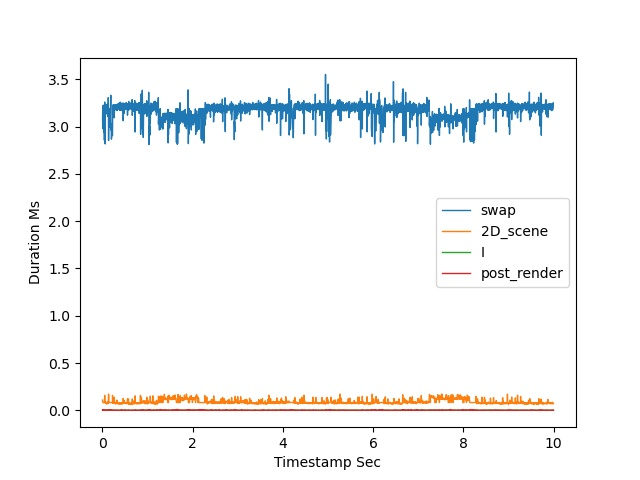 |


### sample_dither
```bash
glslViewer sample_dither.frag assets/danny.png --msaa --width 512 --height 512 -e dynamic_shadows,on -l
```


| GPU | Mean | Median | plot 
| --- | --- | --- | --- |
| V3D | 5.687585733636882 | 5.664794000000256 | 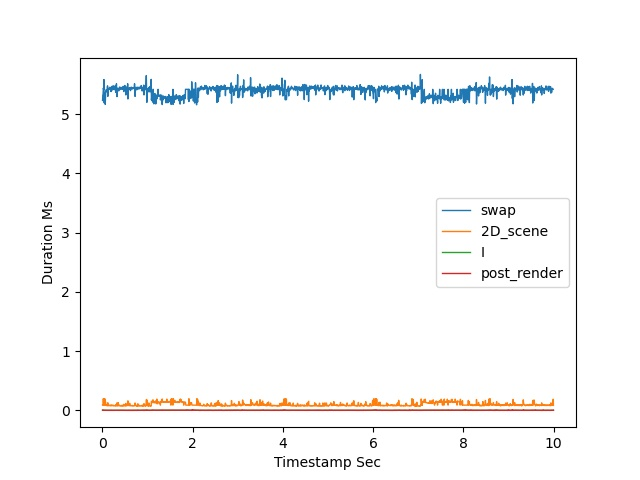 |


### color_iridescence_map
```bash
glslViewer color_iridescence_map.frag --msaa --width 512 --height 512 -e dynamic_shadows,on -l
```


| GPU | Mean | Median | plot 
| --- | --- | --- | --- |
| V3D | 4.054175953365775 | 4.038086000000476 | 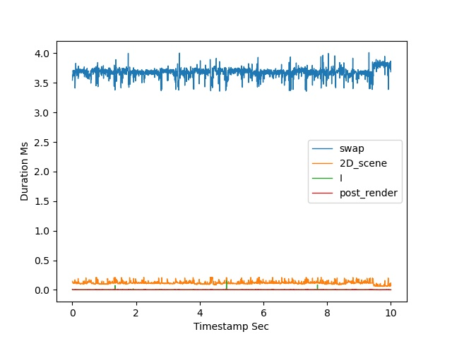 |


### color_wavelength
```bash
glslViewer color_wavelength.frag --msaa --width 512 --height 512 -e dynamic_shadows,on -l
```


| GPU | Mean | Median | plot 
| --- | --- | --- | --- |
| V3D | 9.79221191372549 | 9.78198250000014 | 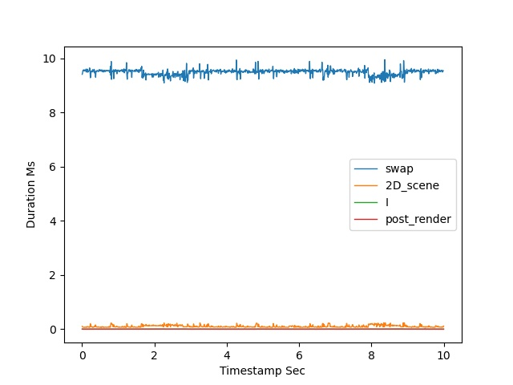 |


### color_wada
```bash
glslViewer color_wada.frag --msaa --width 512 --height 512 -e dynamic_shadows,on -l
```

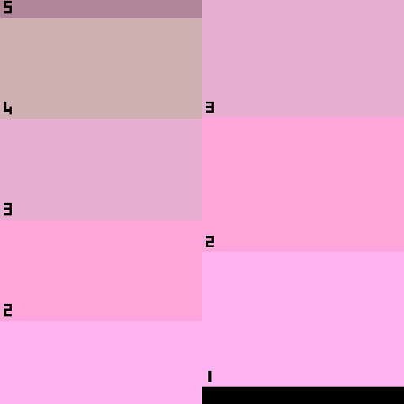

| GPU | Mean | Median | plot 
| --- | --- | --- | --- |
| V3D | 6.834324201094391 | 6.85253849999981 | 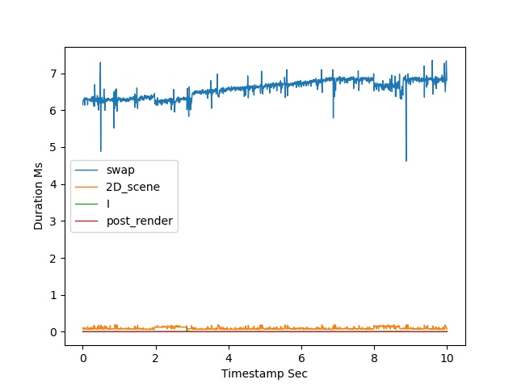 |


### color_wada_dyads
```bash
glslViewer color_wada_dyads.frag --msaa --width 512 --height 512 -e dynamic_shadows,on -l
```

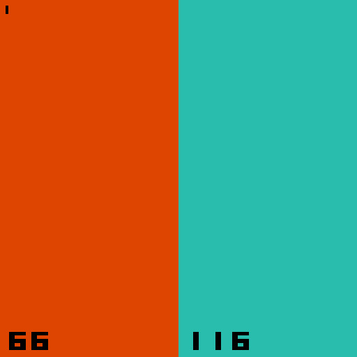

| GPU | Mean | Median | plot 
| --- | --- | --- | --- |
| V3D | 6.351476204704386 | 6.474121000001105 | 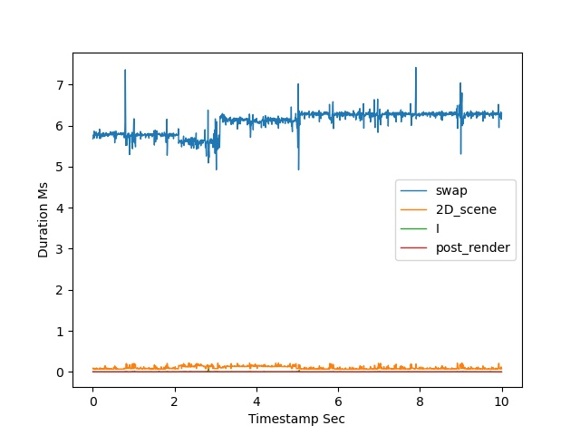 |


### color_wada_triads
```bash
glslViewer color_wada_triads.frag --msaa --width 512 --height 512 -e dynamic_shadows,on -l
```


| GPU | Mean | Median | plot 
| --- | --- | --- | --- |
| V3D | 6.371119113448056 | 6.51709000000028 | 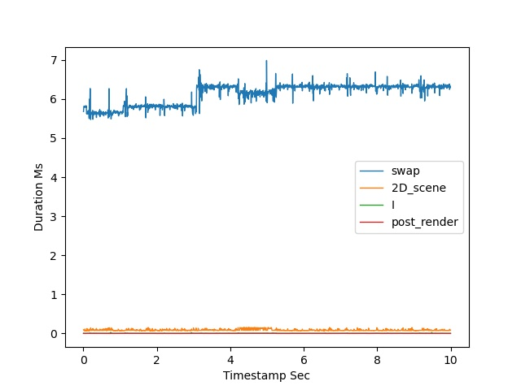 |


### color_wada_tetrads
```bash
glslViewer color_wada_tetrads.frag --msaa --width 512 --height 512 -e dynamic_shadows,on -l
```

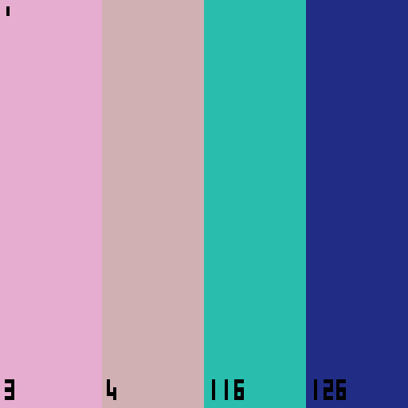

| GPU | Mean | Median | plot 
| --- | --- | --- | --- |
| V3D | 6.391255800511508 | 6.472533999999996 | 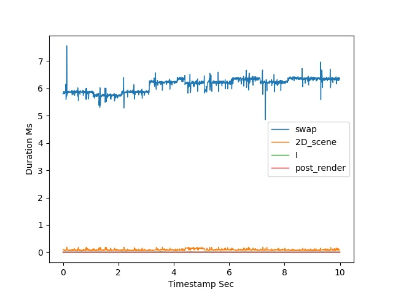 |


### color_pigments
```bash
glslViewer color_pigments.frag --msaa --width 512 --height 512 -e dynamic_shadows,on -l
```

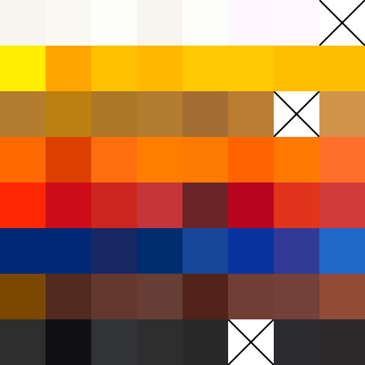

| GPU | Mean | Median | plot 
| --- | --- | --- | --- |
| V3D | 6.240441178526841 | 6.231933000000026 | 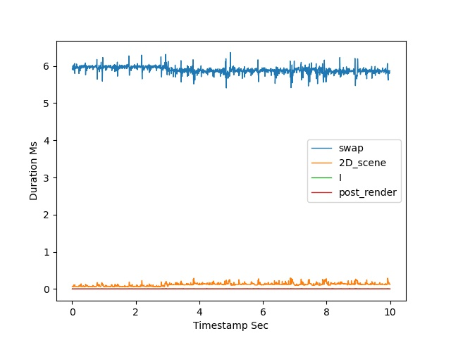 |


### color_palette_lerp
```bash
glslViewer color_palette_lerp.frag --msaa --width 512 --height 512 -e dynamic_shadows,on -l
```

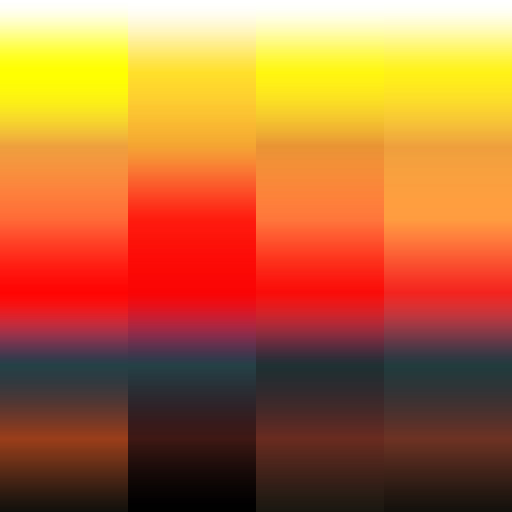

| GPU | Mean | Median | plot 
| --- | --- | --- | --- |
| V3D | 5.197977606344254 | 5.18115299999954 |  |


### color_ryb
```bash
glslViewer color_ryb.frag --msaa --width 512 --height 512 -e dynamic_shadows,on -l
```


| GPU | Mean | Median | plot 
| --- | --- | --- | --- |
| V3D | 12.171998559756096 | 12.161499000000276 | 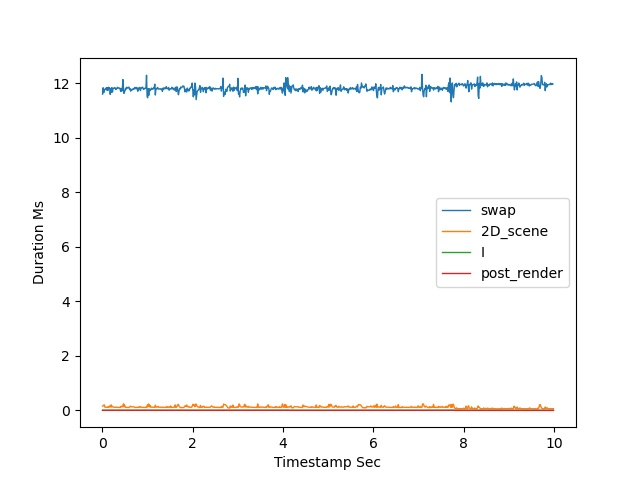 |


### color_zorn
```bash
glslViewer color_zorn.frag --msaa --width 512 --height 512 -e dynamic_shadows,on -l
```


| GPU | Mean | Median | plot 
| --- | --- | --- | --- |
| V3D | 3.9505140165942314 | 3.9360349999997197 | 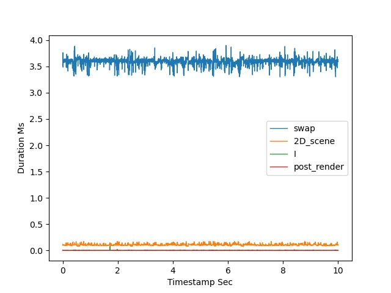 |


### color_mix_ryb
```bash
glslViewer color_mix_ryb.frag --msaa --width 512 --height 512 -e dynamic_shadows,on -l
```

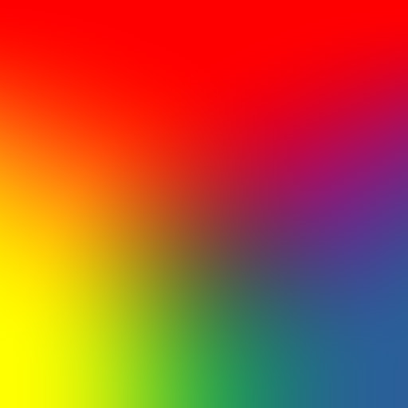

| GPU | Mean | Median | plot 
| --- | --- | --- | --- |
| V3D | 3.760338593303236 | 3.7487790000002406 | 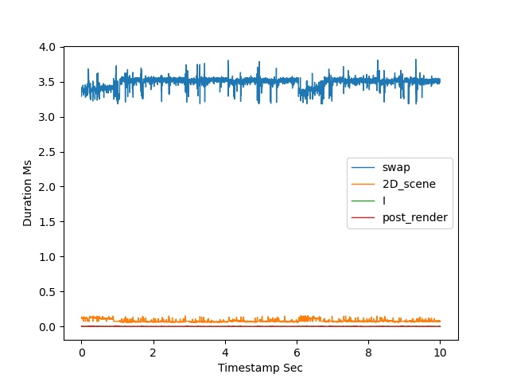 |


### distort_pincushion
```bash
glslViewer distort_pincushion.frag assets/danny.png --msaa --width 512 --height 512 -e dynamic_shadows,on -l
```


| GPU | Mean | Median | plot 
| --- | --- | --- | --- |
| V3D | 4.452840386809268 | 4.494018499999811 | 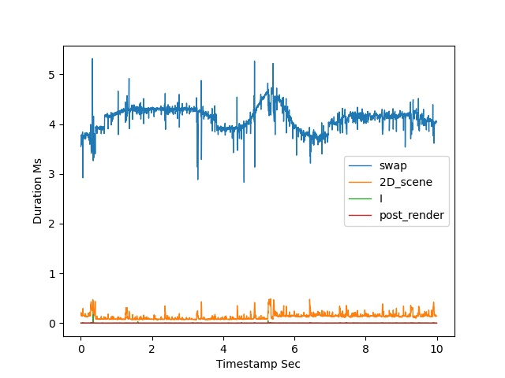 |


### draw_digits
```bash
glslViewer draw_digits.frag --msaa --width 512 --height 512 -e dynamic_shadows,on -l
```


| GPU | Mean | Median | plot 
| --- | --- | --- | --- |
| V3D | 6.007387785929043 | 5.993896000000063 | 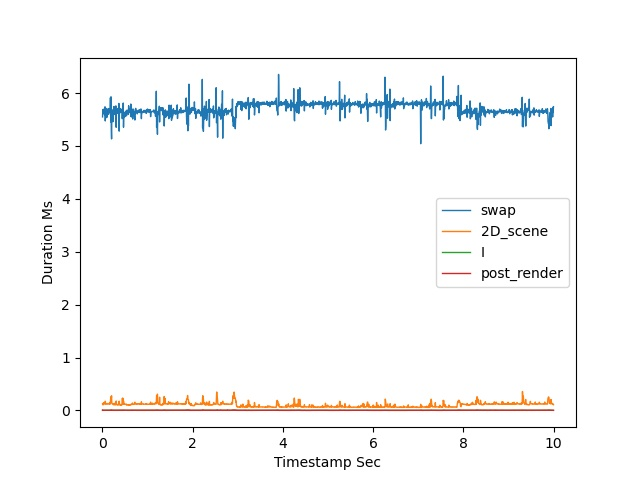 |


### draw_aa
```bash
glslViewer draw_aa.frag --msaa --width 512 --height 512 -e dynamic_shadows,on -l
```


| GPU | Mean | Median | plot 
| --- | --- | --- | --- |
| V3D | 4.372933134733159 | 4.357176999999865 | 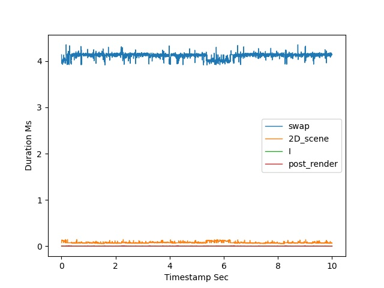 |


### draw_shapes
```bash
glslViewer draw_shapes.frag --msaa --width 512 --height 512 -e dynamic_shadows,on -l
```


| GPU | Mean | Median | plot 
| --- | --- | --- | --- |
| V3D | 5.953717684931506 | 5.940918000000238 | 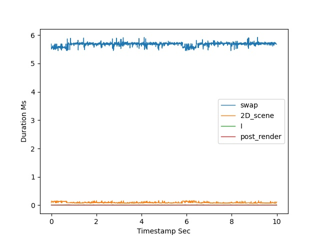 |


### draw_supershape
```bash
glslViewer draw_supershape.frag --msaa --width 512 --height 512 -e dynamic_shadows,on -l
```


| GPU | Mean | Median | plot 
| --- | --- | --- | --- |
| V3D | 4.576342460164835 | 4.555907999999363 | 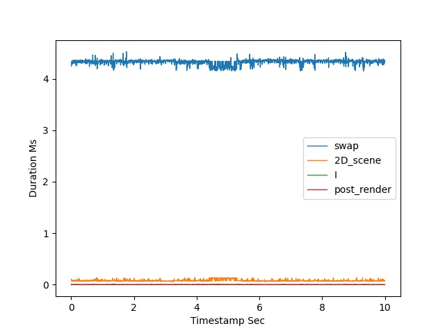 |


### draw_tiles
```bash
glslViewer draw_tiles.frag --msaa --width 512 --height 512 -e dynamic_shadows,on -l
```

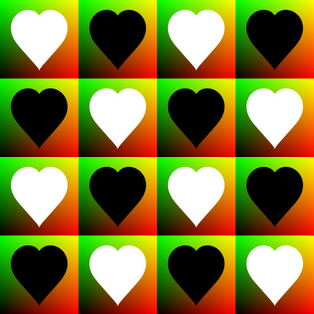

| GPU | Mean | Median | plot 
| --- | --- | --- | --- |
| V3D | 3.7145983392790787 | 3.701904000000468 | 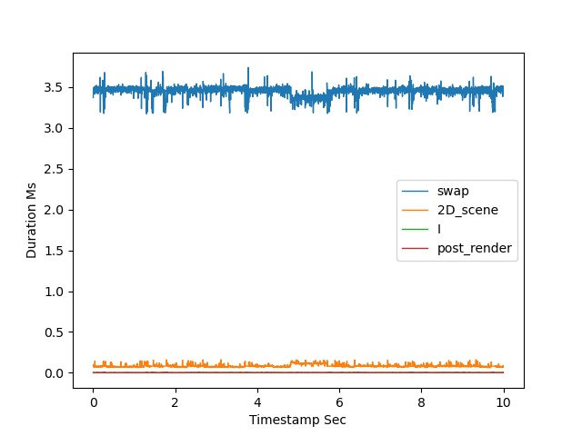 |


### draw_koch
```bash
glslViewer draw_koch.frag --msaa --width 512 --height 512 -e dynamic_shadows,on -l
```

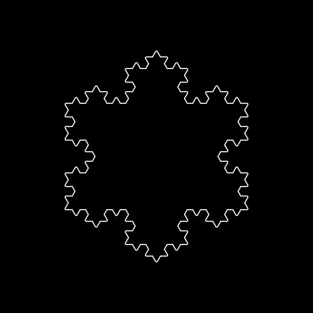

| GPU | Mean | Median | plot 
| --- | --- | --- | --- |
| V3D | 4.168214824854045 | 4.151977499999703 | 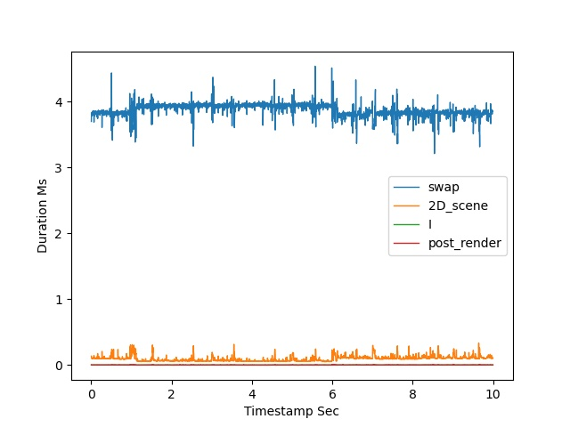 |


### draw_julia
```bash
glslViewer draw_julia.frag --msaa --width 512 --height 512 -e dynamic_shadows,on -l
```


| GPU | Mean | Median | plot 
| --- | --- | --- | --- |
| V3D | 63.78748653846154 | 64.16149949999976 | 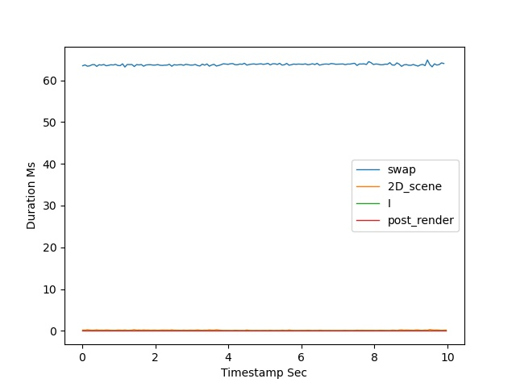 |


### draw_mandelbulb
```bash
glslViewer draw_mandelbulb.frag --msaa --width 512 --height 512 -e dynamic_shadows,on -l
```


| GPU | Mean | Median | plot 
| --- | --- | --- | --- |
| V3D | 1343.299735 | 1552.562989 | 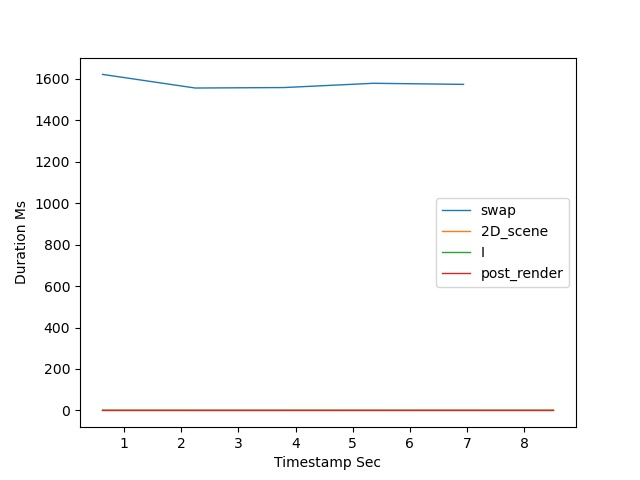 |


### draw_colorChecker
```bash
glslViewer draw_colorChecker.frag --msaa --width 512 --height 512 -e dynamic_shadows,on -l
```


| GPU | Mean | Median | plot 
| --- | --- | --- | --- |
| V3D | 13.516399047361299 | 13.52392599999996 | 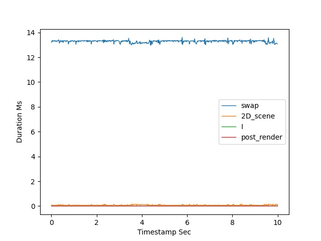 |


### generative_random
```bash
glslViewer generative_random.frag --msaa --width 512 --height 512 -e dynamic_shadows,on -l
```


| GPU | Mean | Median | plot 
| --- | --- | --- | --- |
| V3D | 3.129797458841941 | 3.118163999999524 | 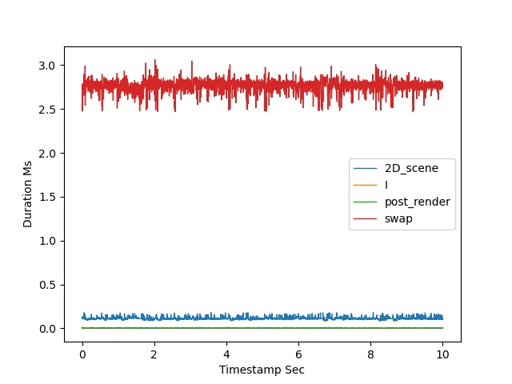 |


### generative_cnoise
```bash
glslViewer generative_cnoise.frag --msaa --width 512 --height 512 -e dynamic_shadows,on -l
```


| GPU | Mean | Median | plot 
| --- | --- | --- | --- |
| V3D | 12.29825746182266 | 12.020996000000196 | 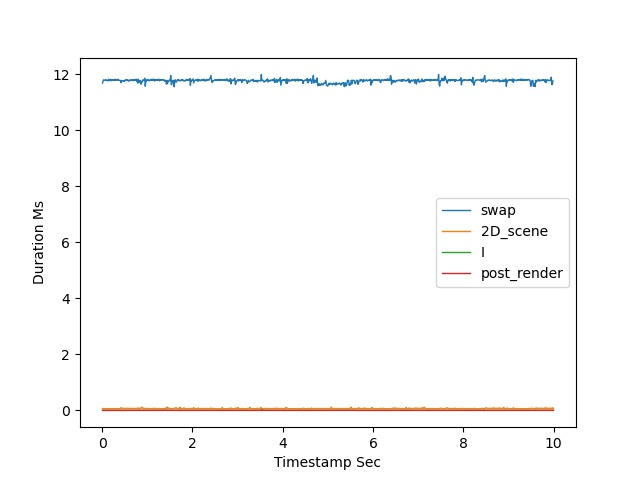 |


### generative_pnoise
```bash
glslViewer generative_pnoise.frag --msaa --width 512 --height 512 -e dynamic_shadows,on -l
```


| GPU | Mean | Median | plot 
| --- | --- | --- | --- |
| V3D | 13.066469841623038 | 13.067016499999255 | 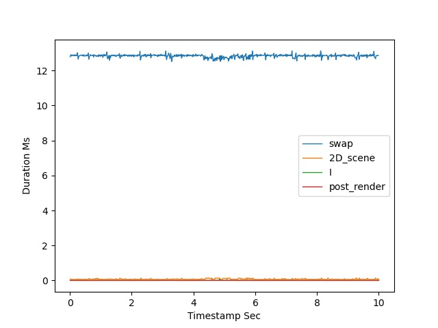 |


### generative_snoise
```bash
glslViewer generative_snoise.frag --msaa --width 512 --height 512 -e dynamic_shadows,on -l
```


| GPU | Mean | Median | plot 
| --- | --- | --- | --- |
| V3D | 8.963940757847535 | 8.957030999999915 | 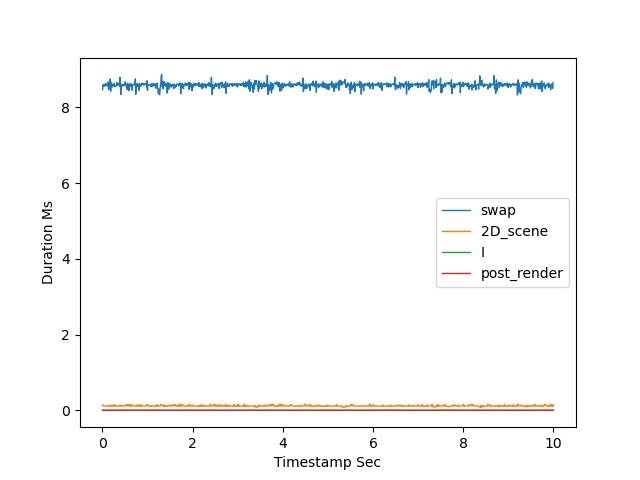 |


### generative_psrdnoise
```bash
glslViewer generative_psrdnoise.frag assets/sphere.ply --msaa --width 512 --height 512 -e dynamic_shadows,on -l
```


| GPU | Mean | Median | plot 
| --- | --- | --- | --- |
| V3D | 10.020297954864594 | 10.0 | 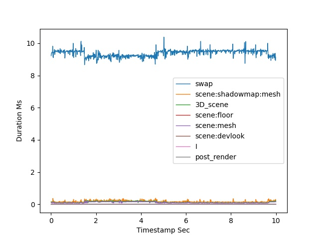 |


### generative_noised
```bash
glslViewer generative_noised.frag --msaa --width 512 --height 512 -e dynamic_shadows,on -l
```


| GPU | Mean | Median | plot 
| --- | --- | --- | --- |
| V3D | 13.975195995804196 | 13.976807000000008 | 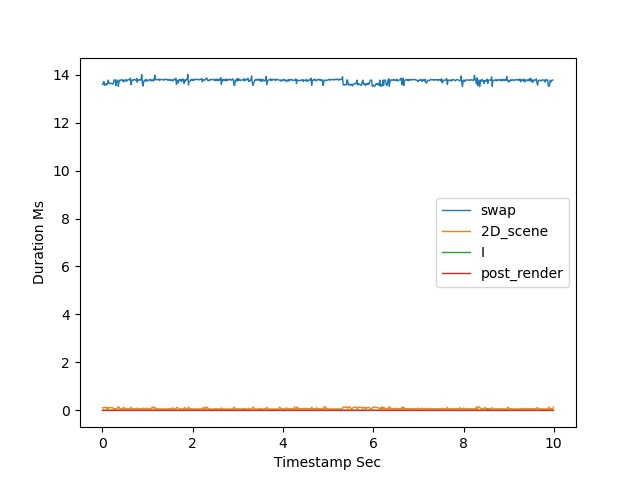 |


### generative_curl
```bash
glslViewer generative_curl.frag --msaa --width 512 --height 512 -e dynamic_shadows,on -l
```


| GPU | Mean | Median | plot 
| --- | --- | --- | --- |
| V3D | 90.7124314587156 | 91.51293899999973 | 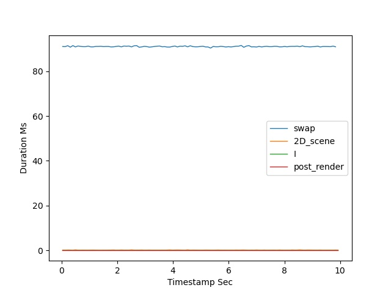 |


### generative_fbm
```bash
glslViewer generative_fbm.frag --msaa --width 512 --height 512 -e dynamic_shadows,on -l
```


| GPU | Mean | Median | plot 
| --- | --- | --- | --- |
| V3D | 27.52265180110497 | 27.580077999999503 |  |


### generative_voronoi
```bash
glslViewer generative_voronoi.frag --msaa --width 512 --height 512 -e dynamic_shadows,on -l
```


| GPU | Mean | Median | plot 
| --- | --- | --- | --- |
| V3D | 28.43146554 | 28.48095700000016 | 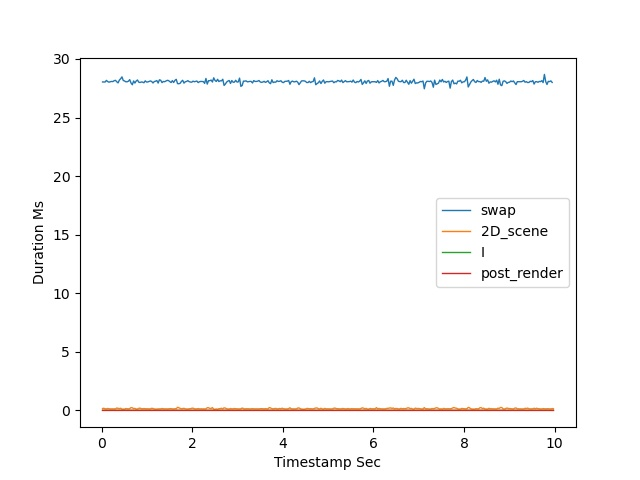 |


### generative_voronoise
```bash
glslViewer generative_voronoise.frag --msaa --width 512 --height 512 -e dynamic_shadows,on -l
```


| GPU | Mean | Median | plot 
| --- | --- | --- | --- |
| V3D | 101.51568229591837 | 102.53417949999994 |  |


### generative_wavelet
```bash
glslViewer generative_wavelet.frag --msaa --width 512 --height 512 -e dynamic_shadows,on -l
```


| GPU | Mean | Median | plot 
| --- | --- | --- | --- |
| V3D | 9.64233586969112 | 9.636963000000605 | 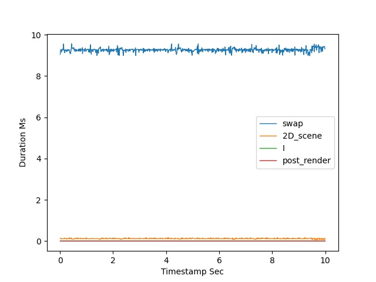 |


### generative_worley
```bash
glslViewer generative_worley.frag --msaa --width 512 --height 512 -e dynamic_shadows,on -l
```


| GPU | Mean | Median | plot 
| --- | --- | --- | --- |
| V3D | 23.958690467625903 | 23.999022999999852 |  |


### filter_boxBlur1D
```bash
glslViewer filter_boxBlur1D.frag assets/danny.png --msaa --width 512 --height 512 -e dynamic_shadows,on -l
```


| GPU | Mean | Median | plot 
| --- | --- | --- | --- |
| V3D | 14.743010437223043 | 14.751952999999958 | 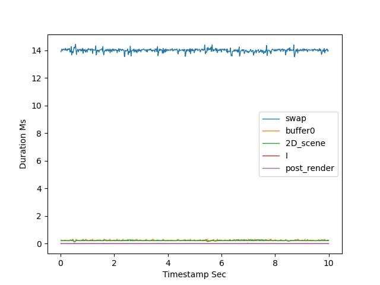 |


### filter_boxBlur2D
```bash
glslViewer filter_boxBlur2D.frag assets/danny.png --msaa --width 512 --height 512 -e dynamic_shadows,on -l
```


| GPU | Mean | Median | plot 
| --- | --- | --- | --- |
| V3D | 68.79187350694444 | 69.27343750000084 | 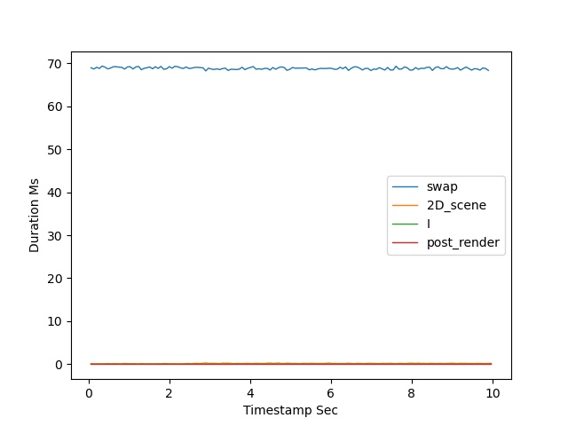 |


### filter_fibonacciBokeh
```bash
glslViewer filter_fibonacciBokeh.frag assets/danny.png --msaa --width 512 --height 512 -e dynamic_shadows,on -l
```


| GPU | Mean | Median | plot 
| --- | --- | --- | --- |
| V3D | 64.75005707142857 | 65.1629640000001 | 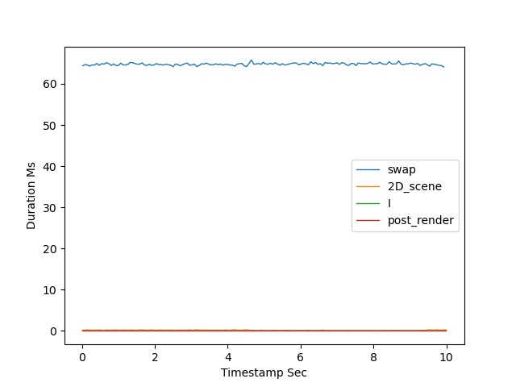 |


### filter_gaussianBlur1D
```bash
glslViewer filter_gaussianBlur1D.frag assets/danny.png --msaa --width 512 --height 512 -e dynamic_shadows,on -l
```


| GPU | Mean | Median | plot 
| --- | --- | --- | --- |
| V3D | 16.21907790243902 | 16.22485299999971 | 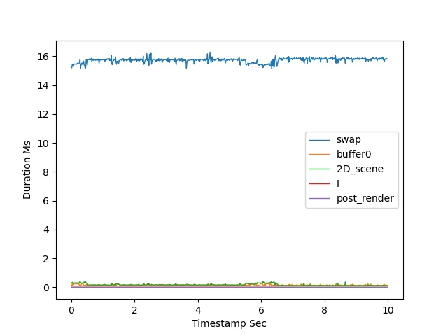 |


### filter_gaussianBlur2D
```bash
glslViewer filter_gaussianBlur2D.frag assets/danny.png --msaa --width 512 --height 512 -e dynamic_shadows,on -l
```


| GPU | Mean | Median | plot 
| --- | --- | --- | --- |
| V3D | 77.7572650859375 | 78.37487800000008 | 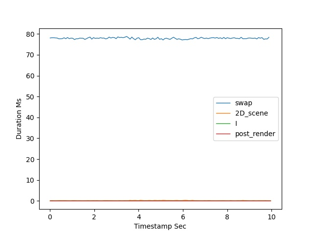 |


### filter_bilateral2D
```bash
glslViewer filter_bilateral2D.frag assets/danny.png --msaa --width 512 --height 512 -e dynamic_shadows,on -l
```


| GPU | Mean | Median | plot 
| --- | --- | --- | --- |
| V3D | 96.33372600970876 | 97.29199200000016 | 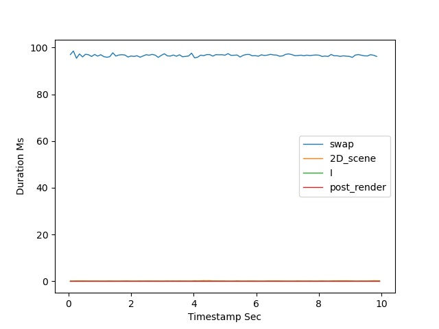 |


### filter_radialBlur2D
```bash
glslViewer filter_radialBlur2D.frag assets/danny.png --msaa --width 512 --height 512 -e dynamic_shadows,on -l
```


| GPU | Mean | Median | plot 
| --- | --- | --- | --- |
| V3D | 25.257237688607596 | 25.275878999999804 | 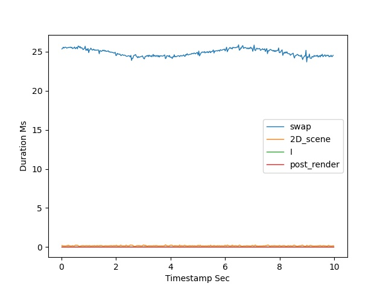 |


### filter_noiseBlur2D
```bash
glslViewer filter_noiseBlur2D.frag -u_tex0 assets/danny.png -u_noise assets/noise_blue.png --msaa --width 512 --height 512 -e dynamic_shadows,on -l
```


| GPU | Mean | Median | plot 
| --- | --- | --- | --- |
| V3D | 7.706720611111112 | 7.696044999999685 | 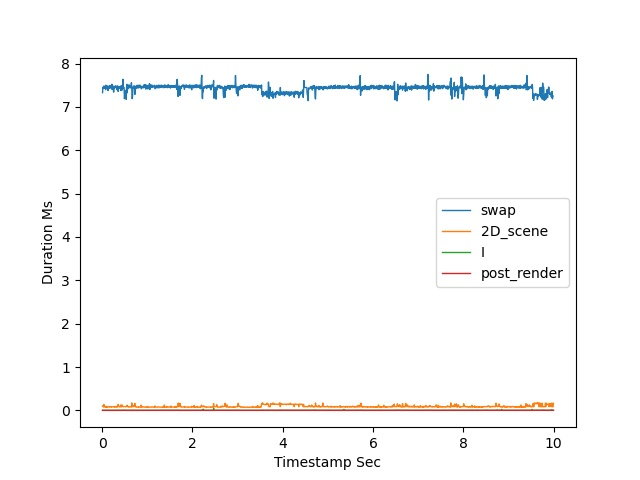 |


### filter_median2D
```bash
glslViewer filter_median2D.frag assets/danny.png --msaa --width 512 --height 512 -e dynamic_shadows,on -l
```


| GPU | Mean | Median | plot 
| --- | --- | --- | --- |
| V3D | 37.41167616541353 | 37.536010499999975 |  |


### filter_kuwahara2D
```bash
glslViewer filter_kuwahara2D.frag assets/danny.png --msaa --width 512 --height 512 -e dynamic_shadows,on -l
```


| GPU | Mean | Median | plot 
| --- | --- | --- | --- |
| V3D | 193.60647950000003 | 197.53918449999992 | 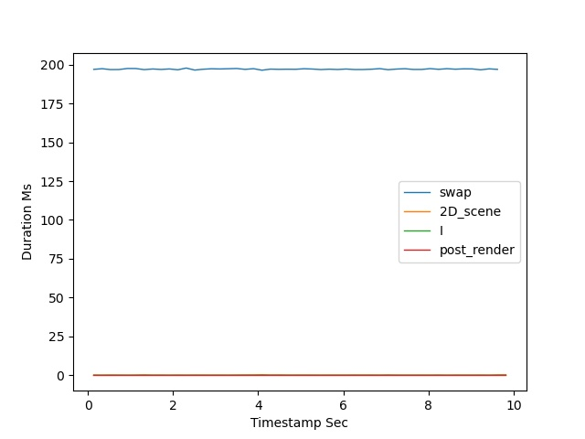 |


### filter_sharpen2D
```bash
glslViewer filter_sharpen2D.frag assets/danny.png --msaa --width 512 --height 512 -e dynamic_shadows,on -l
```


| GPU | Mean | Median | plot 
| --- | --- | --- | --- |
| V3D | 18.42207364575646 | 18.437499999999886 | 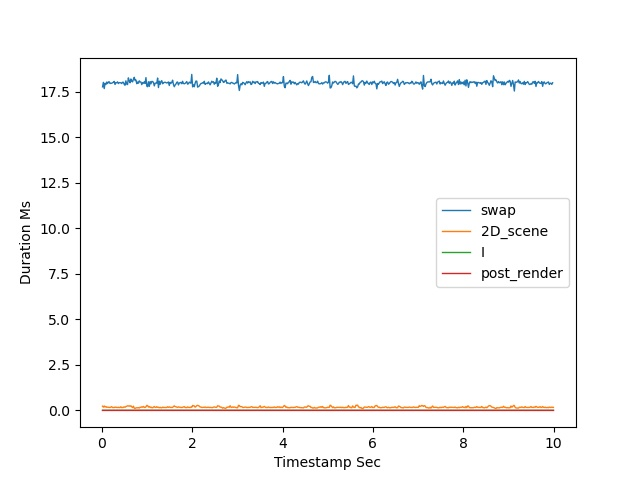 |


### filter_laplacian2D
```bash
glslViewer filter_laplacian2D.frag assets/danny.png --msaa --width 512 --height 512 -e dynamic_shadows,on -l
```


| GPU | Mean | Median | plot 
| --- | --- | --- | --- |
| V3D | 5.188423703530632 | 5.169189000000188 | 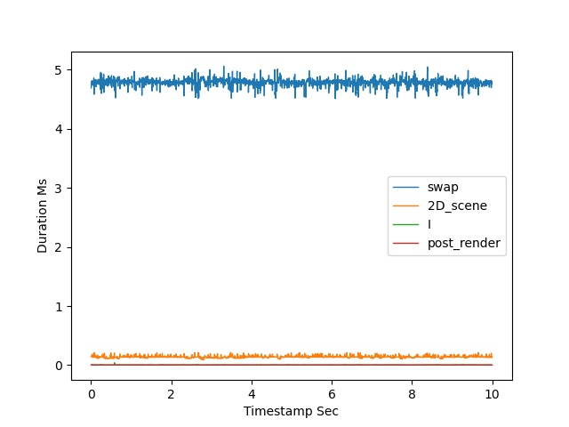 |


### filter_edge2D
```bash
glslViewer filter_edge2D.frag assets/danny.png --msaa --width 512 --height 512 -e dynamic_shadows,on -l
```


| GPU | Mean | Median | plot 
| --- | --- | --- | --- |
| V3D | 6.7873193491847825 | 6.7680660000002035 | 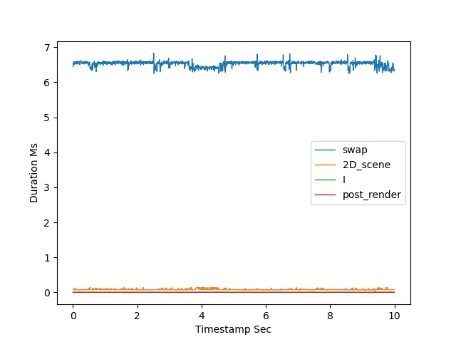 |


### filter_bilinear2D
```bash
glslViewer filter_bilinear2D.frag assets/danny.png --msaa --width 512 --height 512 -e dynamic_shadows,on -l
```


| GPU | Mean | Median | plot 
| --- | --- | --- | --- |
| V3D | 313.0257371290322 | 323.34082000000035 | 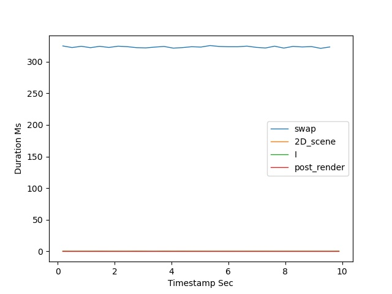 |


### sample_dof
```bash
glslViewer sample_dof.frag assets/dragon.obj  -e camera_position,-1.43923,0.891203,1.98093 --msaa --width 512 --height 512 -e dynamic_shadows,on -C assets/Arches_E_PineTree_3k.hdr -l
```


| GPU | Mean | Median | plot 
| --- | --- | --- | --- |
| V3D | 206.09574889583334 | 210.448486 | 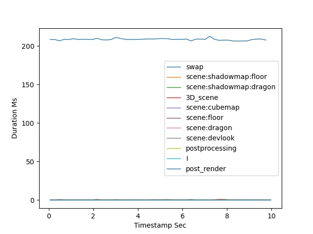 |


### sample_bracketing
```bash
glslViewer sample_bracketing.frag assets/rock_moss.jpg --msaa --width 512 --height 512 -e dynamic_shadows,on -l
```


| GPU | Mean | Median | plot 
| --- | --- | --- | --- |
| V3D | 20.129850818548384 | 20.131957999999713 | 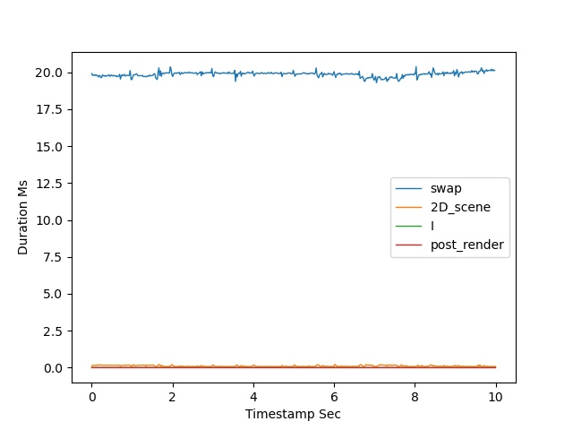 |


### sample_wrap
```bash
glslViewer sample_wrap.frag assets/rocks.png --msaa --width 512 --height 512 -e dynamic_shadows,on -l
```


| GPU | Mean | Median | plot 
| --- | --- | --- | --- |
| V3D | 4.000417354541818 | 3.979981000000407 | 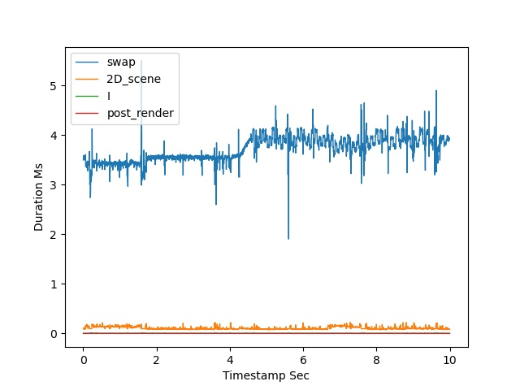 |


### sample_wrap_repeat
```bash
glslViewer sample_wrap_repeat.frag assets/rocks.png --msaa --width 512 --height 512 -e dynamic_shadows,on -l
```

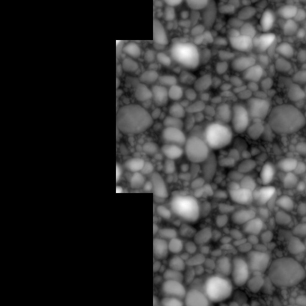

| GPU | Mean | Median | plot 
| --- | --- | --- | --- |
| V3D | 4.068273921041921 | 4.072022000000288 | 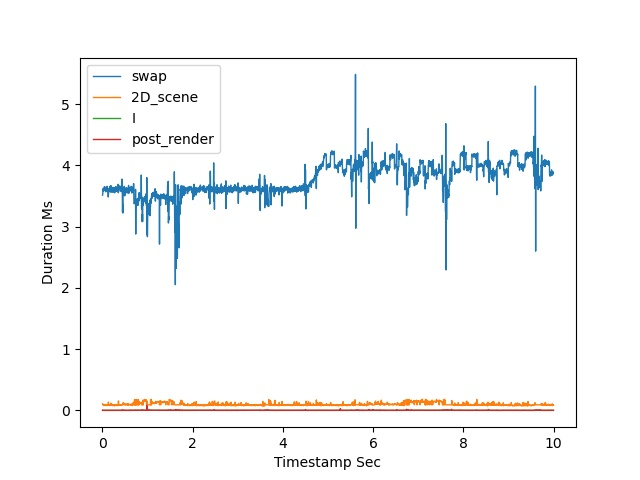 |


### sample_wrap_clamp
```bash
glslViewer sample_wrap_clamp.frag assets/rocks.png --msaa --width 512 --height 512 -e dynamic_shadows,on -l
```

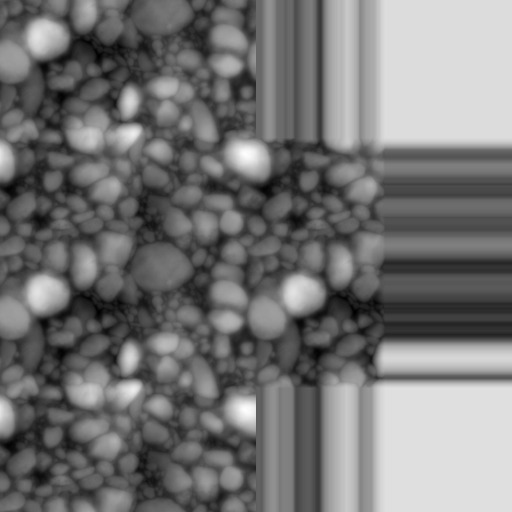

| GPU | Mean | Median | plot 
| --- | --- | --- | --- |
| V3D | 3.9470201342812006 | 3.9554439999997157 | 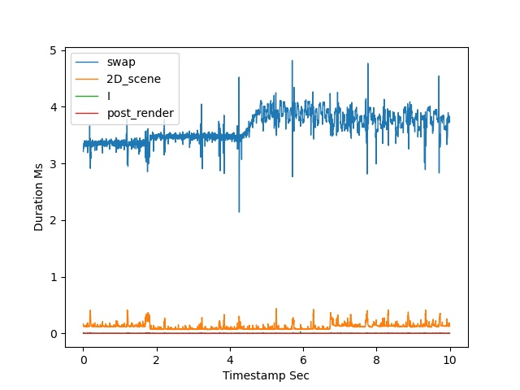 |


### sample_wrap_mirror
```bash
glslViewer sample_wrap_mirror.frag assets/rocks.png --msaa --width 512 --height 512 -e dynamic_shadows,on -l
```


| GPU | Mean | Median | plot 
| --- | --- | --- | --- |
| V3D | 4.472395505592842 | 4.273925999999847 | 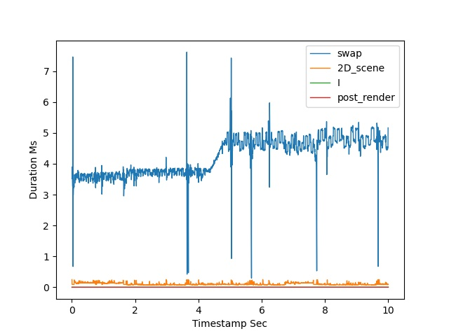 |


### sample_wrap_untile
```bash
glslViewer sample_wrap_untile.frag assets/rocks.png --msaa --width 512 --height 512 -e dynamic_shadows,on -l
```


| GPU | Mean | Median | plot 
| --- | --- | --- | --- |
| V3D | 14.108280850282485 | 11.628905999999688 | 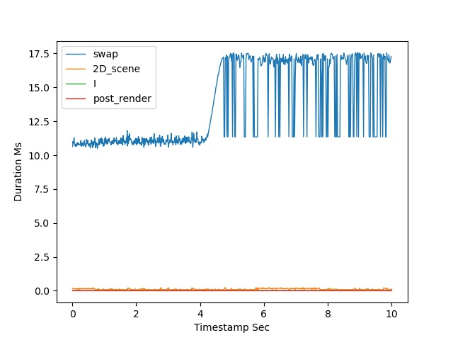 |


### sample_wrap_zero
```bash
glslViewer sample_wrap_zero.frag assets/rocks.png --msaa --width 512 --height 512 -e dynamic_shadows,on -l
```

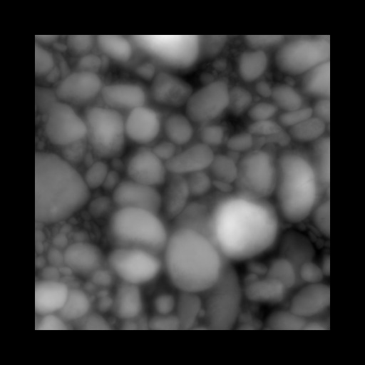

| GPU | Mean | Median | plot 
| --- | --- | --- | --- |
| V3D | 3.0851175944444447 | 3.070068999999876 | 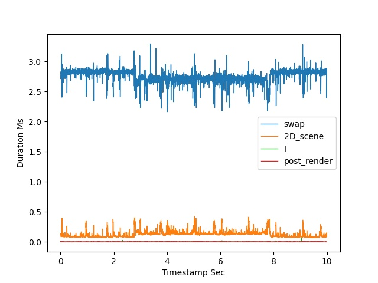 |


### sample_filter_bicubic
```bash
glslViewer sample_filter_bicubic.frag assets/noise_blue.png --msaa --width 512 --height 512 -e dynamic_shadows,on -l
```


| GPU | Mean | Median | plot 
| --- | --- | --- | --- |
| V3D | 4.3113917825711825 | 4.285889000000452 | 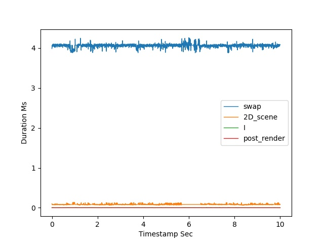 |


### sample_filter_nearest
```bash
glslViewer sample_filter_nearest.frag assets/noise_blue.png --msaa --width 512 --height 512 -e dynamic_shadows,on -l
```


| GPU | Mean | Median | plot 
| --- | --- | --- | --- |
| V3D | 3.216609999034749 | 3.203856999999516 | 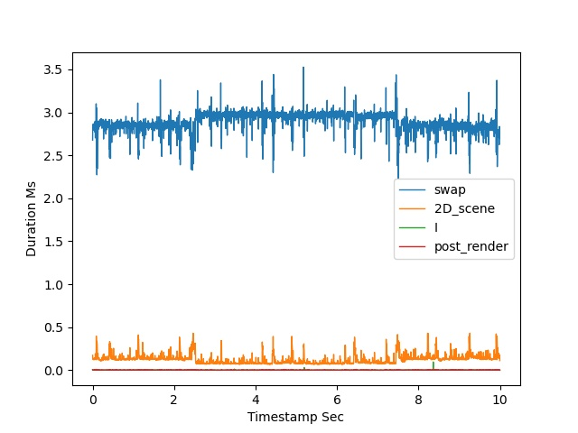 |


### sample_filter_smooth
```bash
glslViewer sample_filter_smooth.frag assets/noise_blue.png --msaa --width 512 --height 512 -e dynamic_shadows,on -l
```


| GPU | Mean | Median | plot 
| --- | --- | --- | --- |
| V3D | 3.2133680765027326 | 3.201171999999133 | 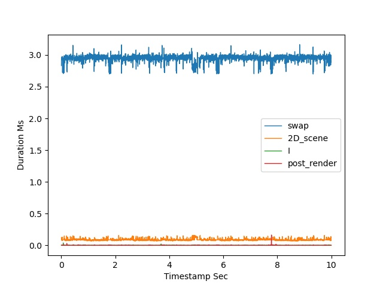 |


### sample_equirect
```bash
glslViewer sample_equirect.frag assets/dragon.obj assets/studio.png  -e camera_position,-1.43923,0.891203,1.98093  -e define,SCENE_CUBEMAP,u_tex0 --msaa --width 512 --height 512 -e dynamic_shadows,on -l
```


| GPU | Mean | Median | plot 
| --- | --- | --- | --- |
| V3D | 33.56122832996633 | 33.325928000000204 | 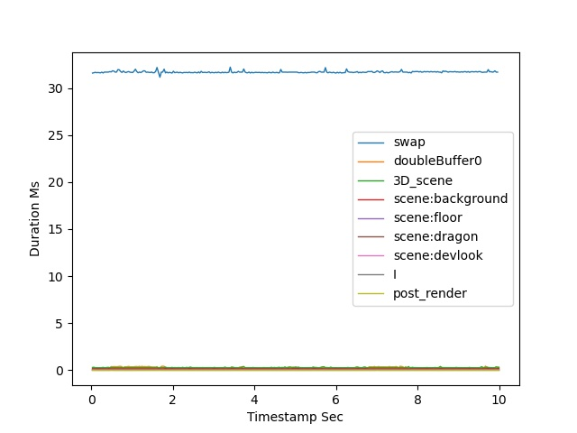 |


### sample_3Dsdf
```bash
glslViewer sample_3Dsdf.frag assets/suzanne.png  -e camera_position,-29.5393,26.2406,-42.1865 --msaa --width 512 --height 512 -e dynamic_shadows,on -l
```


| GPU | Mean | Median | plot 
| --- | --- | --- | --- |
| V3D | 733.5901693333334 | 799.0465084999996 | 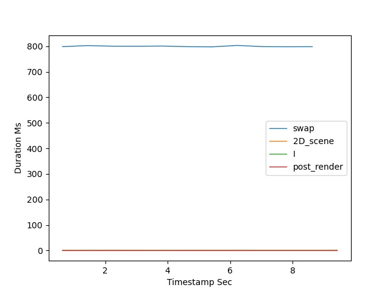 |


### sample_triplanar
```bash
glslViewer sample_triplanar.frag assets/suzanne.obj assets/rock_moss.jpg --msaa --width 512 --height 512 -e dynamic_shadows,on -l
```

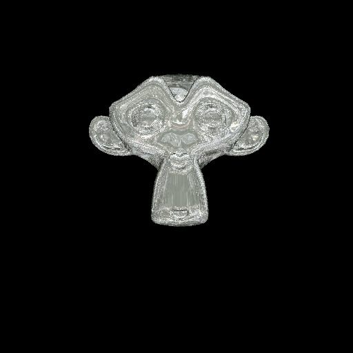

| GPU | Mean | Median | plot 
| --- | --- | --- | --- |
| V3D | 14.067722546478874 | 13.982056000000199 | 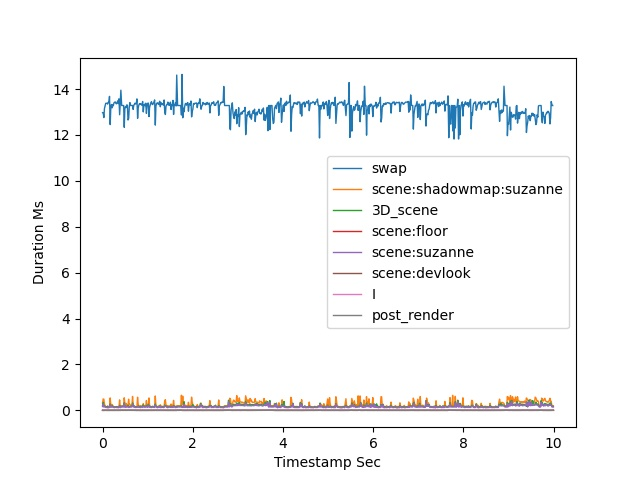 |


### morphological_erosion
```bash
glslViewer morphological_erosion.frag assets/flower.png --msaa --width 512 --height 512 -e dynamic_shadows,on -l
```


| GPU | Mean | Median | plot 
| --- | --- | --- | --- |
| V3D | 2083.9530027499995 | 2777.901489 |  |


### morphological_dilation
```bash
glslViewer morphological_dilation.frag assets/flower.png --msaa --width 512 --height 512 -e dynamic_shadows,on -l
```


| GPU | Mean | Median | plot 
| --- | --- | --- | --- |
| V3D | 2097.9590452499997 | 2784.176025 | 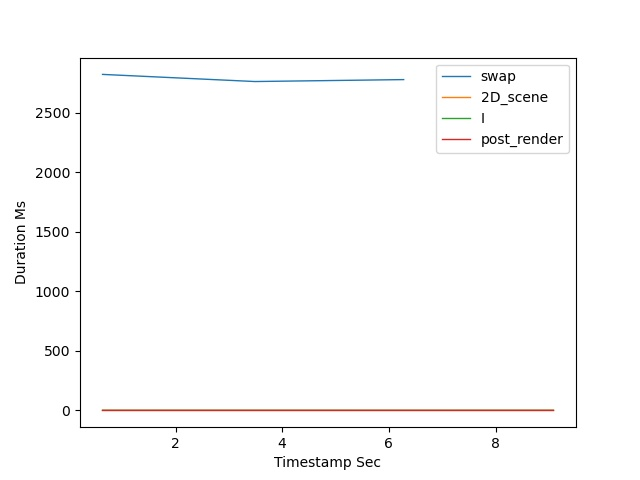 |


### morphological_alphaFill
```bash
glslViewer morphological_alphaFill.frag assets/flower.png --msaa --width 512 --height 512 -e dynamic_shadows,on -l
```


| GPU | Mean | Median | plot 
| --- | --- | --- | --- |
| V3D | 21.480616603448276 | 21.517089499999656 | 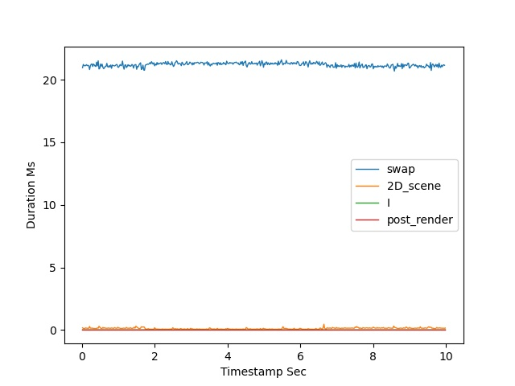 |


### morphological_poissonFill
```bash
glslViewer morphological_poissonFill.frag assets/flower.png --msaa --width 512 --height 512 -e dynamic_shadows,on -l
```


| GPU | Mean | Median | plot 
| --- | --- | --- | --- |
| V3D | 35.85379061371841 | 40.064941999999064 | 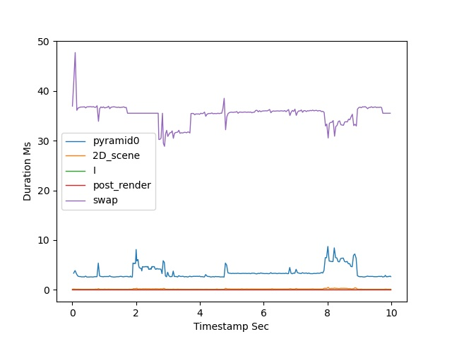 |


### morphological_marchinSquares
```bash
glslViewer morphological_marchinSquares.frag assets/flower.png --msaa --width 512 --height 512 -e dynamic_shadows,on -l
```

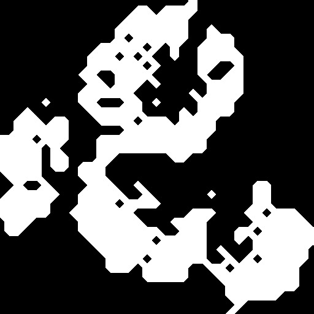

| GPU | Mean | Median | plot 
| --- | --- | --- | --- |
| V3D | 5.08648193994911 | 5.073975000000246 | 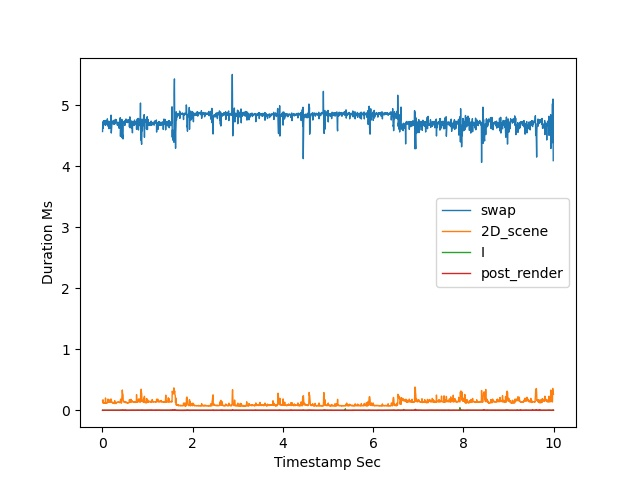 |


### lighting_position
```bash
glslViewer lighting_position.frag assets/dragon.obj  -e camera_position,-1.43923,0.891203,1.98093 --msaa --width 512 --height 512 -e dynamic_shadows,on -l
```


| GPU | Mean | Median | plot 
| --- | --- | --- | --- |
| V3D | 28.226708430594897 | 28.19091800000001 | 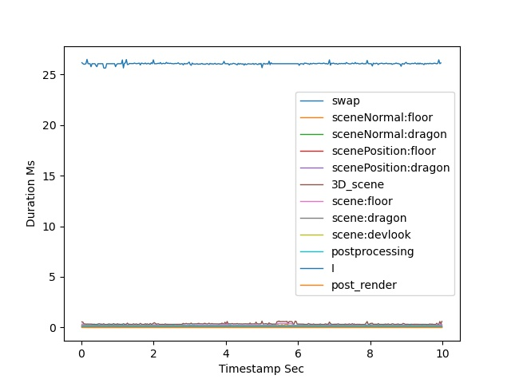 |


### lighting_normal
```bash
glslViewer lighting_normal.frag assets/dragon.obj  -e camera_position,-1.43923,0.891203,1.98093 --msaa --width 512 --height 512 -e dynamic_shadows,on -l
```


| GPU | Mean | Median | plot 
| --- | --- | --- | --- |
| V3D | 10.759956885775862 | 10.43054200000006 | 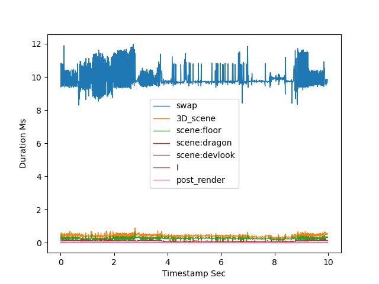 |


### lighting_gooch
```bash
glslViewer lighting_gooch.frag assets/dragon.obj  -e camera_position,-1.43923,0.891203,1.98093 --msaa --width 512 --height 512 -e dynamic_shadows,on -l
```


| GPU | Mean | Median | plot 
| --- | --- | --- | --- |
| V3D | 17.1657425395189 | 17.034057500000017 | 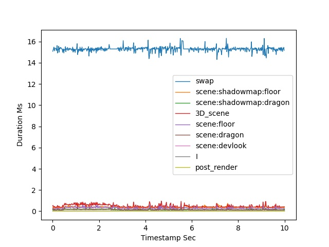 |


### lighting_pbrLittle
```bash
glslViewer lighting_pbrLittle.frag assets/dragon.obj  -e camera_position,-1.43923,0.891203,1.98093 --msaa --width 512 --height 512 -e dynamic_shadows,on -l
```


| GPU | Mean | Median | plot 
| --- | --- | --- | --- |
| V3D | 17.526321706502635 | 17.38208099999997 | 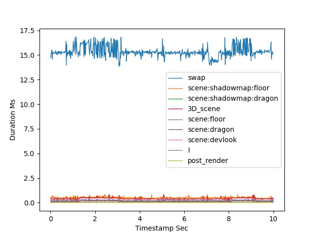 |


### lighting_pbrLittle_cubemap
```bash
glslViewer lighting_pbrLittle.frag assets/dragon.obj  -e camera_position,-1.43923,0.891203,1.98093 --msaa --width 512 --height 512 -e dynamic_shadows,on -C assets/Arches_E_PineTree_3k.hdr -l
```


| GPU | Mean | Median | plot 
| --- | --- | --- | --- |
| V3D | 42.98803395258621 | 42.95544449999994 | 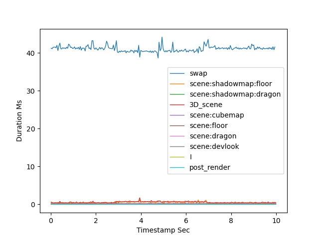 |


### lighting_pbrLittle_deferred
```bash
glslViewer lighting_pbrLittle_deferred.frag assets/dragon.obj  -e camera_position,-1.43923,0.891203,1.98093 --msaa --width 512 --height 512 -e dynamic_shadows,on -l
```

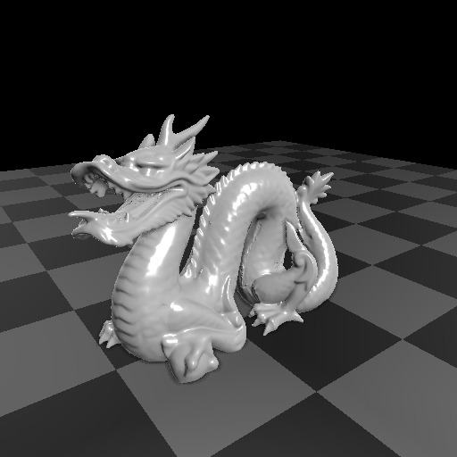

| GPU | Mean | Median | plot 
| --- | --- | --- | --- |
| V3D | 44.61721049327355 | 44.8269049999999 | 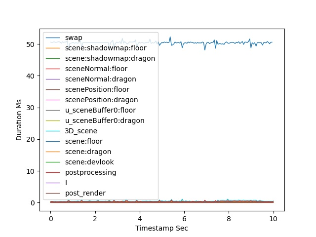 |


### lighting_pbr
```bash
glslViewer lighting_pbr.frag assets/dragon.obj  -e camera_position,-1.43923,0.891203,1.98093 --msaa --width 512 --height 512 -e dynamic_shadows,on -l
```

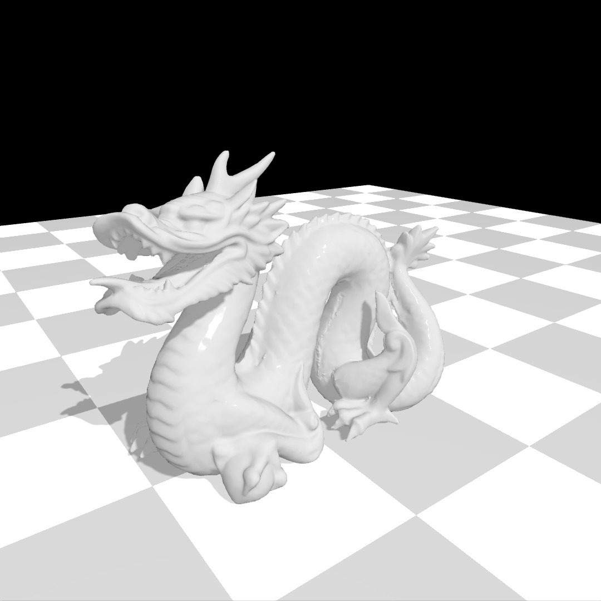

| GPU | Mean | Median | plot 
| --- | --- | --- | --- |
| V3D | 18.71042769043152 | 18.58398500000021 | 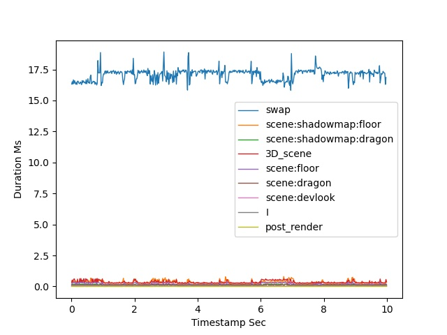 |


### lighting_pbr_cubemap
```bash
glslViewer lighting_pbr.frag assets/dragon.obj  -e camera_position,-1.43923,0.891203,1.98093 --msaa --width 512 --height 512 -e dynamic_shadows,on -C assets/Arches_E_PineTree_3k.hdr -l
```


| GPU | Mean | Median | plot 
| --- | --- | --- | --- |
| V3D | 39.33248961660079 | 39.275878999999804 | 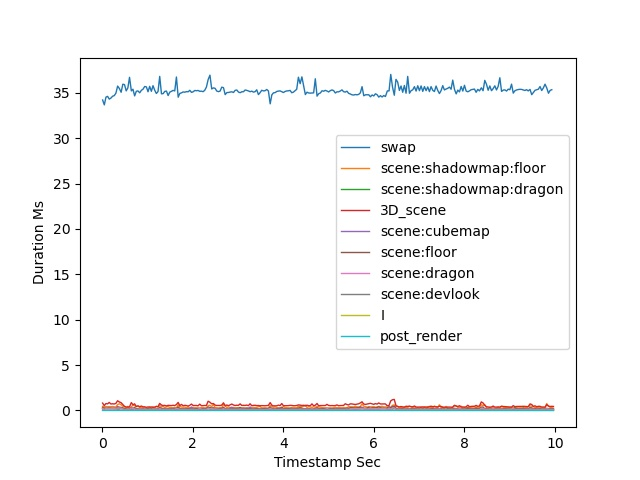 |


### lighting_pbr_lights
```bash
glslViewer lighting_pbr_lights.frag assets/dragon.obj  -e camera_position,-1.43923,0.891203,1.98093 --msaa --width 512 --height 512 -e dynamic_shadows,on -l
```

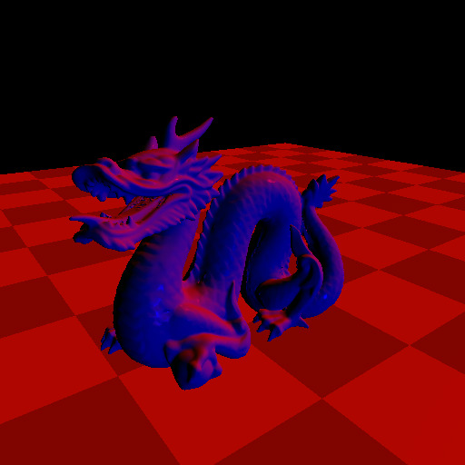

| GPU | Mean | Median | plot 
| --- | --- | --- | --- |
| V3D | 25.044806552763816 | 24.998534500000005 | 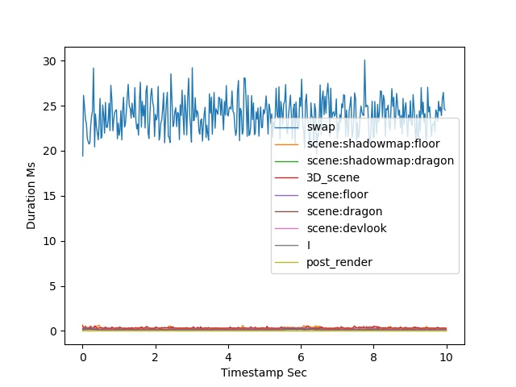 |


### lighting_pbr_dynamic
```bash
glslViewer lighting_pbr_dynamic.frag assets/dragon.obj lighting_pbr_dynamic.vert  -e camera_position,-1.43923,0.891203,1.98093 --msaa --width 512 --height 512 -e dynamic_shadows,on -l
```

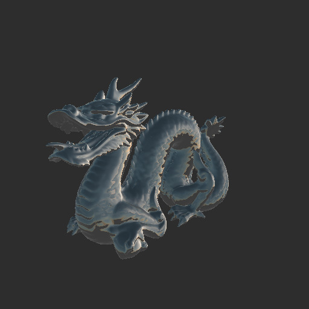

| GPU | Mean | Median | plot 
| --- | --- | --- | --- |
| V3D | 580.6792422941177 | 616.8869630000002 | 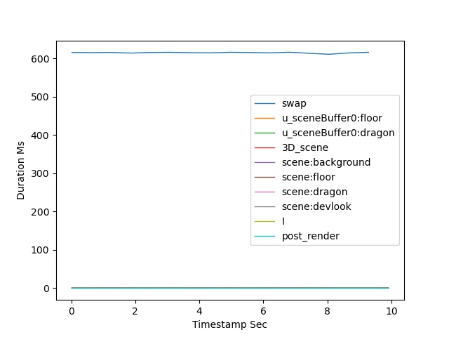 |


### lighting_pbrClearCoat
```bash
glslViewer lighting_pbrClearCoat.frag assets/dragon.obj  -e camera_position,-1.43923,0.891203,1.98093 --msaa --width 512 --height 512 -e dynamic_shadows,on -l
```

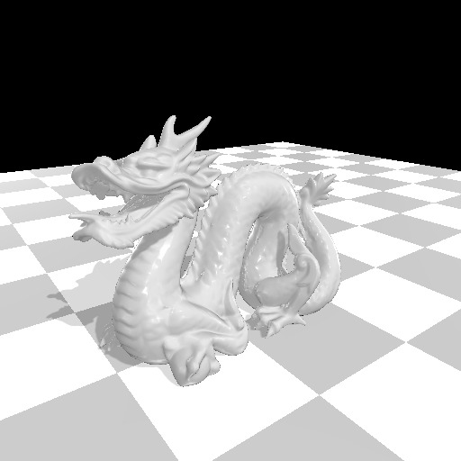

| GPU | Mean | Median | plot 
| --- | --- | --- | --- |
| V3D | 20.841553244258876 | 20.786133000000518 | 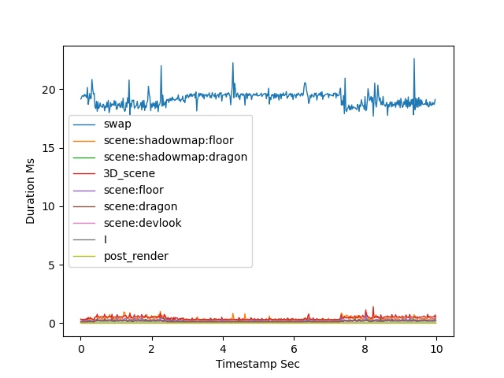 |


### lighting_pbrClearCoat_cubemap
```bash
glslViewer lighting_pbrClearCoat.frag assets/dragon.obj  -e camera_position,-1.43923,0.891203,1.98093 --msaa --width 512 --height 512 -e dynamic_shadows,on -C assets/Arches_E_PineTree_3k.hdr -l
```


| GPU | Mean | Median | plot 
| --- | --- | --- | --- |
| V3D | 45.15734808144797 | 45.250976000001174 | 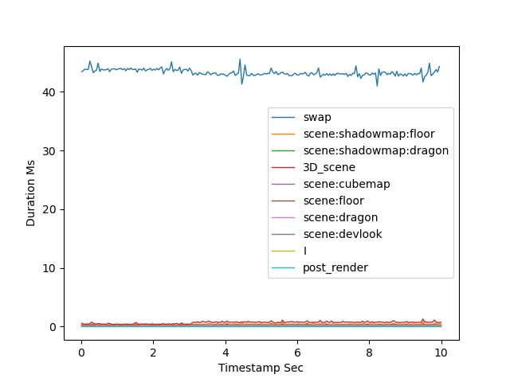 |


### lighting_pbrIridescence
```bash
glslViewer lighting_pbrIridescence.frag assets/IridescenceSuzanne.glb  -e camera_position,-5.34446,3.96689,5.76653 --msaa --width 512 --height 512 -e dynamic_shadows,on -l
```

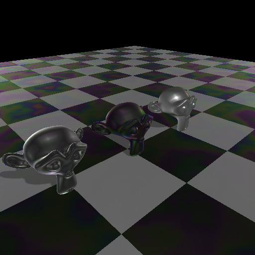

| GPU | Mean | Median | plot 
| --- | --- | --- | --- |
| V3D | 8.022424071485943 | 8.004150999999979 | 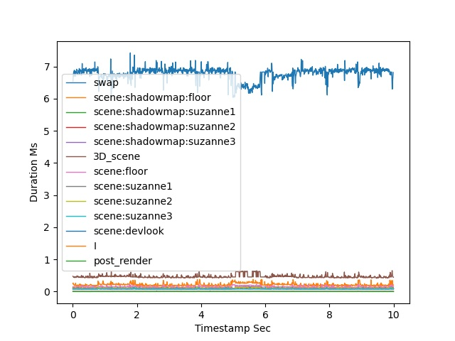 |


### lighting_pbrIridescence_cubemap
```bash
glslViewer lighting_pbrIridescence.frag assets/IridescenceSuzanne.glb  -e camera_position,-5.34446,3.96689,5.76653 --msaa --width 512 --height 512 -e dynamic_shadows,on -C assets/Arches_E_PineTree_3k.hdr -l
```


| GPU | Mean | Median | plot 
| --- | --- | --- | --- |
| V3D | 12.017916866425992 | 11.989013000000341 | 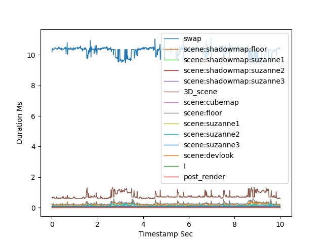 |


### lighting_pbrGlass
```bash
glslViewer lighting_pbrGlass.frag assets/dragon.obj  -e camera_position,-1.43923,0.891203,1.98093 --msaa --width 512 --height 512 -e dynamic_shadows,on -l
```

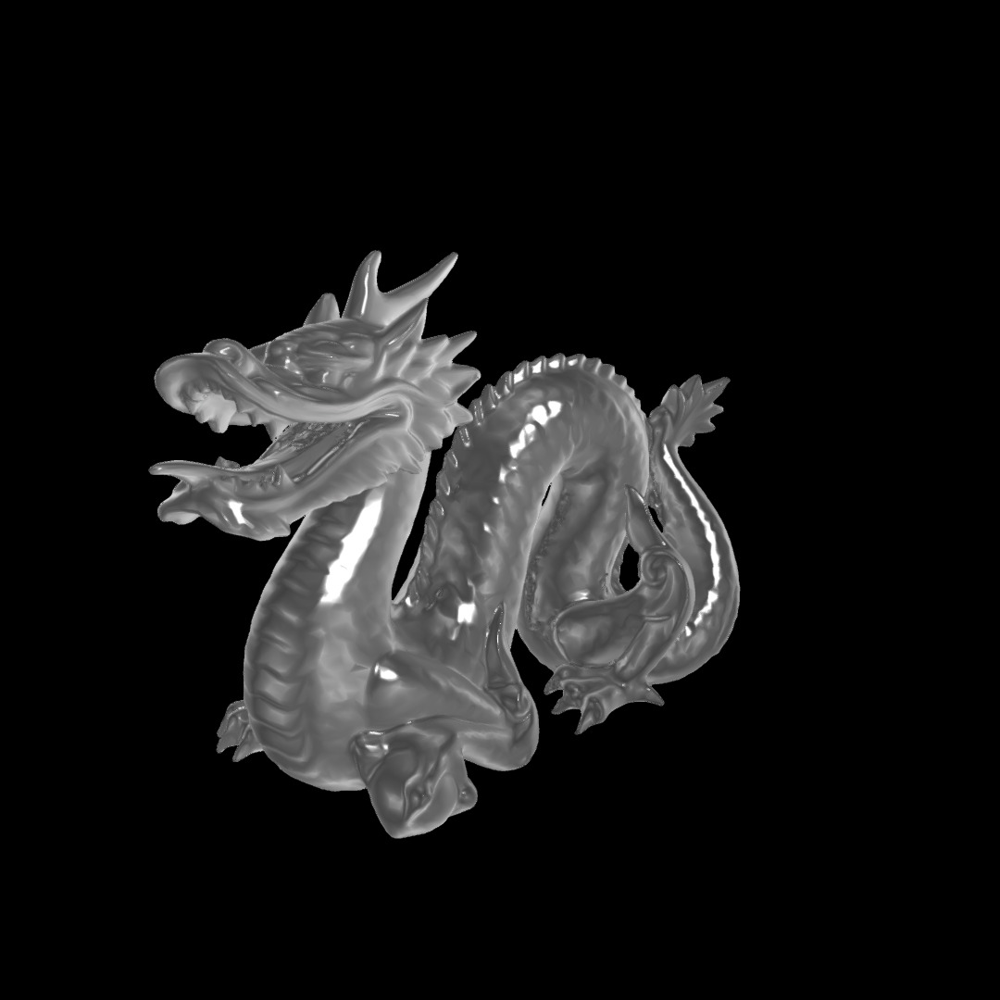

| GPU | Mean | Median | plot 
| --- | --- | --- | --- |
| V3D | 11.64449881118881 | 11.517089499999656 | 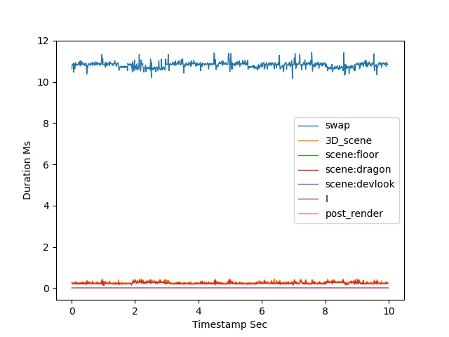 |


### lighting_pbrGlass_cubemap
```bash
glslViewer lighting_pbrGlass.frag assets/dragon.obj  -e camera_position,-1.43923,0.891203,1.98093 --msaa --width 512 --height 512 -e dynamic_shadows,on -C assets/Arches_E_PineTree_3k.hdr -l
```


| GPU | Mean | Median | plot 
| --- | --- | --- | --- |
| V3D | 46.35631586046511 | 46.35595699999976 | 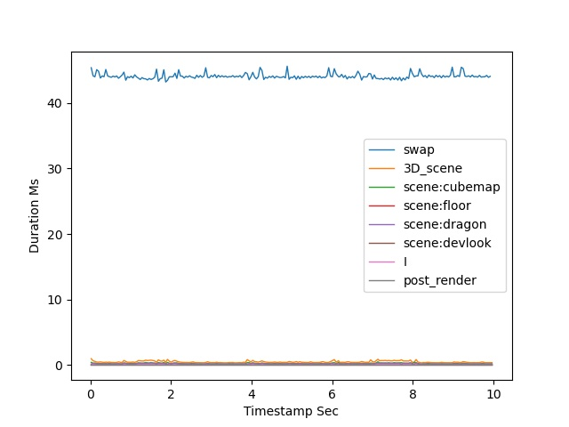 |


### lighting_pbrSsS
```bash
glslViewer lighting_pbrSsS.frag assets/dragon.obj  -e camera_position,-1.43923,0.891203,1.98093 --msaa --width 512 --height 512 -e dynamic_shadows,on -l
```

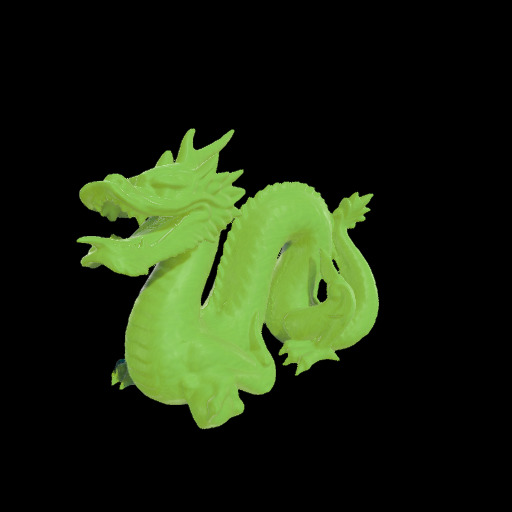

| GPU | Mean | Median | plot 
| --- | --- | --- | --- |
| V3D | 63.56897442307691 | 63.77600100000018 |  |


### lighting_pbrSsS_cubemap
```bash
glslViewer lighting_pbrSsS.frag assets/dragon.obj  -e camera_position,-1.43923,0.891203,1.98093 --msaa --width 512 --height 512 -e dynamic_shadows,on -C assets/Arches_E_PineTree_3k.hdr -l
```


| GPU | Mean | Median | plot 
| --- | --- | --- | --- |
| V3D | 66.47013455704698 | 66.84497100000044 | 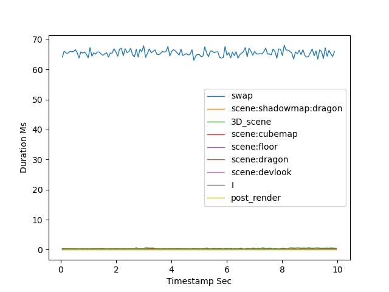 |


### lighting_shadow
```bash
glslViewer lighting_shadow.frag assets/dragon.obj  -e camera_position,-1.43923,0.891203,1.98093 --msaa --width 512 --height 512 -e dynamic_shadows,on -l
```


| GPU | Mean | Median | plot 
| --- | --- | --- | --- |
| V3D | 54.139901869565215 | 54.398681500000066 | 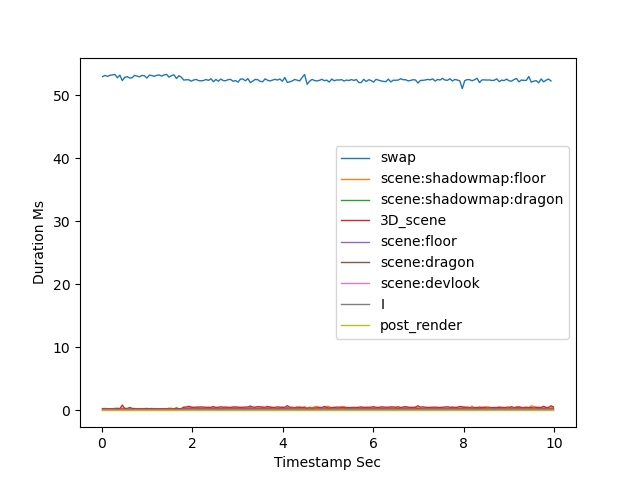 |


### lighting_sphereMap_glass
```bash
glslViewer lighting_sphereMap.frag assets/sem-glass-0003.jpg assets/dragon.obj  -e camera_position,-1.43923,0.891203,1.98093 --msaa --width 512 --height 512 -e dynamic_shadows,on -l
```

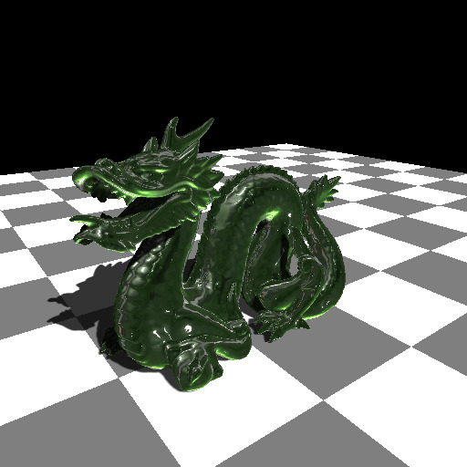

| GPU | Mean | Median | plot 
| --- | --- | --- | --- |
| V3D | 68.05954188356165 | 65.0941164999997 | 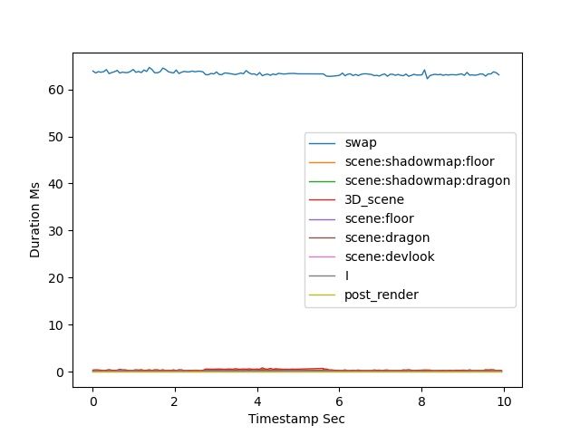 |


### lighting_sphereMap_crystal
```bash
glslViewer lighting_sphereMap.frag assets/sem-glass-0004.jpg assets/dragon.obj  -e camera_position,-1.43923,0.891203,1.98093 --msaa --width 512 --height 512 -e dynamic_shadows,on -l
```

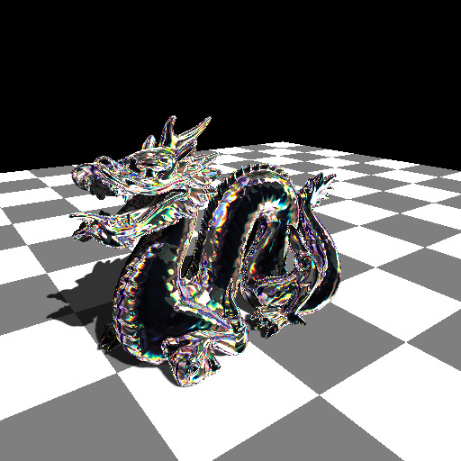

| GPU | Mean | Median | plot 
| --- | --- | --- | --- |
| V3D | 67.99566567123287 | 68.41088850000006 | 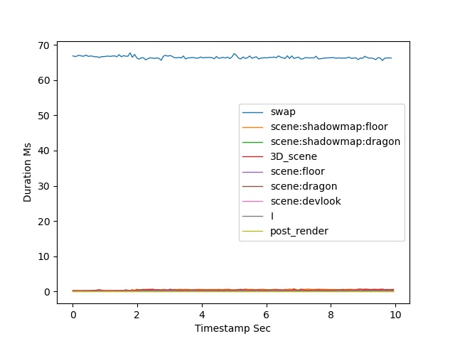 |


### lighting_sphereMap_gold
```bash
glslViewer lighting_sphereMap.frag assets/sem-gold-0003.jpg assets/dragon.obj  -e camera_position,-1.43923,0.891203,1.98093 --msaa --width 512 --height 512 -e dynamic_shadows,on -l
```

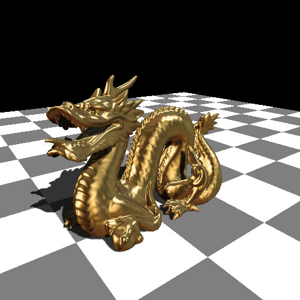

| GPU | Mean | Median | plot 
| --- | --- | --- | --- |
| V3D | 61.221932870370374 | 61.550048999999944 | 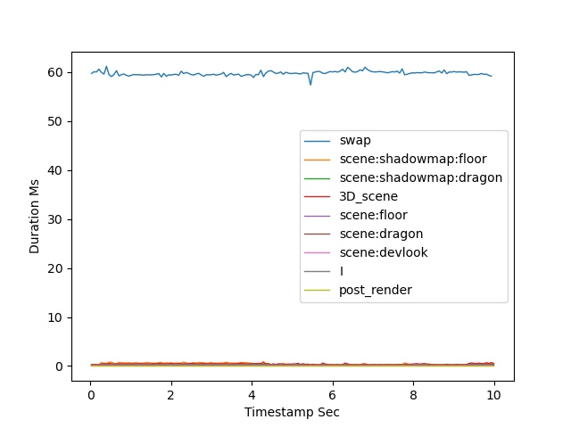 |


### lighting_sphereMap_metal
```bash
glslViewer lighting_sphereMap.frag assets/sem-metal-0003.jpg assets/dragon.obj  -e camera_position,-1.43923,0.891203,1.98093 --msaa --width 512 --height 512 -e dynamic_shadows,on -l
```

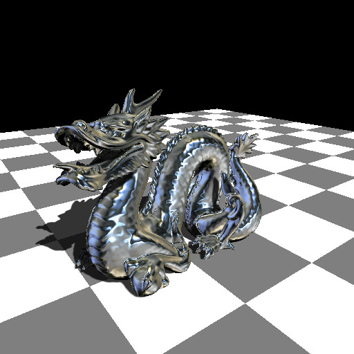

| GPU | Mean | Median | plot 
| --- | --- | --- | --- |
| V3D | 62.02730103125 | 62.39099100000021 | 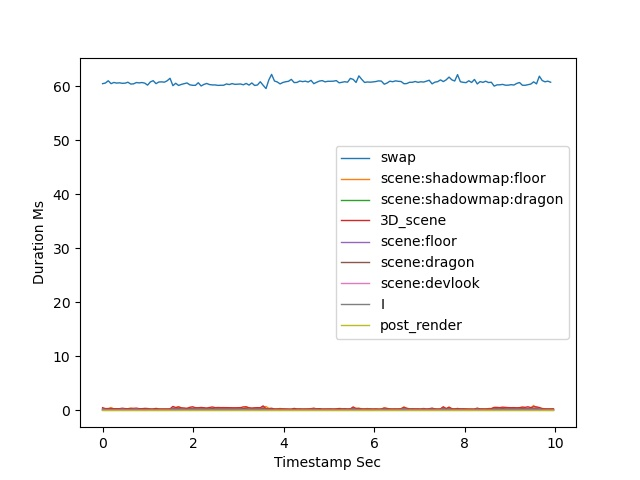 |


### lighting_sphereMap_dark_metal
```bash
glslViewer lighting_sphereMap.frag assets/sem-metal-0019.jpg assets/dragon.obj  -e camera_position,-1.43923,0.891203,1.98093 --msaa --width 512 --height 512 -e dynamic_shadows,on -l
```

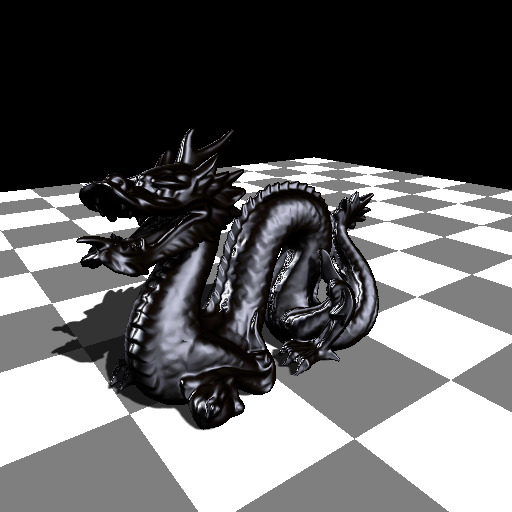

| GPU | Mean | Median | plot 
| --- | --- | --- | --- |
| V3D | 61.08347047530864 | 61.40795899999995 | 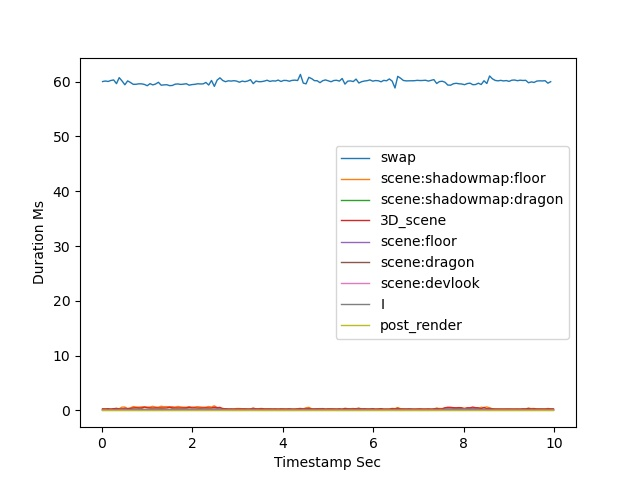 |


### lighting_sphereMap_iridescent
```bash
glslViewer lighting_sphereMap.frag assets/sem-0033.jpg assets/dragon.obj  -e camera_position,-1.43923,0.891203,1.98093 --msaa --width 512 --height 512 -e dynamic_shadows,on -l
```

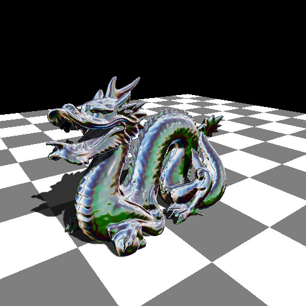

| GPU | Mean | Median | plot 
| --- | --- | --- | --- |
| V3D | 61.21328998765432 | 61.52709949999962 | 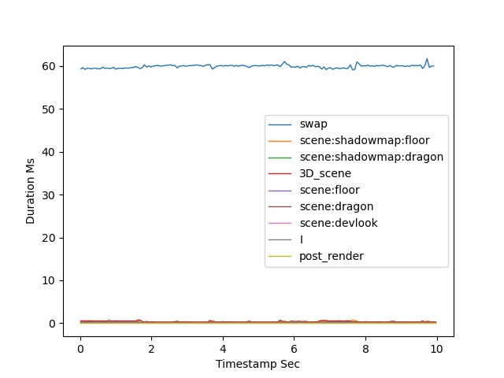 |


### lighting_sphericalHarmonics
```bash
glslViewer lighting_sphericalHarmonics.frag assets/dragon.obj  -e camera_position,-1.43923,0.891203,1.98093  -e sky,on --msaa --width 512 --height 512 -e dynamic_shadows,on -C assets/Arches_E_PineTree_3k.hdr -l
```


| GPU | Mean | Median | plot 
| --- | --- | --- | --- |
| V3D | 55.223266605555565 | 55.475463500000046 | 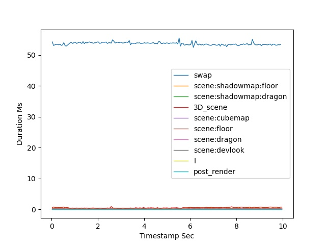 |


### lighting_ssao
```bash
glslViewer lighting_ssao.frag assets/dragon.obj  -e camera_position,-1.43923,0.891203,1.98093 --msaa --width 512 --height 512 -e dynamic_shadows,on -l
```


| GPU | Mean | Median | plot 
| --- | --- | --- | --- |
| V3D | 76.76675107751937 | 77.51098599999932 | 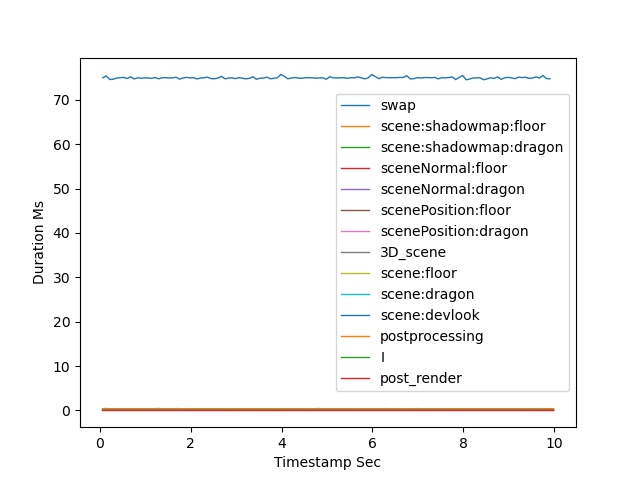 |


### lighting_ssr
```bash
glslViewer lighting_ssr.frag assets/dragon.obj  -e camera_position,-1.43923,0.891203,1.98093 --msaa --width 512 --height 512 -e dynamic_shadows,on -C assets/Arches_E_PineTree_3k.hdr -l
```


| GPU | Mean | Median | plot 
| --- | --- | --- | --- |
| V3D | 620.4561360666667 | 664.4018559999995 | 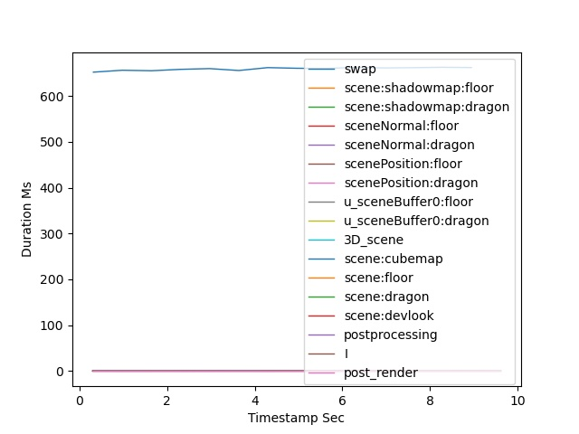 |


### lighting_volumetric
```bash
glslViewer lighting_volumetric.frag assets/dragon.obj  -e camera_position,-1.67433,0.0682091,-1.99539 --msaa --width 512 --height 512 -e dynamic_shadows,on -C assets/Arches_E_PineTree_3k.hdr -l
```

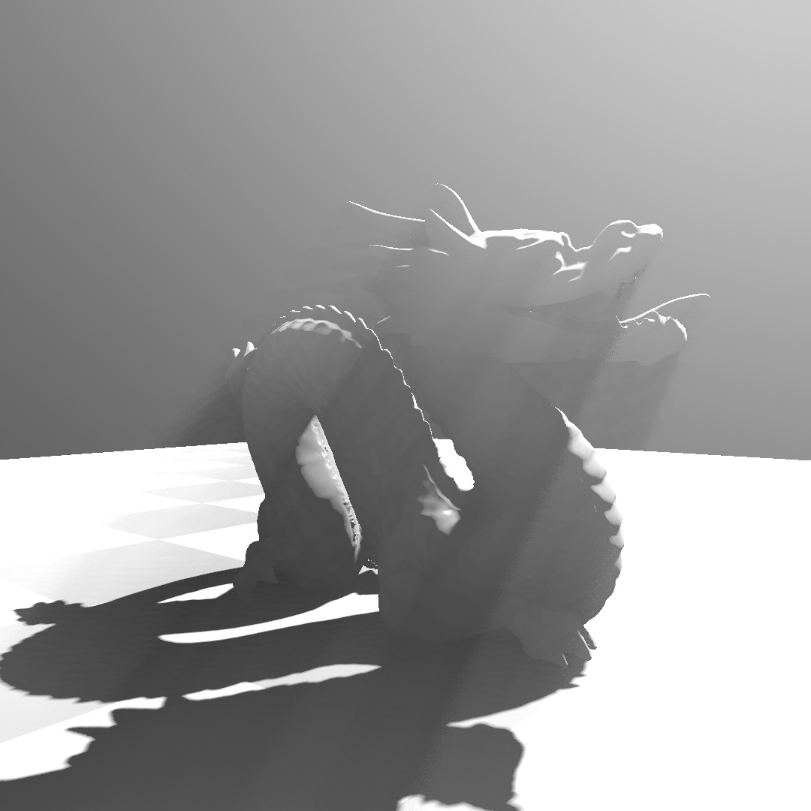

| GPU | Mean | Median | plot 
| --- | --- | --- | --- |
| V3D | 86.78110650877194 | 87.40100100000029 | 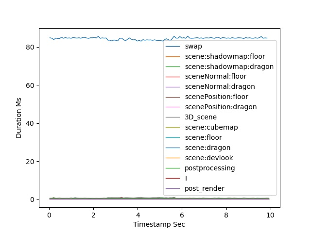 |


### lighting_raymarching
```bash
glslViewer lighting_raymarching.frag  -e camera_position,29.5393,26.2406,42.1865 --msaa --width 512 --height 512 -e dynamic_shadows,on -l
```


| GPU | Mean | Median | plot 
| --- | --- | --- | --- |
| V3D | 1253.1544364285712 | 1461.0419920000004 | 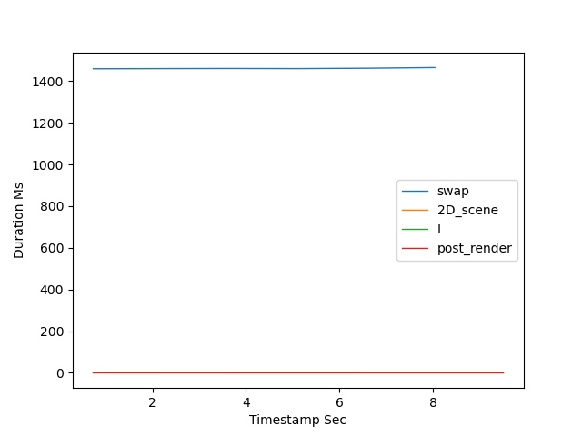 |


### lighting_raymarching_cubemap
```bash
glslViewer lighting_raymarching.frag  -e camera_position,29.5393,26.2406,42.1865 --msaa --width 512 --height 512 -e dynamic_shadows,on -C assets/Arches_E_PineTree_3k.hdr -l
```


| GPU | Mean | Median | plot 
| --- | --- | --- | --- |
| V3D | 1252.9362794285714 | 1461.5168460000002 | 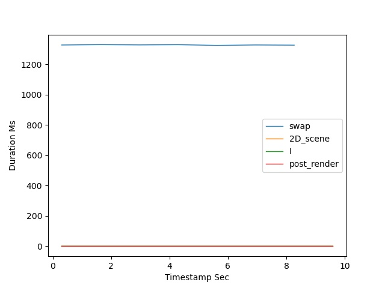 |


### lighting_raymarching_return
```bash
glslViewer lighting_raymarching_return.frag  -e camera_position,29.5393,26.2406,42.1865 --msaa --width 512 --height 512 -e dynamic_shadows,on -l
```

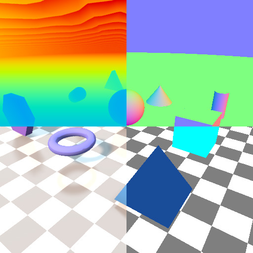

| GPU | Mean | Median | plot 
| --- | --- | --- | --- |
| V3D | 1271.7357004285714 | 1483.603028 | 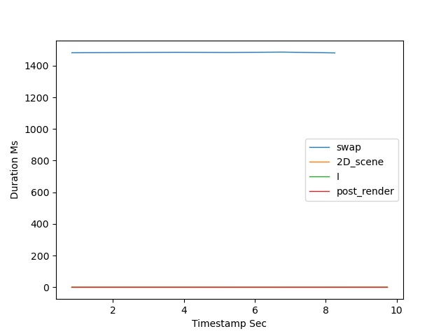 |


### lighting_raymarching_gooch
```bash
glslViewer lighting_raymarching_gooch.frag  -e camera_position,29.5393,26.2406,42.1865 --msaa --width 512 --height 512 -e dynamic_shadows,on -l
```

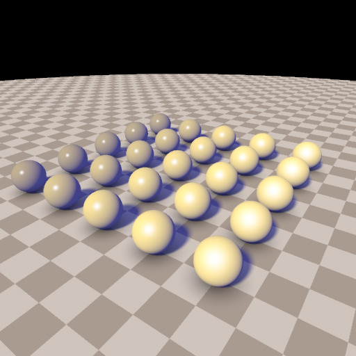

| GPU | Mean | Median | plot 
| --- | --- | --- | --- |
| V3D | 236.2266816097561 | 242.08618099999967 | 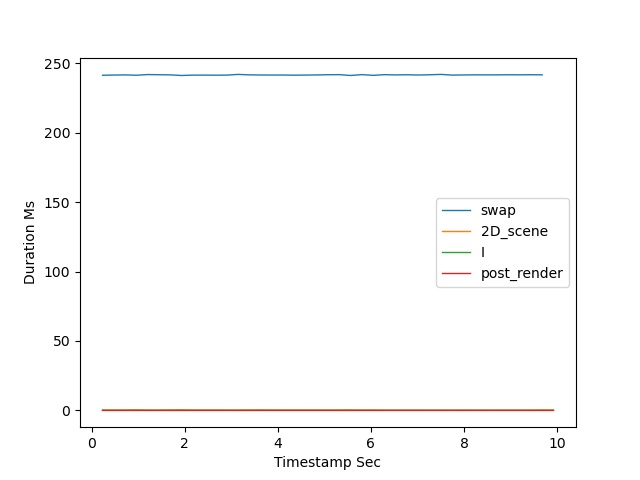 |


### lighting_raymarching_pbr
```bash
glslViewer lighting_raymarching_pbr.frag  -e camera_position,29.5393,26.2406,42.1865 --msaa --width 512 --height 512 -e dynamic_shadows,on -l
```


| GPU | Mean | Median | plot 
| --- | --- | --- | --- |
| V3D | 264.1994892972973 | 271.5219729999999 |  |


### lighting_raymarching_pbr_cubemap
```bash
glslViewer lighting_raymarching_pbr.frag  -e camera_position,29.5393,26.2406,42.1865 --msaa --width 512 --height 512 -e dynamic_shadows,on -C assets/Arches_E_PineTree_3k.hdr -l
```


| GPU | Mean | Median | plot 
| --- | --- | --- | --- |
| V3D | 252.31323241025638 | 258.893067 |  |


### lighting_raymarching_pbrLittle
```bash
glslViewer lighting_raymarching_pbrLittle.frag  -e camera_position,29.5393,26.2406,42.1865 --msaa --width 512 --height 512 -e dynamic_shadows,on -l
```

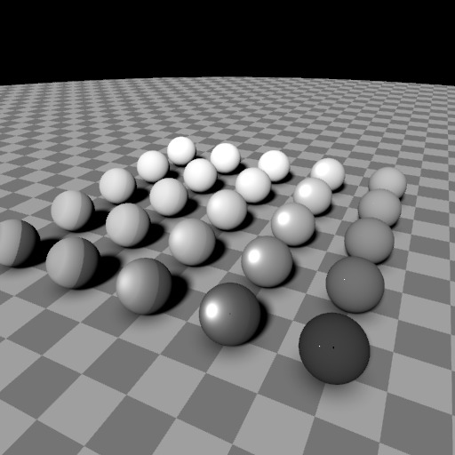

| GPU | Mean | Median | plot 
| --- | --- | --- | --- |
| V3D | 240.494998097561 | 246.4951170000004 | 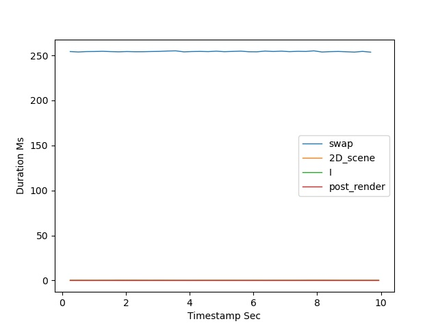 |


### lighting_raymarching_pbrLittle_cubemap
```bash
glslViewer lighting_raymarching_pbrLittle.frag  -e camera_position,29.5393,26.2406,42.1865 --msaa --width 512 --height 512 -e dynamic_shadows,on -C assets/Arches_E_PineTree_3k.hdr -l
```

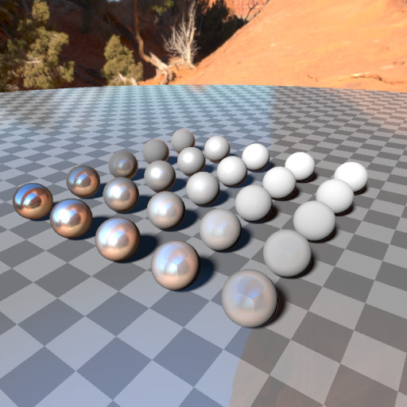

| GPU | Mean | Median | plot 
| --- | --- | --- | --- |
| V3D | 240.802389 | 246.75195299999996 | 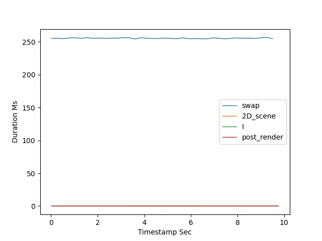 |


### lighting_raymarching_pbrClearCoat
```bash
glslViewer lighting_raymarching_pbrClearCoat.frag  -e camera_position,29.5393,26.2406,42.1865 --msaa --width 512 --height 512 -e dynamic_shadows,on -l
```

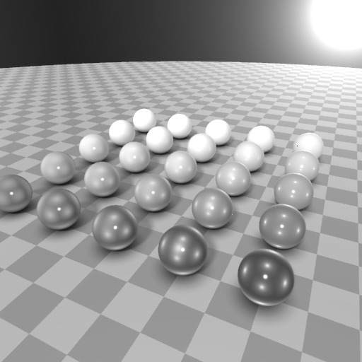

| GPU | Mean | Median | plot 
| --- | --- | --- | --- |
| V3D | 269.2728881944445 | 276.93005349999976 | 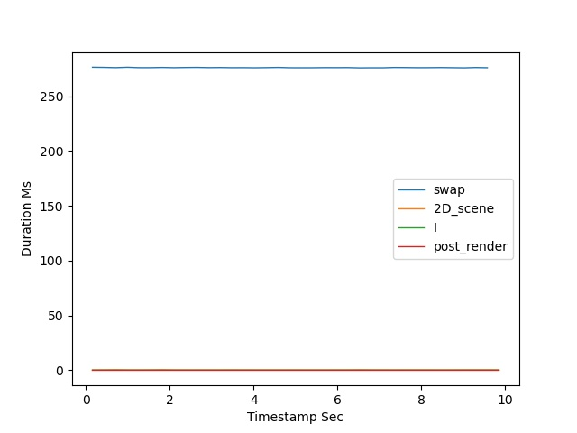 |


### lighting_raymarching_pbrClearCoat_cubemap
```bash
glslViewer lighting_raymarching_pbrClearCoat.frag  -e camera_position,29.5393,26.2406,42.1865 --msaa --width 512 --height 512 -e dynamic_shadows,on -C assets/Arches_E_PineTree_3k.hdr -l
```

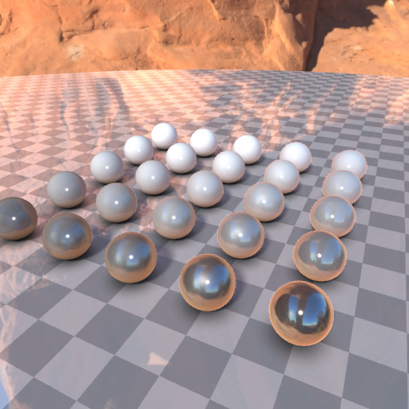

| GPU | Mean | Median | plot 
| --- | --- | --- | --- |
| V3D | 257.08934260526314 | 263.8955075000001 | 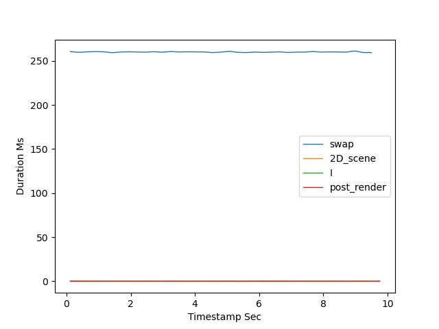 |


### lighting_raymarching_pbrGlass
```bash
glslViewer lighting_raymarching_pbrGlass.frag  -e camera_position,29.5393,26.2406,42.1865 --msaa --width 512 --height 512 -e dynamic_shadows,on -l
```

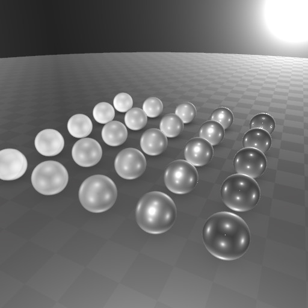

| GPU | Mean | Median | plot 
| --- | --- | --- | --- |
| V3D | 194.95195801999998 | 198.89001450000023 |  |


### lighting_raymarching_pbrGlass_cubemap
```bash
glslViewer lighting_raymarching_pbrGlass.frag  -e camera_position,29.5393,26.2406,42.1865 --msaa --width 512 --height 512 -e dynamic_shadows,on -C assets/Arches_E_PineTree_3k.hdr -l
```

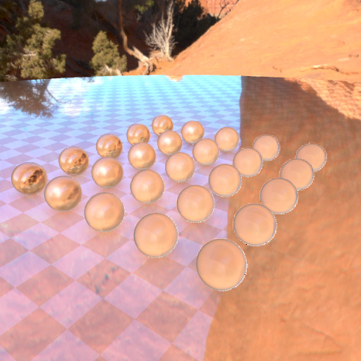

| GPU | Mean | Median | plot 
| --- | --- | --- | --- |
| V3D | 180.34153916666668 | 183.75451699999985 |  |


### lighting_raymarching_pbrIridescence
```bash
glslViewer lighting_raymarching_pbrIridescence.frag  -e camera_position,29.5393,26.2406,42.1865 --msaa --width 512 --height 512 -e dynamic_shadows,on -l
```

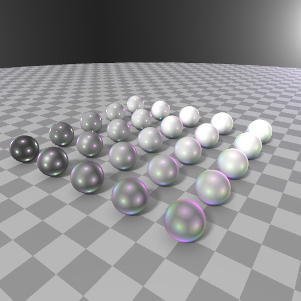

| GPU | Mean | Median | plot 
| --- | --- | --- | --- |
| V3D | 264.2075921081081 | 271.5139159999999 | 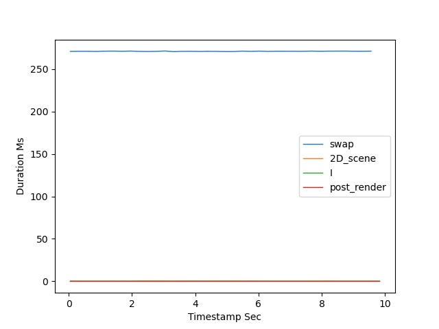 |


### lighting_raymarching_pbrIridescence_cubemap
```bash
glslViewer lighting_raymarching_pbrIridescence.frag  -e camera_position,29.5393,26.2406,42.1865 --msaa --width 512 --height 512 -e dynamic_shadows,on -C assets/Arches_E_PineTree_3k.hdr -l
```

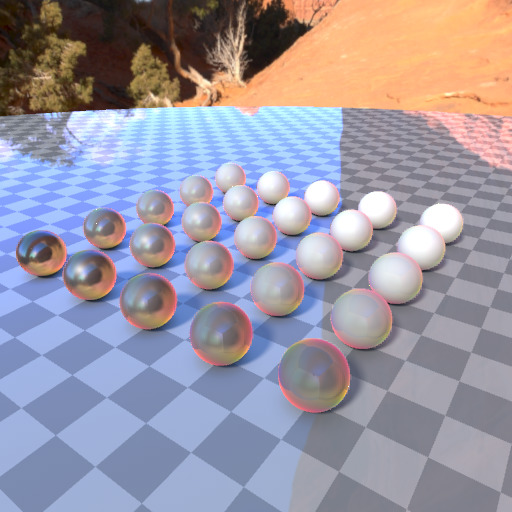

| GPU | Mean | Median | plot 
| --- | --- | --- | --- |
| V3D | 252.24812825641027 | 258.973876 |  |


### lighting_raymarching_volume
```bash
glslViewer lighting_raymarching_volume.frag  -e camera_position,29.5393,26.2406,42.1865 --msaa --width 512 --height 512 -e dynamic_shadows,on -l
```


| GPU | Mean | Median | plot 
| --- | --- | --- | --- |


### lighting_raymarching_pbr_volume
```bash
glslViewer lighting_raymarching_pbr_volume.frag  -e camera_position,29.5393,26.2406,42.1865 --msaa --width 512 --height 512 -e dynamic_shadows,on -l
```

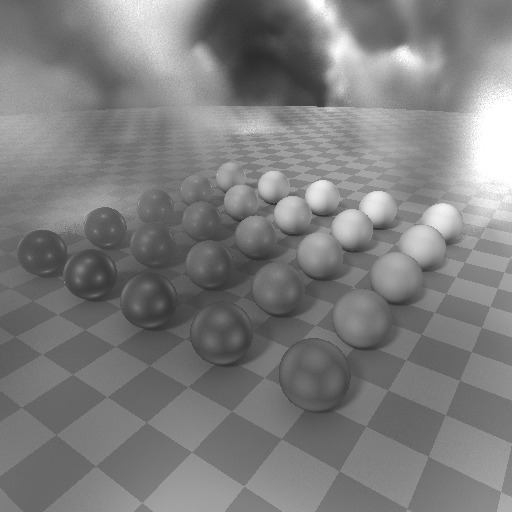

| GPU | Mean | Median | plot 
| --- | --- | --- | --- |


### lighting_raymarching_pbr_volume_cubemap
```bash
glslViewer lighting_raymarching_pbr_volume.frag  -e camera_position,29.5393,26.2406,42.1865 --msaa --width 512 --height 512 -e dynamic_shadows,on -C assets/Arches_E_PineTree_3k.hdr -l
```

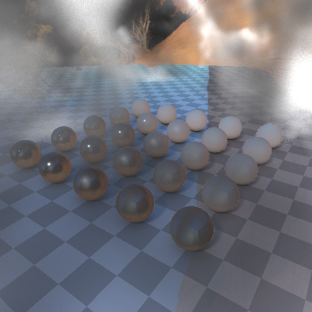

| GPU | Mean | Median | plot 
| --- | --- | --- | --- |


### lighting_atmosphere_equirectangular
```bash
glslViewer lighting_atmosphere.frag  -e define,PROJECTION_MODE,0 --msaa --width 1024 --height 512 -e dynamic_shadows,on -l
```


| GPU | Mean | Median | plot 
| --- | --- | --- | --- |
| V3D | 129.35185737662337 | 131.28100599999925 | 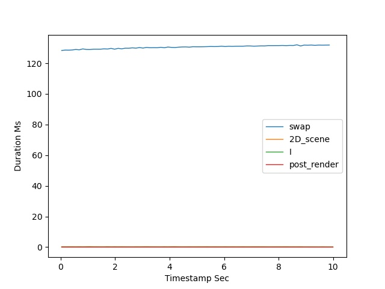 |


### lighting_atmosphere_fisheye
```bash
glslViewer lighting_atmosphere.frag  -e define,PROJECTION_MODE,1 --msaa --width 512 --height 512 -e dynamic_shadows,on -l
```


| GPU | Mean | Median | plot 
| --- | --- | --- | --- |
| V3D | 158.78052938709678 | 166.87805149999997 | 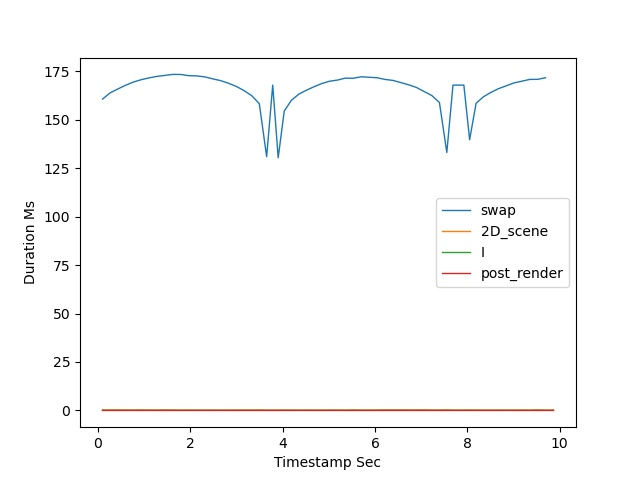 |


